:::note
Capstone guides and videos [here](https://verdant-raindrop-f3e404.netlify.app/capstonetraining/github/2-forking-and-cloning).
:::

## Forking and Cloning

### Forking a Repository

1. **Find the Repository:** Navigate to the repository on GitHub that you wish to fork:

   [GitHub - thoth-tech/arcade-hackathon-project](https://github.com/thoth-tech/arcade-hackathon-project): For use in the Arcade Games "Hackathon-in-a-box" event.

    :::tip
    If you are not signed in to GitHub, sign in, if you don’t have an account, sign up.
    :::

2. **Fork the Repository:** Click the ***Fork*** button located at the top-right of the page (shown with red arrow). If prompted, select your personal account as the destination.

    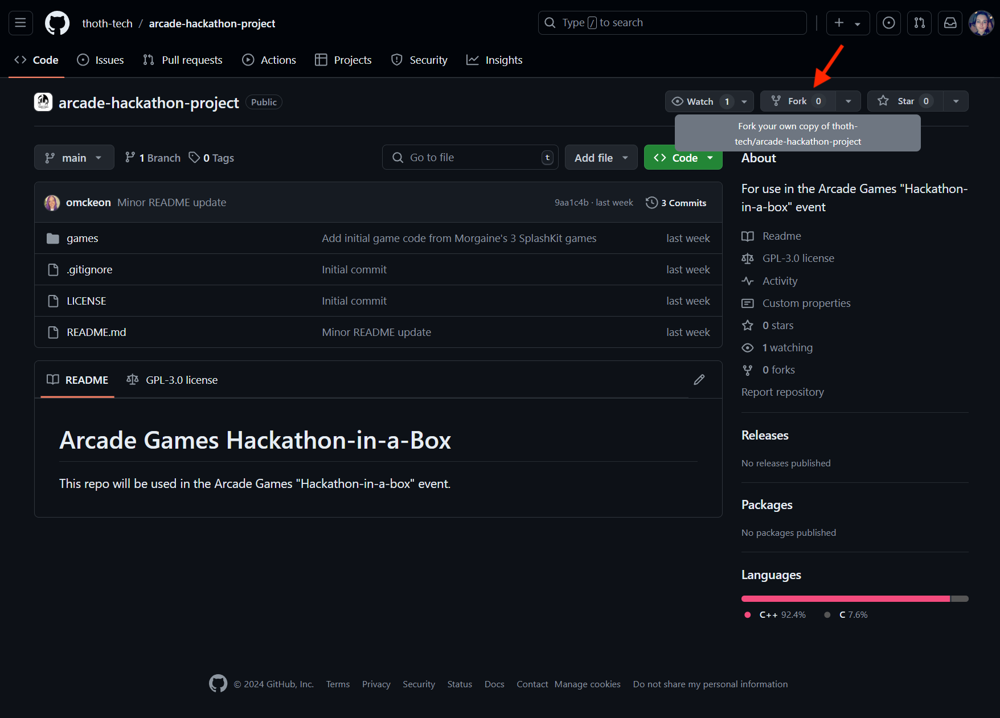

    On the **Create a new fork** page, deselect the option *"Copy the main branch only"* (shown with yellow arrow below).

    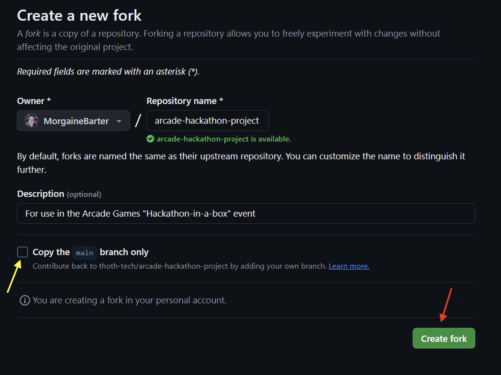

    Then click **Create fork** (shown with red arrow above).

3. **Fork Confirmation:** You’ll now have your own fork of the repository in your GitHub account, ready for your contributions.

    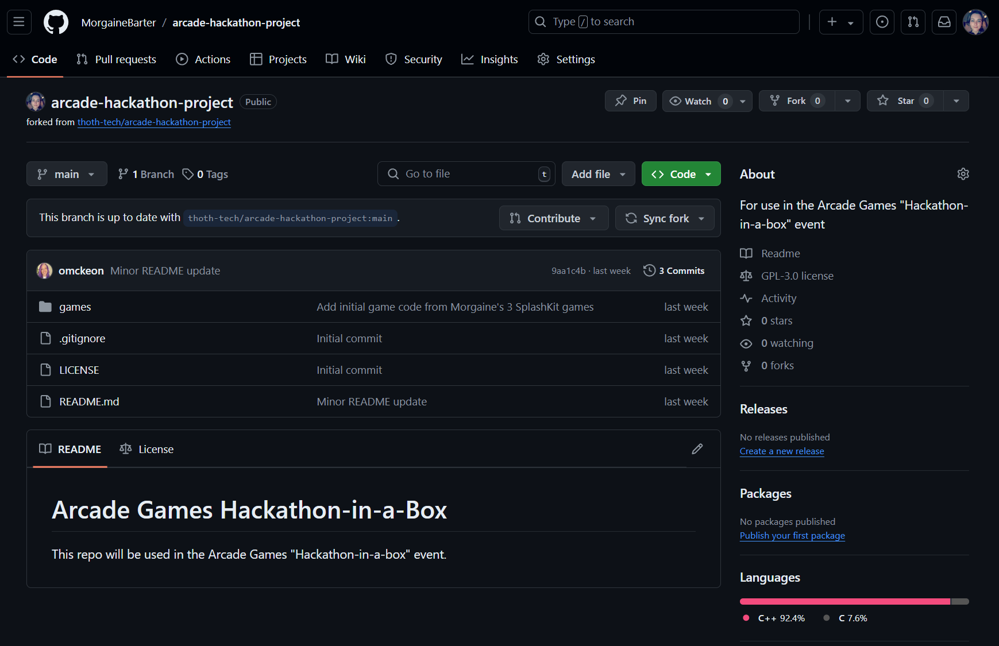

### Cloning a Repository

Once the files are in your account you must download them to your device.

1. **Locate the Repository:** On GitHub, go to your profile with the forked repository and clone the repository (and its files) to your device by clicking the "Code" button (shown with red arrow below), then copy the Copy button (shown with yellow arrow).

    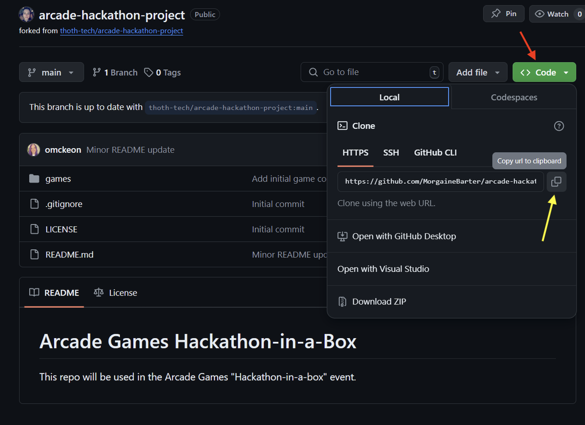

2. **Prepare to Clone:** Click **Code** (shown with red arrow in image above) and under “Clone with HTTPS”, copy the provided URL (shown with yellow arrow above).

3. **Open Your Terminal:** Launch the terminal within VS Code or your preferred environment (such as MSYS2 MinGW x64 if on Windows, GitBash, Terminal on macOS, or GitHub Desktop Application).

    *Note: The example images in this guide will be using the Git Bash terminal.*

4. **Navigate to Your Directory:** Use `cd` to change to the directory where you want the cloned directory.

    Example: `cd Documents/GitHub/HackathonProject`

    :::caution[Ensure you’re cloning into an empty folder for a smooth process.]
    :::

    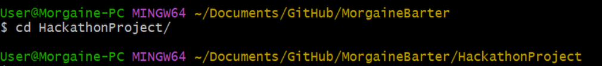

5. **Clone:** Type `git clone`, then paste the URL you copied. Press enter to create your local clone.

    Eg: `git clone https://github.com/YOUR-USERNAME/YOUR-REPOSITORY`

---

## Team Setup on First Day

:::tip[Firstly, as a team, decide on two things:]

1. **Coding Language:**

    Choose whether to use C++ or C# as your programming language.

    *The whole team must choose the same language.*

2. **Team Name:**

    Choose a **team name** or think of a new name for the game to use for your teams project.

    *This will be used for the folder name of your files to ensure the original files are not changed, and teams' projects remain separate.*

:::

### In Team Leader's Fork

#### Create team project folder

Copy and Paste the `LostInSpace` folder you wish to use (C++ or C# version).

Then rename the newly copied folder with your team's name.

#### Add new folder to GitHub repo

Add the new project files to the Team Leader's fork on GitHub with the following commands:

1. Use `git status` to check the current state of the working directory and staging area.

    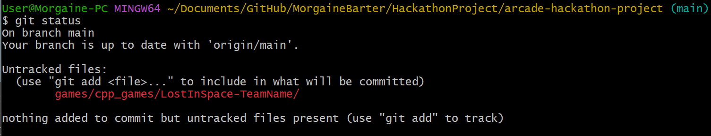

2. Use `git add .` to add all of the new files in the current working directory to the staging area.

    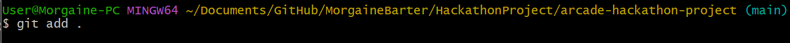

3. Use `git status` again to see files added to staging area.

    

4. Use `git commit -m "new project files"` to commit your new files.

    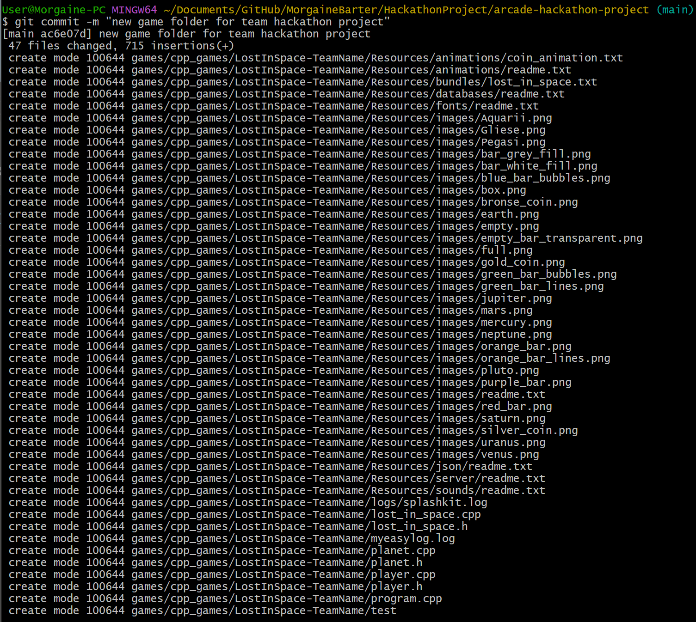

5. Use `git push` to push the files to the fork on GitHub.

    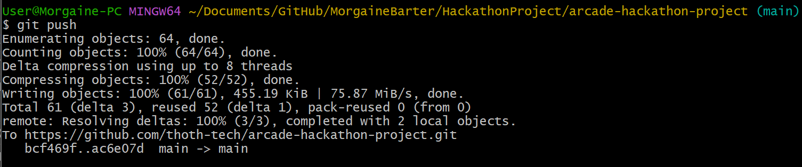

The team leader's fork should now have the new folder showing on their profile, and can share this URL with other team members.

:::caution[Check this on GitHub WebUI]
Go to the Team Leader's fork on [github.com](https://github.com/), and check that the new folder has been added correctly before moving to the next step.
:::

### Add Team Members as Collaborators

Adding team members as collaborators allows all team members to make changes directly on the same repository, which means that team members can make contributions more quickly.

To add collaborators using the GitHub Web UI, follow the steps below on the ***Team Leader's fork***:

1. Click the **Settings** tab across the top of the screen.
2. Click on **Collaborators** in the left sidebar.
3. Click the **Add people** button under the "Manage Access" section.


You can now add your team members using their GitHub username, their full name, or their email linked to their GitHub account.

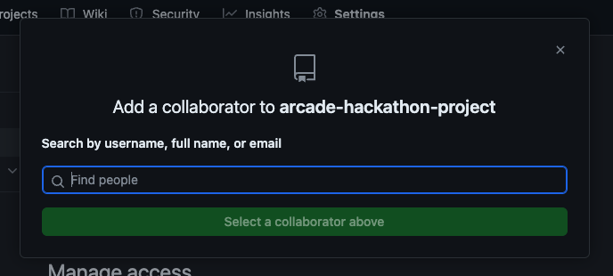

### Team Member Setup

There are 2 options for how the team can collaborate on the Team Leader's forked repo:

#### Forking Leader's Repo

This option is the safest (with the least chance of issues arising), and is useful to practice the style that is used in capstone.

1. Go to the URL of the Team Leader's fork.
2. Fork and clone this repository using the steps above, but from the leaders forked repo rather than the thoth-tech repo.

#### Cloning Leader's Repo

This option allows all team members to make changes directly on the same repository, without needing to make pull requests to add their contributions. It is most suitable for those with some experience with GitHub, or those wanting to explore more options.

:::note
Using separate branches is particularly important if using this option. See the [Creating and Switching Branches](#creating-and-switching-branches) section below for more information on branching.

If branching is too confusing, team members can just use the forking option without branches on their own fork.
:::

1. Go to the URL of the Team Leader's fork.
2. Clone this repository using the steps above without forking the leader's repository first.

:::tip[More Info on GitHub Docs]

Here are some articles with more information that you may find useful:

- [Allowing changes to a pull request branch created from a fork - GitHub Docs](https://docs.github.com/en/pull-requests/collaborating-with-pull-requests/working-with-forks/allowing-changes-to-a-pull-request-branch-created-from-a-fork)
- [Committing changes to a pull request branch created from a fork - GitHub Docs](https://docs.github.com/en/pull-requests/collaborating-with-pull-requests/proposing-changes-to-your-work-with-pull-requests/committing-changes-to-a-pull-request-branch-created-from-a-fork)

:::

---

## Creating and Switching Branches

Why do we need to use branches?

- **Feature Development:** Isolate new feature development from the stable codebase.
- **Bug Fixes:** Address and fix issues without disrupting the main development flow.
- **Experimentation:** Try out new ideas in a sandboxed environment without risk to the main project. *This is particularly important when working in a team.*

### Using the Command Line

*Note: This is the recommended way of creating new branches.*

Follow these steps to create a new branch using the command line:

1. **Navigate to Your Repository:** In your terminal, go to your local GitHub repository folder where you wish to create a new branch.

    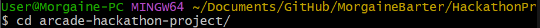

2. **Create new branch:** Use the command: `git checkout -b <new-branch-name>` to create a new branch on your local clone.

    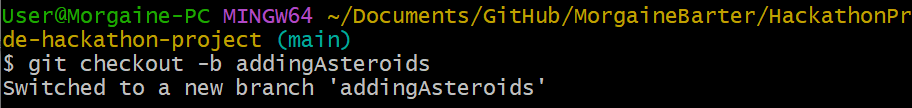

    This command switches to your new branch and creates it if it doesn’t already exist.

3. **Push Your New Branch:** Use `git push origin <new-branch-name>` to push your new branch to your remote fork.

    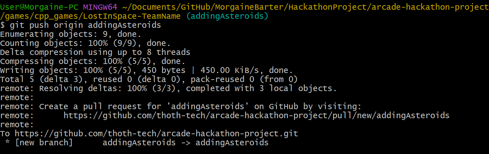

### Using the GitHub Web UI

Alternatively, follow these steps to create a new branch in the GitHub Web UI:

1. **Navigate to Your Repository's Branches:** Go to your GitHub repository (online) where you wish to create a new branch.
2. **Go to the "Branches" page:** Click the branch button (shown with red arrow below).

    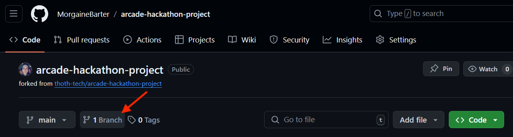

3. **Create new Branch:** Click the **New Branch** button (shown with yellow arrow below).

    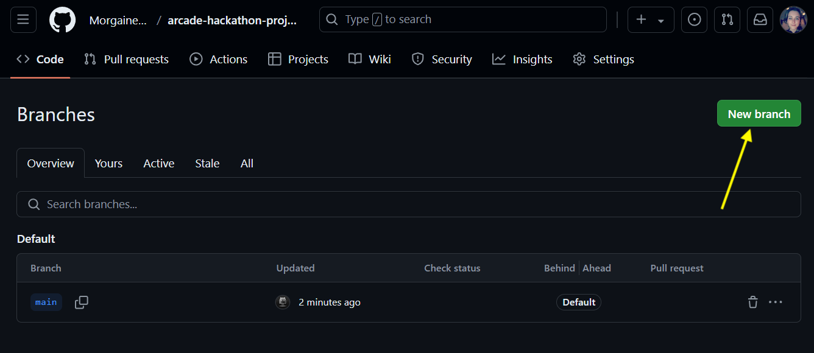

    - Add the name of the new branch in the text box under the **New branch name** heading.
    - Then click the drop-down menu under the **Source** heading if you need to update which branch the new branch will be created from.

    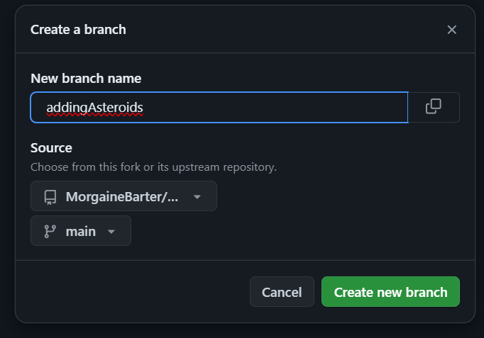

4. **Pull Your New Branch:**  Open your terminal, navigate to the cloned project folder, and then run `git pull` to pull down your newly created branch to your local clone.
5. **Switch to Your New Branch:** In the same directory, run the command `git checkout <new-branch-name>` to switch to your new branch.

Now that you’ve created a branch, you’re ready to start making changes. Remember, the modifications you make on this branch are isolated from the main line of development. This isolation allows you to develop features, fix bugs, or experiment freely.

---

## Contributing

### Making Changes

Now that you've cloned your repo, you can follow these steps to start making changes in your local clone:

1. Open Visual Studio Code (or whatever you prefer to use for writing code).
2. Open the cloned folder by clicking **File**, then **Open Folder**.

    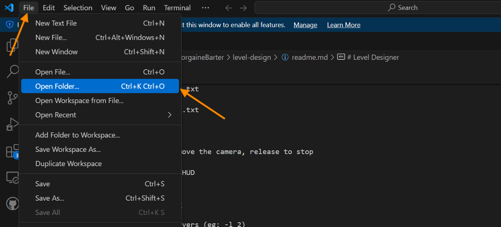

3. Navigate to the folder where your local clone was saved and select the game folder with your team name.

    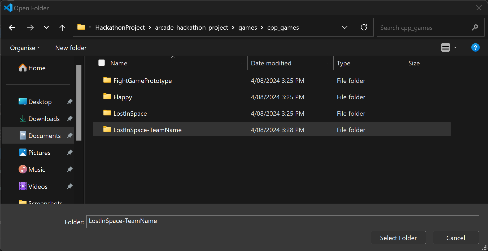

4. Once it opens, click **Yes, I trust the authors**.

*Now you're ready to start coding!*

Once you've made your changes, look at the next section for how to commit these changes.

### Preparing Your Changes

Before your changes can be committed to your repository, they must be staged. This process involves selecting the modifications you wish to include in your next commit.

To stage all changes, use the following command:

```shell
git add .
```

To stage particular files, add them using their filename:

```shell
git add <filename>
```

Replace `<fileName>` with the name of the file you’ve modified.

For example, if staging a file named `asteroid.h`, you would use `git add asteroid.h`.

### Checking Your Current Status

It’s easy to lose track of which changes have been staged for commit. Use the following command to display your working directory’s current state:

```shell
git status
```

This command will list staged changes, unstaged changes, and files that are not being tracked by Git.

The images below show what it looks like when you run `git status`:

1. Before making any changes.

    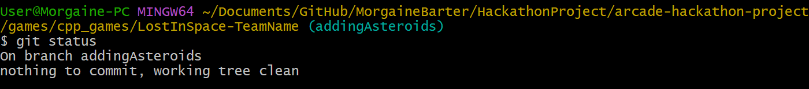

2. After making changes, but before staging any changes.

    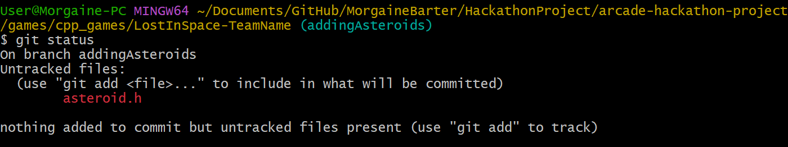

3. After staging all your changes.

    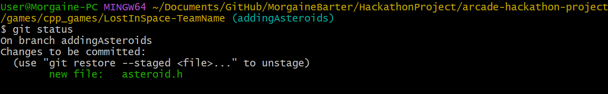

### Committing Your Changes

Once you've staged your changes, you will need to `commit` them.

#### Crafting a Meaningful Commit Message

Commit messages are crucial for understanding the history of your project. They should clearly describe what was changed and why.

:::tip[Why It Matters]

- **Clarity**: A clear commit message helps reviewers understand the purpose of your changes.
- **Project History**: Well-crafted messages enhance the readability of your project’s history.

:::

#### How to Commit

The following command is used to commit your changes (use your own commit message):

```shell
git commit -m “Describe your changes here”
```

#### Example Messages

- “Updated navigation links to reflect new file structure.”
- “Added README.md for project control instructions.”
- “Added Asteroid behaviour code”

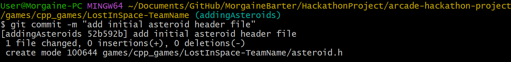

### Synchronizing Changes with GitHub

After committing your changes locally, you need to synchronize them with your GitHub repository.

#### Pulling Changes

To ensure your local repository is up to date, pull any changes made by others:

```shell
git pull origin main
```

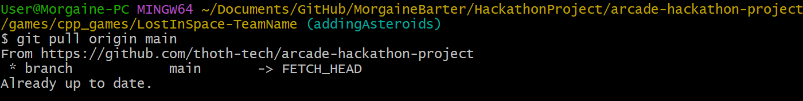

#### Pushing Your Changes

Once your local repository is updated, push your changes to GitHub:

```shell
git push origin <branch_name>
```

Replace `<branch_name>` with the name of your branch. If you’re pushing for the first time, this command also creates the branch on GitHub.


### PR to Leader's Fork

If a team member has cloned their own fork, rather than the leader's fork, they will need to make a pull request to add their changes to the team contributions.

**In Team Member Fork:** Follow steps 1-6 in the [How to Create a Pull Request](#how-to-create-a-pull-request) section to **create** the pull request.

**In Team Leader Fork:** Follow the steps in the [Review Team Member PRs](#review-team-member-prs) section to **review** the pull request.  
Then push the new branch to the team leader's fork using `git push origin <branch_name>` with the name of the branch created when reviewing the PR as the `<branch_name>`.  
*Note: This can be done by a team member if added as a collaborator.*

---

## Consolidating Team Contributions

Once all contributions have been finalised, the **Team Leader's fork** should end up with all team members' contributions on a new branch named with the team's name.

This will be used for creating the final PR (Pull Request) to the [thoth-tech/arcade-hackathon-project](https://github.com/thoth-tech/arcade-hackathon-project) repo.

### Create PR Branch

Start by switching to the main branch using `git checkout main`.

To add the commits from other branches to the team's PR branch, firstly create and switch to the PR branch using the following command:

```shell
git checkout -b <team-branch-name>
```

Replace `<team-branch-name>` with the name of your team's PR branch.

### Add Team Member Contributions

In the new branch, use `git pull origin <branch-name>`, replacing `<branch-name>` with a branch to be added to the PR.

Repeat this for each team member's contributions.

:::note[Team Member Forks]
If a team member is using their own fork from the team leader's fork, they will need to create a pull request to the leader's fork to add their changes.
:::

### Review Team Member PRs

For team member contributions that have been made on their own fork with a PR to the leader's fork, these can be reviewed in the clone of the leader's fork using the following steps:

#### Get Remote Branches

1. In the local clone folder of the leader's fork, run the following command to check for remote branches:

    ```shell
    git remote -v
    ```

2. Add the remote repositories:

    ```shell
    git remote add upstream https://github.com/<username>/<repo-name>.git
    ```

3. Run the first command again to see the upstream branches added.

The result of these commands will look something like this:

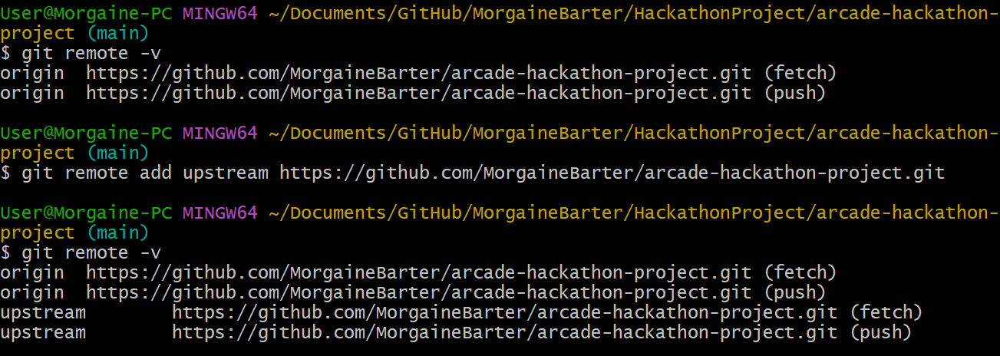

#### Fetch Pull Request changes

Firstly ensure you have the correct upstream branches, which should be the Team Leader's fork.

To fetch the changes in a pull request to your local clone, open the PR in the GitHub Web UI to check the ID number of the PR, then run one of the following commands:

- For reviewing a pull request in the same repository, you can use `origin` as seen below:

    ```shell
    git fetch origin pull/<PR#>/head:<PR-branch-name>
    ```

- For reviewing a pull request in an upstream repository, from your forked repo:

    ```shell
    git fetch upstream pull/<PR#>/head:<PR-branch-name>
    ```

Replace `<PR#>` with the ID number of the PR, and replace `<PR-branch-name>` with the name you want to use for the new branch containing the PR changes.

For example, here are the commands used to review a PR in the thoth-tech repo:

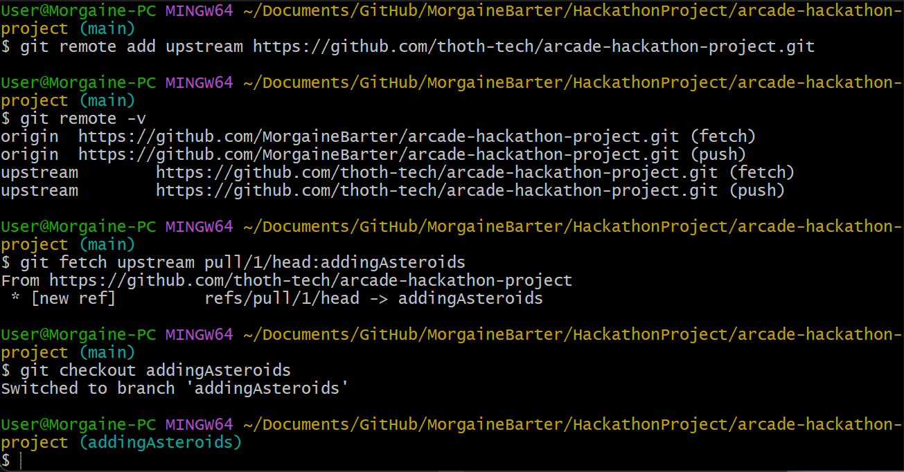

---

## Make PR to thoth-tech

Once your team has finished making changes, and has finalised all team member contributions into the branch for the pull request, the Team Leader will need to make a PR to the thoth-tech repo.

### How to Create a Pull Request

1. **Navigate to the GitHub Repository:** Go to the GitHub page of the project you’ve contributed to. (Leaders forked repository)

2. **Open Pull Request:** There are multiple ways to do this.

    Firstly, change the branch to the one to be used for the PR using the drop-down list of branches. Then follow the steps in one of the options below:

    1. Click on the “Pull Requests” tab near the top of the repository’s GitHub page, then click the “New Pull Request” button.
    2. Click on the "**Contribute**" button (shown with yellow arrow in image below), then click the "Open pull request" button.
    3. Click "Compare and pull request" button (shown with red arrow in image below) if it shows up.

    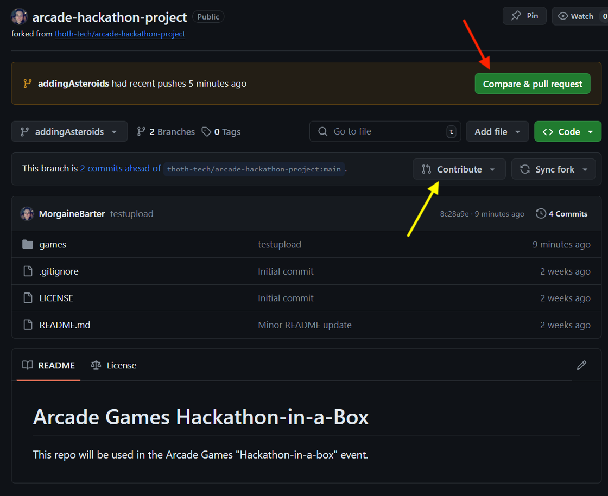

3. **Choose the Base and Compare:** Select the base branch and the compare branch (under "Comparing changes"). You can see an example of this at the top of the image under step 5.

    :::tip[Which is which?]
    - The **base** branch is the one you want your changes pulled into.
    - The **compare** branch is the branch containing your changes.
    :::

4. **Review Your Changes:** GitHub will display the differences between your branch and the base branch. Review these changes to ensure accuracy. You can see an example of this at the bottom of the image in the step below.

5. **Add Pull Request Details:** Give your pull request a title and a description that explains the changes you’ve made, why you’ve made them, and any other relevant details.

    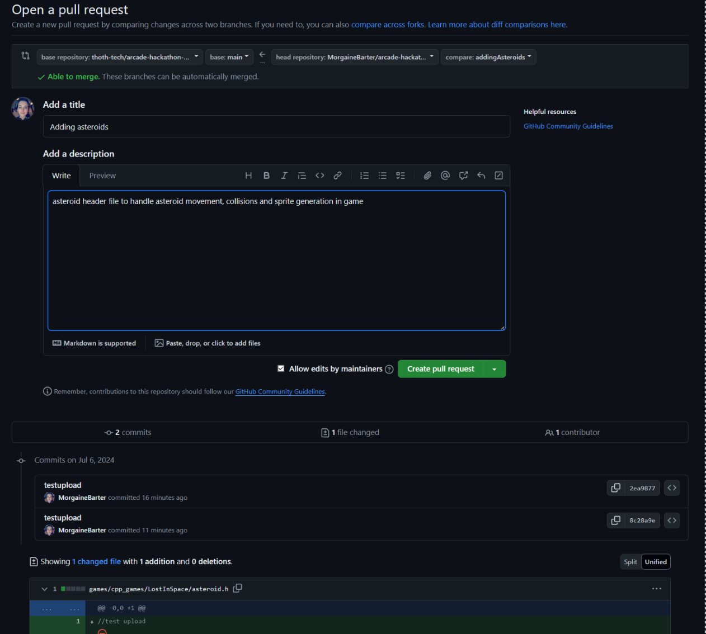

6. **Create Pull Request:** After reviewing, click “Create Pull Request.”

7. **Await Review:** Once your pull request is submitted, project maintainers will review it. They may approve, request changes, or reject the pull request.

Our support staff will review changes made to projects, test them and install them on one of the Arcade machines at Deakin University.

---
