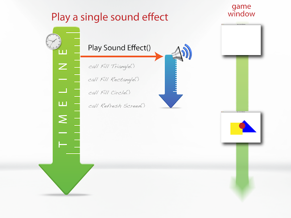
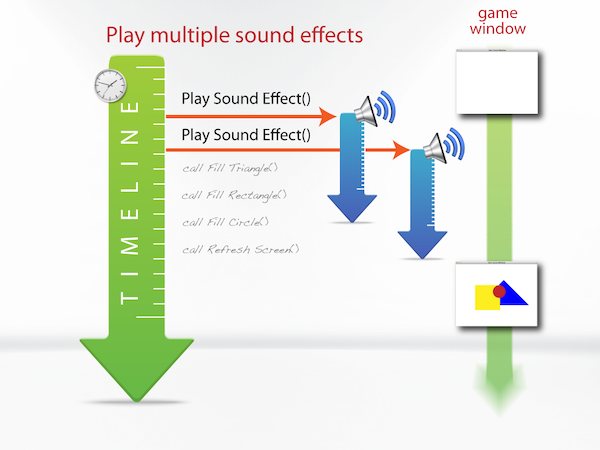
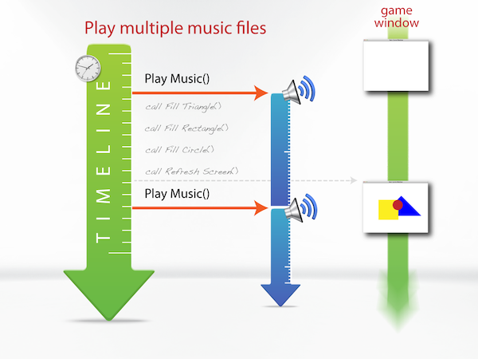

import { Tabs, TabItem } from "@astrojs/starlight/components";

**{frontmatter.description}**  
Written by: {frontmatter.author}  
_Last updated: {frontmatter.lastupdated}_

---

This article provides background information you will need to get started with audio in SplashKit. This will introduce you to the file formats supported, along with general information about loading and playing music and sound effects.

Music and sound effects make a huge difference to game play experience. SplashKit makes it easy for you to have both music and sound effects in your games.

Before you get started with audio you will need to get some sound files that you want played in your game. The following table outlines the file formats that SplashKit supports. A tick in the sound effect column means that the format can be used for sound effects, similarly a tick in the music column means it can be used for music.

## Supported Audio Formats

The following table shows the supported audio formats for Sound Effect and Music:

| Format | Sound Effect | Music |
| ------ | ------------ | ----- |
| WAV    | ✔            |       |
| OGG    | ✔            | ✔     |
| MP3    |              | ✔     |
| MIDI   |              | ✔     |
| FLAC   | ✔            | ✔     |
| MOD    | ✔            | ✔     |

---

## Playing a Sound Effect

To play a sound effect you fist must load the audio file into your program. Sounds are stored in the **Resources/sounds** folder, and can be loaded using [Load Sound Effect](/api/audio/#load-sound-effect). You only need to load the sound effect once, and you can then access it using the name you assigned to the sound effect and [Sound Effect Named](/api/audio/#sound-effect-named), or by using the name of the sound effect in other calls.

Once it is loaded, you can use the name you can play the sound effect using [Play Sound Effect](/api/audio/#play-sound-effect). By default the sound effect will play once, at full volume. Additional parameters can be passed along with the sound effect to change the number of times the sound plays, and the volume.

Sounds play until the file ends or until it is manually stopped in your code using [Stop Sound Effect](/api/audio/#stop-sound-effect) or [Stop Music](/api/audio/#stop-music). The sound effect or music will play in the background while your program's code continues to run.



## Sound Effects vs Music?

Sound effects should be used for short sounds you play in response to some action or event in your program. These will be loaded into memory before they are played.

Music can be longer, and is usually played constantly while the program runs. Unlike sound effects, music is not loaded in its entirety before it starts playing. Instead the music data is read as it is played.

## Mixing Sound Effects

Multiple sounds can be played at one time using SplashKit, these sounds can be mixed using channels. Each channel can only play one sound effect at a time. So every call to [Play Sound Effect](/api/audio/#play-sound-effect) will use a channel that is not currently playing any sound. When there are no free channels SplashKit will stop a channel from playing it's current sound effect and play the new sound effect from the start.



## Music

Music is different from sound effects in that music has it's own reserved channel that only music can be played on. Music, like sound effects will continue to be played until either the music is finished or [Stop Music](/api/audio/#stop-music) is called.

Since Music has one channel to itself, if you call [Play Music](/api/audio/#play-music) when Music is already playing the currently playing Music will be stopped and the new Music will start playing from the beginning.



## Example Code

The following program code demonstrates the use of various sound effect features.

:::note
To test this code below, you can download these [**Resources**](/resources/guides/audio/basics/BasicSoundEffectResources.zip).

This includes sample sounds, and a font ("arial").
:::

<Tabs syncKey="code-language">

<TabItem label="C++">

```cpp
#include "splashkit.h"

int main()
{
    sound_effect snd_effect;

    open_window("Sound Demo", 640, 320);

    snd_effect = load_sound_effect("chipmunk", "chipmunk.ogg");

    load_sound_effect("bells", "bells.ogg");
    load_sound_effect("camera", "camera.ogg");
    load_sound_effect("boing", "comedy_boing.ogg");
    load_sound_effect("dinosaur", "dinosaur.ogg");
    load_sound_effect("bark", "dog_bark.ogg");

    load_font("arial", "arial.ttf");

    do
    {
        process_events();

        if (key_down(RIGHT_CTRL_KEY) || key_down(LEFT_CTRL_KEY))
        {
            if (key_typed(NUM_1_KEY))
                snd_effect = sound_effect_named("chipmunk");
            if (key_typed(NUM_2_KEY))
                snd_effect = sound_effect_named("bells");
            if (key_typed(NUM_3_KEY))
                snd_effect = sound_effect_named("camera");
            if (key_typed(NUM_4_KEY))
                snd_effect = sound_effect_named("boing");
            if (key_typed(NUM_5_KEY))
                snd_effect = sound_effect_named("dinosaur");
            if (key_typed(NUM_6_KEY))
                snd_effect = sound_effect_named("bark");
        }
        else
        {
            if (key_typed(NUM_1_KEY))
                play_sound_effect(snd_effect);
            if (key_typed(NUM_2_KEY))
                play_sound_effect(snd_effect, 0.5f);
            if (key_typed(NUM_3_KEY))
                play_sound_effect(snd_effect, 3, 0.25);
            if (key_typed(NUM_4_KEY))
                play_sound_effect(snd_effect, -1, 0.1);
            if (key_typed(NUM_5_KEY))
            {
                if (sound_effect_playing(snd_effect))
                    stop_sound_effect(snd_effect);
            }
        }

        // Drawing Keyboard Controls information in window (focus on sound effect code above)

        // SplashKit Orange background
        clear_screen(rgb_color(245, 166, 35));

        // Draw heading
        set_font_style("arial", BOLD_FONT);
        draw_text("Keyboard Controls", COLOR_BLACK, "arial", 20, (screen_width() - text_width("Keyboard Controls", "arial", 20)) / 2, 10);
        set_font_style("arial", NORMAL_FONT);

        // Draw left box with SplashKit Cyan/Teal bo
        fill_rectangle(rgb_color(5, 172, 193), 10, 45, screen_width() / 2 + 10, screen_height() - 85);
        fill_rectangle(COLOR_PAPAYA_WHIP, 20, 55, screen_width() / 2 - 10, screen_height() - 105);
        draw_line(COLOR_LIGHT_GRAY, 30, 105, screen_width() / 2, 105);

        // Playing sound effect controls text
        draw_text("Playing Sound Controls", COLOR_RED, "arial", 18, 80, 70);
        draw_text("[1]    Play Sound At Full Volume", COLOR_BLUE, "arial", 14, 30, 120);
        draw_text("[2]    Play Sound At 50% Volume", COLOR_BLUE, "arial", 14, 30, 150);
        draw_text("[3]    Play Sound 3 Times At 25% Volume", COLOR_BLUE, "arial", 14, 30, 180);
        draw_text("[4]    Play Sound Continuously at 10% Volume", COLOR_BLUE, "arial", 14, 30, 210);
        draw_text("[5]    Stop Playing Current Sound", COLOR_BLUE, "arial", 14, 30, 240);

        // Exit text
        set_font_style("arial", ITALIC_FONT);
        draw_text("Press [Escape] or [Q] to quit", COLOR_BLACK, "arial", 16, 65, 290);
        set_font_style("arial", NORMAL_FONT);

        // Draw left box with SplashKit Cyan/Teal bo
        fill_rectangle(rgb_color(5, 172, 193), screen_width() / 2 + 30, 45, screen_width() / 2 - 40, screen_height() - 55);
        fill_rectangle(COLOR_PAPAYA_WHIP, screen_width() / 2 + 40, 55, screen_width() / 2 - 60, screen_height() - 75);
        draw_line(COLOR_LIGHT_GRAY, screen_width() / 2 + 50, 105, screen_width() - 30, 105);

        // Switching to sound effect controls text
        draw_text("Switching Sound Controls", COLOR_ORANGE_RED, "arial", 18, screen_width() / 2 + 65, 70);
        draw_text("[CTRL + 1]    Chipmunk Sound", COLOR_DARK_GREEN, "arial", 14, screen_width() / 2 + 50, 120);
        draw_text("[CTRL + 2]    Bells Sound", COLOR_DARK_GREEN, "arial", 14, screen_width() / 2 + 50, 150);
        draw_text("[CTRL + 3]    Camera Sound", COLOR_DARK_GREEN, "arial", 14, screen_width() / 2 + 50, 180);
        draw_text("[CTRL + 4]    Boing Sound", COLOR_DARK_GREEN, "arial", 14, screen_width() / 2 + 50, 210);
        draw_text("[CTRL + 5]    Dinasaur Sound", COLOR_DARK_GREEN, "arial", 14, screen_width() / 2 + 50, 240);
        draw_text("[CTRL + 6]    Bark Sound", COLOR_DARK_GREEN, "arial", 14, screen_width() / 2 + 50, 270);

        refresh_screen(60);
    } while (!(quit_requested() || key_typed(ESCAPE_KEY) || key_typed(Q_KEY)));

    close_all_windows();
    return 0;
}
```

</TabItem>
<TabItem label="C#">

```csharp
using SplashKitSDK;
using static SplashKitSDK.SplashKit;

SoundEffect sndEffect;

OpenWindow("Sound Demo", 640, 320);

sndEffect = LoadSoundEffect("chipmunk", "chipmunk.ogg");

LoadSoundEffect("bells", "bells.ogg");
LoadSoundEffect("camera", "camera.ogg");
LoadSoundEffect("boing", "comedy_boing.ogg");
LoadSoundEffect("dinosaur", "dinosaur.ogg");
LoadSoundEffect("bark", "dog_bark.ogg");

LoadFont("arial", "arial.ttf");

do
{
    ProcessEvents();

    if (KeyDown(KeyCode.RightCtrlKey) || KeyDown(KeyCode.LeftCtrlKey))
    {
        if (KeyTyped(KeyCode.Num1Key))
            sndEffect = SoundEffectNamed("chipmunk");
        if (KeyTyped(KeyCode.Num2Key))
            sndEffect = SoundEffectNamed("bells");
        if (KeyTyped(KeyCode.Num3Key))
            sndEffect = SoundEffectNamed("camera");
        if (KeyTyped(KeyCode.Num4Key))
            sndEffect = SoundEffectNamed("boing");
        if (KeyTyped(KeyCode.Num5Key))
            sndEffect = SoundEffectNamed("dinosaur");
        if (KeyTyped(KeyCode.Num6Key))
            sndEffect = SoundEffectNamed("bark");
    }
    else
    {
        if (KeyTyped(KeyCode.Num1Key))
            sndEffect.Play();
        if (KeyTyped(KeyCode.Num2Key))
            sndEffect.Play(0.5f);
        if (KeyTyped(KeyCode.Num3Key))
            sndEffect.Play(3, 0.25f);
        if (KeyTyped(KeyCode.Num4Key))
            sndEffect.Play(-1, 0.1f);
        if (KeyTyped(KeyCode.Num5Key))
        {
            if (sndEffect.IsPlaying)
                sndEffect.Stop();
        }
    }

    // Drawing Keyboard Controls information in window (focus on sound effect code above)

    // SplashKit Orange background
    ClearScreen(RGBColor(245, 166, 35));

    // Draw heading
    SetFontStyle("arial", FontStyle.BoldFont);
    DrawText("Keyboard Controls", Color.Black, "arial", 20, (ScreenWidth() - TextWidth("Keyboard Controls", "arial", 20)) / 2, 10);
    SetFontStyle("arial", FontStyle.NormalFont);

    // Draw left box with SplashKit Cyan/Teal bo
    FillRectangle(RGBColor(5, 172, 193), 10, 45, ScreenWidth() / 2 + 10, ScreenHeight() - 85);
    FillRectangle(Color.PapayaWhip, 20, 55, ScreenWidth() / 2 - 10, ScreenHeight() - 105);
    DrawLine(Color.LightGray, 30, 105, ScreenWidth() / 2, 105);

    // Playing sound effect controls text
    DrawText("Playing Sound Controls", Color.Red, "arial", 18, 80, 70);
    DrawText("[1]    Play Sound At Full Volume", Color.Blue, "arial", 14, 30, 120);
    DrawText("[2]    Play Sound At 50% Volume", Color.Blue, "arial", 14, 30, 150);
    DrawText("[3]    Play Sound 3 Times At 25% Volume", Color.Blue, "arial", 14, 30, 180);
    DrawText("[4]    Play Sound Continuously at 10% Volume", Color.Blue, "arial", 14, 30, 210);
    DrawText("[5]    Stop Playing Current Sound", Color.Blue, "arial", 14, 30, 240);

    // Exit text
    SetFontStyle("arial", FontStyle.ItalicFont);
    DrawText("Press [Escape] or [Q] to quit", Color.Black, "arial", 16, 65, 290);
    SetFontStyle("arial", FontStyle.NormalFont);

    // Draw left box with SplashKit Cyan/Teal bo
    FillRectangle(RGBColor(5, 172, 193), ScreenWidth() / 2 + 30, 45, ScreenWidth() / 2 - 40, ScreenHeight() - 55);
    FillRectangle(Color.PapayaWhip, ScreenWidth() / 2 + 40, 55, ScreenWidth() / 2 - 60, ScreenHeight() - 75);
    DrawLine(Color.LightGray, ScreenWidth() / 2 + 50, 105, ScreenWidth() - 30, 105);

    // Switching to sound effect controls text
    DrawText("Switching Sound Controls", Color.OrangeRed, "arial", 18, ScreenWidth() / 2 + 65, 70);
    DrawText("[CTRL + 1]    Chipmunk Sound", Color.DarkGreen, "arial", 14, ScreenWidth() / 2 + 50, 120);
    DrawText("[CTRL + 2]    Bells Sound", Color.DarkGreen, "arial", 14, ScreenWidth() / 2 + 50, 150);
    DrawText("[CTRL + 3]    Camera Sound", Color.DarkGreen, "arial", 14, ScreenWidth() / 2 + 50, 180);
    DrawText("[CTRL + 4]    Boing Sound", Color.DarkGreen, "arial", 14, ScreenWidth() / 2 + 50, 210);
    DrawText("[CTRL + 5]    Dinasaur Sound", Color.DarkGreen, "arial", 14, ScreenWidth() / 2 + 50, 240);
    DrawText("[CTRL + 6]    Bark Sound", Color.DarkGreen, "arial", 14, ScreenWidth() / 2 + 50, 270);

    RefreshScreen(60);
} while (!(QuitRequested() || KeyTyped(KeyCode.EscapeKey) || KeyTyped(KeyCode.QKey)));

CloseAllWindows();
```

</TabItem>
<TabItem label="Python">

```python
from splashkit import *

open_window("Sound, Demo", 640, 320)

snd_effect = load_sound_effect("chipmunk", "chipmunk.ogg")

load_sound_effect("bells", "bells.ogg")
load_sound_effect("camera", "camera.ogg")
load_sound_effect("boing", "comedy_boing.ogg")
load_sound_effect("dinosaur", "dinosaur.ogg")
load_sound_effect("bark", "dog_bark.ogg")

load_font("arial", "arial.ttf")

while not (quit_requested() or key_typed(KeyCode.escape_key or key_typed(KeyCode.q_key))):
    process_events()
    
    if key_down(KeyCode.right_ctrl_key) or key_down(KeyCode.left_ctrl_key):
        if key_typed(KeyCode.num_1_key):
            snd_effect = sound_effect_named("chipmunk")
        if key_typed(KeyCode.num_2_key):
            snd_effect = sound_effect_named("bells")
        if key_typed(KeyCode.num_3_key):
            snd_effect = sound_effect_named("camera")
        if key_typed(KeyCode.num_4_key):
            snd_effect = sound_effect_named("boing")
        if key_typed(KeyCode.num_5_key):
            snd_effect = sound_effect_named("dinosaur")
        if key_typed(KeyCode.num_6_key):
            snd_effect = sound_effect_named("bark")
    else:
        if key_typed(KeyCode.num_1_key):
            play_sound_effect(snd_effect)
        if key_typed(KeyCode.num_2_key):
            play_sound_effect_with_volume(snd_effect, 0.5)
        if key_typed(KeyCode.num_3_key):
            play_sound_effect_with_times_and_volume(snd_effect, 3, 0.25)
        if key_typed(KeyCode.num_4_key):
            play_sound_effect_with_times_and_volume(snd_effect, -1, 0.1)
        if key_typed(KeyCode.num_5_key):
            if sound_effect_playing(snd_effect):
                stop_sound_effect(snd_effect)


    # Drawing Keyboard Controls information in window (focus on sound effect code above)

    # SplashKit Orange background
    clear_screen(rgb_color(245, 166, 35))

    # Draw heading
    set_font_style_name_as_string("arial", FontStyle.bold_font)
    draw_text_font_as_string("Keyboard Controls", color_black(), "arial", 20, (screen_width() - text_width_font_named("Keyboard Controls", "arial", 20)) / 2, 10)
    set_font_style_name_as_string("arial", FontStyle.normal_font)

    # Draw left box with SplashKit Cyan/Teal bo
    fill_rectangle(rgb_color(5, 172, 193), 10, 45, screen_width() / 2 + 10, screen_height() - 85)
    fill_rectangle(color_papaya_whip(), 20, 55, screen_width() / 2 - 10, screen_height() - 105)
    draw_line(color_light_gray(), 30, 105, screen_width() / 2, 105)

    # Playing sound effect controls text
    draw_text_font_as_string("Playing Sound Controls", color_red(), "arial", 18, 80, 70)
    draw_text_font_as_string("[1]    Play Sound At Full Volume", color_blue(), "arial", 14, 30, 120)
    draw_text_font_as_string("[2]    Play Sound At 50% Volume", color_blue(), "arial", 14, 30, 150)
    draw_text_font_as_string("[3]    Play Sound 3 Times At 25% Volume", color_blue(), "arial", 14, 30, 180)
    draw_text_font_as_string("[4]    Play Sound Continuously at 10% Volume", color_blue(), "arial", 14, 30, 210)
    draw_text_font_as_string("[5]    Stop Playing Current Sound", color_blue(), "arial", 14, 30, 240)

    # Exit text
    set_font_style_name_as_string("arial", FontStyle.italic_font)
    draw_text_font_as_string("Press [Escape] or [Q] to quit", color_black(), "arial", 16, 65, 290)
    set_font_style_name_as_string("arial", FontStyle.normal_font)

    # Draw left box with SplashKit Cyan/Teal bo
    fill_rectangle(rgb_color(5, 172, 193), screen_width() / 2 + 30, 45, screen_width() / 2 - 40, screen_height() - 55)
    fill_rectangle(color_papaya_whip(), screen_width() / 2 + 40, 55, screen_width() / 2 - 60, screen_height() - 75)
    draw_line(color_light_gray(), screen_width() / 2 + 50, 105, screen_width() - 30, 105)

    # Switching to sound effect controls text
    draw_text_font_as_string("Switching Sound Controls", color_orange_red(), "arial", 18, screen_width() / 2 + 65, 70)
    draw_text_font_as_string("[CTRL + 1]    Chipmunk Sound", color_dark_green(), "arial", 14, screen_width() / 2 + 50, 120)
    draw_text_font_as_string("[CTRL + 2]    Bells Sound", color_dark_green(), "arial", 14, screen_width() / 2 + 50, 150)
    draw_text_font_as_string("[CTRL + 3]    Camera Sound", color_dark_green(), "arial", 14, screen_width() / 2 + 50, 180)
    draw_text_font_as_string("[CTRL + 4]    Boing Sound", color_dark_green(), "arial", 14, screen_width() / 2 + 50, 210)
    draw_text_font_as_string("[CTRL + 5]    Dinasaur Sound", color_dark_green(), "arial", 14, screen_width() / 2 + 50, 240)
    draw_text_font_as_string("[CTRL + 6]    Bark Sound", color_dark_green(), "arial", 14, screen_width() / 2 + 50, 270)

    refresh_screen_with_target_fps(60)

close_all_windows()
```

</TabItem>
</Tabs>
