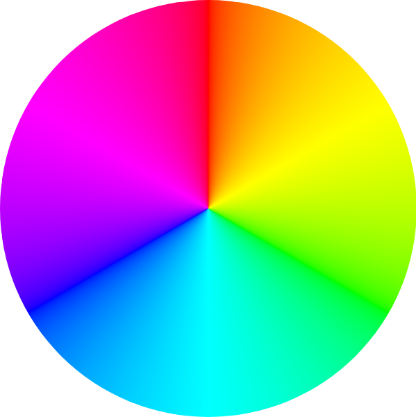

**{frontmatter.description}**  
Written by: {frontmatter.author}  
_Last updated: {frontmatter.lastupdated}_

---

import ColorGenerator from "/src/components/ColorGenerator.astro";
import ColorPalette from "/src/components/ColorPalette.astro";

## SplashKit Colours

Colours are at the heart of creating engaging and visually appealing applications, and SplashKit makes working with them seamless. By leveraging industry-standard colour models, SplashKit enables you to work with colours in a way that feels natural and intuitive.

### Colour RGB(A)

The RGB(A) model defines colours based on their Red, Green, and Blue components, with an optional Alpha channel to control transparency. Each component ranges from 0 to 255, creating a vast palette of possible colours. Whether you're designing vivid visuals or subtle gradients, RGB(A) is a straightforward way to define and manipulate colours.

### Colour HSB

On the other hand, the HSB (Hue, Saturation, Brightness) model offers a more intuitive approach to colour creation. Hue determines the base colour, measured in degrees around a colour wheel (0° for red, 120° for green, 240° for blue, and so on).

Saturation adjusts the intensity of the colour, from a dull gray to a vibrant hue, while Brightness defines how light or dark the color appears. This model is particularly useful for applications where fine-tuning the emotional or thematic tone of visuals is key.

The tools below will help you to experiment with both models to find your perfect colour. You can also explore the full range of SplashKit colours that have ready-to-use functions for C++, C#, or Python.

## Colour Generator

The Colour Generator tool is designed to help you visualise and generate precise colour configurations in both RGB(A) and HSB formats for your SplashKit projects. Whether you’re tweaking Red, Green, and Blue values or adjusting Hue, Saturation, and Brightness, this tool provides immediate visual feedback through a colour preview box.

<ColorGenerator />

## Colour Palette

SplashKit streamlines colour manipulation in graphical applications by providing you with an intuitive and efficient approach to working with colours. This interactive colour palette displays all the available SplashKit colours, allowing you to visually explore and select your desired shade. Once a colour is chosen, the corresponding SplashKit functions in C++, C#, and Python will be shown, making it simple to integrate precise colour choices into your project.

<ColorPalette />
