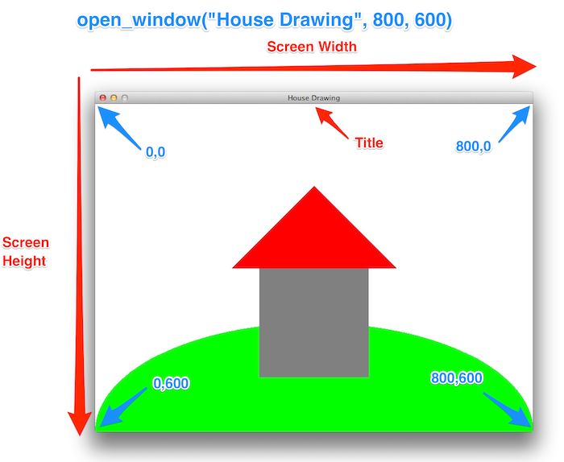
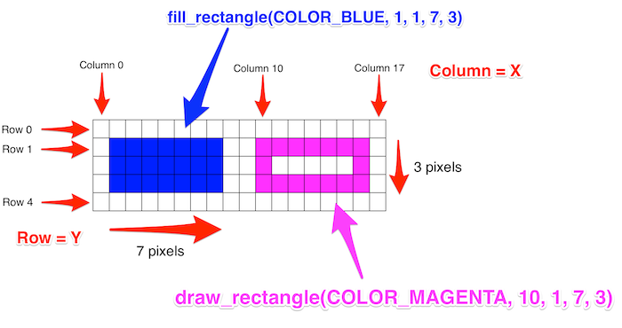
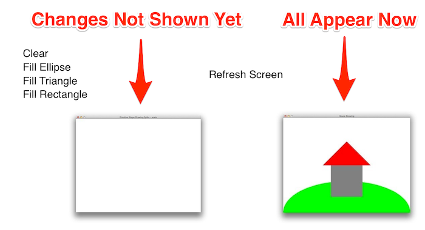

import { Tabs, TabItem } from "@astrojs/starlight/components";

**{frontmatter.description}**  
Written by: {frontmatter.author}  
_Last updated: {frontmatter.lastupdated}_

---

In this article you will see how to get started with SplashKit with some simple drawing operations. Once you have this working you will be able to start exploring the different features you can work with.

## Step 1: Creating a Window

In SplashKit you can open a Window to draw on and interact with. To open the window you need to call [Open Window](/api/windows/#open-window). This procedure requires you to pass it the window’s title, width and height. For example `open_window("House Drawing", 800, 600);` will open a window that is 800 pixels wide and 600 pixels high with the title "House Drawing", as shown in the following image. Please note that the house and hill are drawn by additional code. You must close the window when you are done using it, even if your program is otherwise finished. If you do not, the window will not be freed from memory when the program exits. You can close a window by calling a [close window](/api/windows/#close-window) function E.G. close_all_windows().



Lets get this started by opening a new Window, and using SplashKit to delay us for a few seconds. Give the following code a try:

<Tabs syncKey="code-language">
<TabItem label="C++">

```cpp
#include "splashkit.h"

int main()
{
    open_window("Window Title... to change", 800, 600);
    delay(5000);
    close_all_windows();
    return 0;
}
```

</TabItem>
<TabItem label="C#">

<Tabs syncKey="csharp-style">
<TabItem label="Top-level Statements">

```csharp
using static SplashKitSDK.SplashKit;

OpenWindow("Window Title... to change ", 800, 600);
Delay(5000);
CloseAllWindows();
```

</TabItem>
<TabItem label="Object-Oriented">

```csharp
using SplashKitSDK;

namespace DrawingUsingProcedures
{
    public class Program
    {
        public static void Main()
        {
            Window window = new Window("Shapes by ...", 800, 600);
            SplashKit.Delay(5000);
            SplashKit.CloseAllWindows();
        }
    }
}
```

</TabItem>
</Tabs>

</TabItem>
<TabItem label="Python">

```python
from splashkit import *

open_window("Window Title... to change", 800, 600)
delay(5000)
close_all_windows()
```

</TabItem>
</Tabs>

Compile and run the program from the terminal.

<Tabs syncKey="code-language">
<TabItem label="C++">

```shell
clang++ program.cpp -l SplashKit -o ShapeDrawing
./ShapeDrawing
```

</TabItem>
<TabItem label="C#">

```shell
dotnet run
```

</TabItem>
<TabItem label="Python">

```shell
skm python3 program.cpp
```

</TabItem>
</Tabs>

You should see the window open, and the program delay for 5 seconds.

Now change the window title to "Shapes by " and your name. For example, `"Shapes by Andrew"`.

Switch back to the terminal to compile and run your program.

## Step 2: Drawing to a Window

Adjust the code so that it now draws the house shown above.

<Tabs syncKey="code-language">
<TabItem label="C++">

```cpp
#include "splashkit.h"

int main()
{
    open_window("Shapes by ...", 800, 600);

    clear_screen(COLOR_WHITE);
    fill_ellipse(COLOR_BRIGHT_GREEN, 0, 400, 800, 400);
    fill_rectangle(COLOR_GRAY, 300, 300, 200, 200);
    fill_triangle(COLOR_RED, 250, 300, 400, 150, 550, 300);
    refresh_screen();

    delay(5000);

    close_all_windows();

    return 0;
}
```

</TabItem>
<TabItem label="C#">

<Tabs syncKey="csharp-style">
<TabItem label="Top-level Statements">

```csharp
using static SplashKitSDK.SplashKit;

OpenWindow("Shapes by ...", 800, 600);

ClearScreen(ColorWhite());
FillEllipse(ColorBrightGreen(), 0, 400, 800, 400);
FillRectangle(ColorGray(), 300, 300, 200, 200);
FillTriangle(ColorRed(), 250, 300, 400, 150, 550, 300);
RefreshScreen();

Delay(5000);

CloseAllWindows();
```

</TabItem>
<TabItem label="Object-Oriented">

```csharp
using SplashKitSDK;

namespace DrawingUsingProcedures
{
    public class Program
    {
        public static void Main()
        {
            Window window = new Window("Shapes by ...", 800, 600);

            window.Clear(Color.White);
            window.FillEllipse(Color.BrightGreen, 0, 400, 800, 400);
            window.FillRectangle(Color.Gray, 300, 300, 200, 200);
            window.FillTriangle(Color.Red, 250, 300, 400, 150, 550, 300);
            window.Refresh();

            SplashKit.Delay(5000);

            SplashKit.CloseAllWindows();
        }
    }
}
```

</TabItem>
</Tabs>

</TabItem>
<TabItem label="Python">

```python
from splashkit import *

open_window("Shapes by ...", 800, 600)

clear_screen(color_white())
fill_ellipse(color_bright_green(), 0, 400, 800, 400)
fill_rectangle(color_gray(), 300, 300, 200, 200)
fill_triangle(color_red(), 250, 300, 400, 150, 550, 300)
refresh_screen()

delay(5000)

close_all_windows()
```

</TabItem>
</Tabs>

Compile and run the program again:

<Tabs syncKey="code-language">
<TabItem label="C++">

```shell
clang++ program.cpp -l SplashKit -o ShapeDrawing
./ShapeDrawing
```

</TabItem>
<TabItem label="C#">

```shell
dotnet run
```

</TabItem>
<TabItem label="Python">

```shell
skm python3 program.cpp
```

</TabItem>
</Tabs>

Make sure it all looks correct before moving on.

## Pixels and Coordinates

The images you see on your computers screen are made up of dots called pixels: picture elements. The screen has many pixels arranged into a grid (columns and rows), with each pixel having its own color and unique location (a combination of an `x` and `y` value, where `x` indicates the column and `y` the row).

The following image shows an example of two rectangles (one filled, one outlined). The top left corner of the screen is at row (x) 0 and column (y) 0, and these numbers increase as you go to the right and down the screen. The call to `fill_rectangle` and `draw_rectangle` take in a color, a `x` value, a `y` value, and a `width` and a `height`. So the blue rectangle is filled at x 1, y 1, is 7 pixels wide, and 3 pixels high.



Positions on the screen are determined using two values, one for x and the other for y. The x value determines the number of pixels from the left side of the screen. The y value determines the number of pixels from the top of the screen.

For example: the magenta rectangle is drawn at 10, 1. This means its x value is 10 and its y is 1. This rectangle is drawn 10 pixels from the left of the screen, and its 1 pixel from the top.

## Drawing Procedures

To draw a shape with SplashKit you need to call one of the shape drawing procedures. All of the shape drawing operations in SplashKit take a number of parameter values:

* The **color** to draw the shape.
    SplashKit has a number of colors you can use. See the list of colors starting with [Alice Blue](/api/color#color-alice-blue). For example, in C++ the colors are written as `COLOR_WHITE`, `COLOR_GREEN`, `COLOR_BLUE`, `COLOR_BLACK`, `COLOR_RED`, and many others. VS Code should show you a list once you type `COLOR_` then hit ctrl+space. Though this only works if you opened the project folder.
* An **x** value, representing the x position of the shape (column).

    This is a number of pixels from the left edge of the screen. Larger values are further to the right.
* A **y** value, representing the y position of the shape (row).

    This is a number of pixels from the top edge of the screen. Larger values are further down the screen.
* and other values for the size of the shape, these will differ depending on the kind of shape being drawn (e.g., rectangle has a width and height, as does ellipse, circles would have a radius).

See the following for examples of what you can call:

* [Clear Screen](/api/graphics/#clear-screen)
* [Draw Circle](/api/graphics/#draw-circle)
* [Fill Circle](/api/graphics/#fill-circle)
* [Draw Rectangle](/api/graphics/#draw-rectangle)
* [Fill Rectangle](/api/graphics/#fill-rectangle)
* [Draw Triangle](/api/graphics/#draw-triangle)
* [Fill Triangle](/api/graphics/#fill-triangle)
* [Draw Ellipse](/api/graphics/#draw-ellipse)
* [Fill Ellipse](/api/graphics/#fill-ellipse)
* [Draw Line](/api/graphics/#draw-line)

## Autocomplete

You should be able to get Visual Studio Code to show you to list of parameters. Type the start of the procedure name then press `ctrl-space`. There are usually a couple of different ways to draw each shape, by pressing the up down arrows you should be able to explore this list. An example with C++ is shown below.


## Double Buffering

To draw a picture, like the house shown above, the computer executes the code to draw the individual shapes one at a time in the order they appear in the code (in **sequence**).  However, we dont want each element to appear individually, we just want the whole picture to appear at once, so in this case the whole house should show all at once. SplashKit uses a technique called **Double Buffering** to enable this. When double buffering, the computer first draws the shapes, then waits for a command to display the shapes to the user.  With SplashKit, the shapes are all shown together when you call the `refresh_screen` procedure. This is illustrated below.


