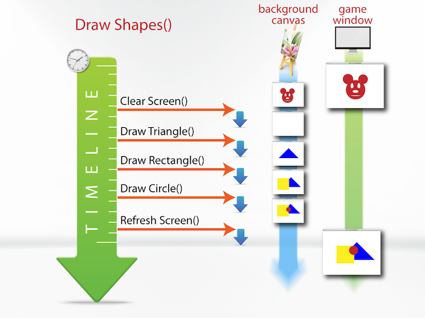
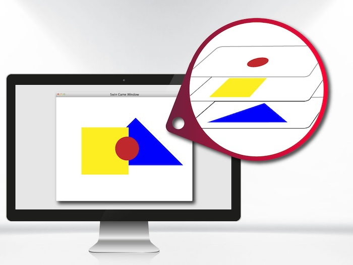

import { Tabs, TabItem } from "@astrojs/starlight/components";

**{frontmatter.description}**  
Written by: {frontmatter.author}  
_Last updated: {frontmatter.lastupdated}_

---

## Double Buffering

SplashKit uses a technique called Double Buffering to ensure you have control over how things appear on the screen. In this technique you draw to a background canvas and then call [Refresh Screen](/api/graphics/#refresh-screen) to make that canvas appear to the user.

This means you control when something appears on the screen which is important when coordinating a number of shapes, sprites, images or text.

The four images below execute the following pseudo code.

```plaintext
call Fill Triangle()
call Fill Rectangle()
call Fill Circle()
call Refresh Screen()
```



## The Painter Model

Drawing shapes, sprites or other devices into a window is similar to an artist painting on a canvas. Once a brush stroke has been applied, you cannot insert anything underneath it. To insert a shape, sprite, image or text you will need to clear the screen and redraw the items in to the order you need them to render. As discussed above, it is important to note that SplashKit executes the commands top down. However, on the game window they are rendered bottom up. Take a look at the images below and the pseudo code. They will give you a better understanding of the Painter Model.



So when drawing you need to keep two things in mind:

1. Anything you draw will not appear until you have refreshed the screen
2. Newer drawing operations will draw over anything that was already on the canvas

## Example Code

The following program code demonstrates the use of Refresh Screen after drawing shapes

<Tabs syncKey="code-language">

<TabItem label="C++">

```cpp
#include "splashkit.h"

int main()
{

  // Create canvas
  open_window("Refresh Screen", 800, 600);

  // Draw to background canvas
  clear_screen(COLOR_WHITE);
  fill_triangle(COLOR_BLUE, 300, 380, 760, 380, 530, 150);
  fill_rectangle(COLOR_YELLOW, 200, 150, 250, 250);
  fill_circle(COLOR_RED, 420, 300, 60);

  // Refresh screen to update game window with background canvas
  refresh_screen();
  delay(5000);
  close_all_windows();
  return 0;
}
```

</TabItem>
<TabItem label="C#">

<Tabs syncKey="csharp-style">
<TabItem label="Top-level Statements">

```csharp
using SplashKitSDK;
using static SplashKitSDK.SplashKit;

// Create canvas
OpenWindow("Refresh Screen", 800, 600);

// Draw to background canvas
ClearScreen(ColorWhite());
FillTriangle(ColorBlue(), 300, 380, 760, 380, 530, 150);
FillRectangle(ColorYellow(), 200, 150, 250, 250);
FillCircle(ColorRed(), 420, 300, 60);

// Refresh screen to update game window with background canvas
RefreshScreen();
Delay(5000);
CloseAllWindows();
```

</TabItem>
<TabItem label="Object-Oriented">

```csharp
using SplashKitSDK;

namespace RefreshScreen
{
  public class Program
  {
    public static void Main()
    {
      // Create canvas
      SplashKit.OpenWindow("Refresh Screen", 800, 600);

      // Draw to background canvas
      SplashKit.ClearScreen(Color.White);
      SplashKit.FillTriangle(Color.Blue, 300, 380, 760, 380, 530, 150);
      SplashKit.FillRectangle(Color.Yellow, 200, 150, 250, 250);
      SplashKit.FillCircle(Color.Red, 420, 300, 60);

      // Refresh screen to update game window with background canvas
      SplashKit.RefreshScreen();
      SplashKit.Delay(5000);
      SplashKit.CloseAllWindows();
    }
  }
}
```

</TabItem>
</Tabs>

</TabItem>
<TabItem label="Python">

```python
from splashkit import *

# Create canvas
open_window("Refresh Screen", 800, 600)

# Draw to background canvas
clear_screen(color_white())
fill_triangle(color_blue(), 300, 380, 760, 380, 530, 150)
fill_rectangle(color_yellow(), 200, 150, 250, 250)
fill_circle(color_red(), 420, 300, 60)

# Refresh screen to update game window with background canvas
refresh_screen()
delay(5000)
close_all_windows()

```

</TabItem>
</Tabs>
