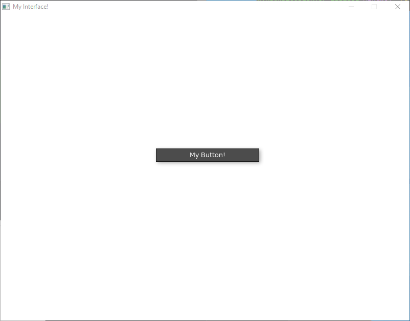

**{frontmatter.description}**
_Written by {frontmatter.author} on {frontmatter.lastupdated}_

import { Tabs, TabItem } from "@astrojs/starlight/components";

In this article we'll see how to create user interfaces in SplashKit. This'll let you add buttons, sliders, text boxes, and other elements to your games/programs. This is a great way to add interactivity, and also to visualise your variables!

## Part 1: Basic element creation

Let's see how we can create a simple button. We'll start in an empty project, and focus on just _showing_ the button. Then we'll make it interactive.

1. Let's begin by setting up our main function and opening up a window for us to place our interface elements on. See [Drawing using Procedures](/guides/getting-started/1-drawing-using-procedures/) if you aren't familiar with this part. In this example code, we've:
    1. opened up a window
    2. _cleared_ the screen white
    3. _refreshed_ the screen so we can see what's on it
    4. and finally _delayed_ for 5 seconds (so the program doesn't end immediately)

    Make sure to have a look at the code, and see where we'll put our interface code!

    <Tabs syncKey="code-language">
    <TabItem label="C++">

    ```cpp
    #include "splashkit.h"

    int main()
    {
        // open a window and clear it to white
        open_window("My Interface!", 800, 600);
        clear_screen(COLOR_WHITE);

        // ...we'll put our interface code here!...

        // refresh the screen, then wait 5 seconds
        refresh_screen();
        delay(5000);

        // close all open windows
        close_all_windows();

        return 0;
    }
    ```

    </TabItem>
    <TabItem label="C#">

    <Tabs syncKey="csharp-style">
    <TabItem label="Top-level Statements">

    ```csharp
    using static SplashKitSDK.SplashKit;

    // open a window and clear it to white
    OpenWindow("My Interface!", 800, 600);
    ClearScreen(ColorWhite());

    // ...we'll put our interface code here!...

    // refresh the screen, then wait for 5 seconds
    RefreshScreen();
    Delay(5000);

    // close all open windows
    CloseAllWindows();
    ```

    </TabItem>
    <TabItem label="Object-Oriented">

    ```csharp
    using SplashKitSDK;

    namespace CreatingUserInterfaces
    {
        public class Program
        {
            public static void Main()
            {
                // open a window and clear it to white
                Window window = new Window("My Interface!", 800, 600);
                window.Clear(Color.White);

                // ...we'll put our interface code here!...

                // refresh the screen, then wait for 5 seconds
                window.Refresh();
                SplashKit.Delay(5000);

                // close all open windows
                SplashKit.CloseAllWindows();
            }
        }
    }
    ```

    </TabItem>
    </Tabs>

    </TabItem>
    <TabItem label="Python">

    ```python
    from splashkit import *

    # open a window and clear it to white
    open_window("My Interface!", 800, 600)
    clear_screen_to_white()

    # ... we'll put our interface code here!...

    # refresh the screen, then wait 5 seconds
    refresh_screen()
    delay(5000)

    # close all open windows
    close_all_windows()
    ```

    </TabItem>
    </Tabs>

2. Now let's show a button! This can be done with the [Button](/api/interface/#button) function, which takes some text to show on the button, and also a position and size so it knows where to show up.

    For example in C++, `button("My Button!", rectangle_from(300, 260, 200, 24));` will show a button in the middle of the screen, with the label "My Button!".

3. We also need to _draw_ the interface - we can do this with [Draw Interface](/api/interface/#draw-interface)

    Making those changes, we get the following:

    <Tabs syncKey="code-language">
    <TabItem label="C++">

    ```cpp ins={9-13}
    #include "splashkit.h"

    int main()
    {
        // open a window and clear it to white
        open_window("My Interface!", 800, 600);
        clear_screen(COLOR_WHITE);

        // show button
        button("My Button!", rectangle_from(300, 260, 200, 24));

        // draw the interface!
        draw_interface();

        // refresh the screen, then wait 5 seconds
        refresh_screen();
        delay(5000);

        // close all open windows
        close_all_windows();

        return 0;
    }
    ```

    </TabItem>
    <TabItem label="C#">

    <Tabs syncKey="csharp-style">
    <TabItem label="Top-level Statements">

    ```csharp ins={7-11}
    using static SplashKitSDK.SplashKit;

    // open a window and clear it to white
    OpenWindow("My Interface!", 800, 600);
    ClearScreen(ColorWhite());

    // show button
    Button("My Button!", RectangleFrom(300, 260, 200, 24));

    // draw the interface!
    DrawInterface();

    // refresh the screen, then wait 5 seconds
    RefreshScreen();
    Delay(5000);

    // close all open windows
    CloseAllWindows();
    ```

    </TabItem>
    <TabItem label="Object-Oriented">

    ```csharp ins={13-17}
    using SplashKitSDK;

    namespace CreatingUserInterfaces
    {
        public class Program
        {
            public static void Main()
            {
                // open a window and clear it to white
                Window window = new Window("My Interface!", 800, 600);
                window.Clear(Color.White);

                // show button
                SplashKit.Button("My Button!", SplashKit.RectangleFrom(300, 260, 200, 24));

                // draw the interface!
                SplashKit.DrawInterface();

                // refresh the screen, then wait 5 seconds
                window.Refresh();
                SplashKit.Delay(5000);

                // close all open windows
                SplashKit.CloseAllWindows();
            }
        }
    }
    ```

    </TabItem>
    </Tabs>

    </TabItem>
    <TabItem label="Python">

    ```python ins={5-9}
    # open a window and clear it to white
    open_window("My Interface!", 800, 600)
    clear_screen_to_white()

    # show button
    button_at_position("My Button!", rectangle_from(300, 260, 200, 24))

    # draw the interface!
    draw_interface()

    # refresh the screen, then wait 5 seconds
    refresh_screen()
    delay(5000)

    # close all open windows
    close_all_windows()
    ```

    </TabItem>
    </Tabs>

    Which if you run, will show you this!

    

    But you'll notice that you can't click the button yet! Don't worry, to get this working  we just need to make sure we process the user's events (like clicks and keyboard presses).

    To do this, we need to add a loop - this will make our code run over and over again (rather than just waiting 5 seconds then exiting like it does now). Then inside that loop we'll check for user input!

    1. Start by deleting the [Delay](/api/utilities/#delay) (`delay(5000)`) line, since this was just so the window didn't vanish immediately.

    2. Then we can add a `while` loop, that loops as long as the user hasn't tried to close the window (using [Quit Requested](/api/input/#quit-requested)). This loop will need to enclose basically _everything_, from clearing the screen, down to refreshing it. That way we can keep updating the screen and drawing our button to it over and over!

    3. Then well add a statement _inside_ the `while` loop at the top, to check for user input using [Process Events](/api/input/#process-events). You may have also noticed a warning in the terminal about this:

   ```plaintext
   WARNING -> Interface function called before 'process_events' - make sure to call this first!
   ```

   SplashKit will try to give helpful messages when things aren't quite right, so make sure to pay attention to them!

    Putting this all together, we get this:

    <Tabs syncKey="code-language">
    <TabItem label="C++">

    ```cpp ins={8-10, 19}
    #include "splashkit.h"

    int main()
    {
        // open a window
        open_window("My Interface!", 800, 600);

        while (!quit_requested())
        {
            process_events();

            clear_screen(COLOR_WHITE);

            button("My Button!", rectangle_from(300, 260, 200, 24));

            draw_interface();

            refresh_screen();
        }

        // close all open windows
        close_all_windows();

        return 0;
    }
    ```

    </TabItem>
    <TabItem label="C#">

    <Tabs syncKey="csharp-style">
    <TabItem label="Top-level Statements">

    ```csharp ins={6-8, 17}
    using static SplashKitSDK.SplashKit;

    // open a window
    OpenWindow("My Interface!", 800, 600);

    while (!QuitRequested())
    {
        ProcessEvents();

        ClearScreen(ColorWhite());

        Button("My Button!", RectangleFrom(300, 260, 200, 24));

        DrawInterface();

        RefreshScreen();
    }

    // close all open windows
    CloseAllWindows();
    ```

    </TabItem>
    <TabItem label="Object-Oriented">

    ```csharp ins={12-14, 23}
    using SplashKitSDK;

    namespace CreatingUserInterfaces
    {
        public class Program
        {
            public static void Main()
            {
                // open a window
                Window window = new Window("My Interface!", 800, 600);

                while (!window.CloseRequested)
                {
                    SplashKit.ProcessEvents();

                    window.Clear(Color.White);

                    SplashKit.Button("My Button!", SplashKit.RectangleFrom(300, 260, 200, 24));

                    SplashKit.DrawInterface();

                    window.Refresh();
                }

                // close all open windows
                SplashKit.CloseAllWindows();
            }
        }
    }
    ```

    </TabItem>
    </Tabs>

    </TabItem>
    <TabItem label="Python">

    ```python ins={4-5}
    # open a window
    open_window("My Interface!", 800, 600)

    while (not quit_requested()):
        process_events()
        
        clear_screen_to_white()

        button_at_position("My Button!", rectangle_from(300, 260, 200, 24))

        draw_interface()

        refresh_screen()

    # close all open windows
    close_all_windows()
    ```

    </TabItem>
    </Tabs>

    And we can now click the button!
    

    You'll notice something interesting here - we put the call to [Button](/api/interface/#button) _inside_ the loop! This is because SplashKit uses what's called an 'immediate mode' UI paradigm.

    This means that when we make a [Button](/api/interface/#button), or any other element, it does its job of 'checking if its clicked' _once_, and then stops existing.
    This means we need to keep calling [Button](/api/interface/#button) every iteration of our loop, just like we call [Process Events](/api/input/#process-events) every iteration.

    This makes it really easy to make dynamic user interfaces, since you can change them every iteration! This might be different to other UI frameworks you have used or will use, so just make sure to keep this in mind.

    :::tip[SplashKit Interfaces]
    SplashKit uses an immediate mode GUI paradigm. This makes it easy to create dynamic interfaces!

    When using it, keep in mind that every UI element is ephemeral, and the interface is _reset_ after calls to [Draw Interface](/api/interface/#draw-interface) and [Process Events](/api/input/#process-events) -
    so make sure you create all elements _inside_ the main loop, and between those two functions.
    :::

## Part 2: Responding to events

Alright, now we can hover over and click the button! But it doesn't do anything yet - how do we check if it's been pressed?
All the UI elements in SplashKit _return_ their results. For instance, [Button](/api/interface/#button) returns a `boolean` - `true` if it has been clicked, and `false` if not!

:::tip[Retrieving results]
SplashKit element functions _return_ changes to them. Buttons return if they've been clicked or not, number sliders return their current value, and so on.
:::

Let's try it out:

1. We can put the call to [Button](/api/interface/#button) inside an if statement.
2. Then, in the if statement's body let's just make it print some text to the terminal, using [Write Line](/api/terminal/#write-line)

We should also give the button some more descriptive text inside it, like "Write To Terminal!"

<Tabs syncKey="code-language">
<TabItem label="C++">

```cpp ins="Write To Terminal!" ins="if (" ins=/24\\)\\)(\\))/ ins={2-4}
    if (button("Write To Terminal!", rectangle_from(300, 260, 200, 24)))
    {
        write_line("The button was clicked!");
    }
```

</TabItem>
<TabItem label="C#">

<Tabs syncKey="csharp-style">
<TabItem label="Top-level Statements">

```csharp ins="Write To Terminal!" ins="if (" ins=/24\\)\\)(\\))/ ins={2-4}
if (Button("Write To Terminal!", RectangleFrom(300, 260, 200, 24)))
{
    WriteLine("The button was clicked!");
}
```

</TabItem>
<TabItem label="Object-Oriented">

```csharp ins="Write To Terminal!" ins="if (" ins=/24\\)\\)(\\))/ ins={2-4}
            if (SplashKit.Button("Write To Terminal!", SplashKit.RectangleFrom(300, 260, 200, 24)))
            {
                SplashKit.WriteLine("The button was clicked!");
            }
```

</TabItem>
</Tabs>

</TabItem>
<TabItem label="Python">

```python ins="Write To Terminal!" ins="if " ins=":" ins={2}
if button_at_position("Write To Terminal!", rectangle_from(300, 260, 200, 24)):
    write_line("The button was clicked!")
```

</TabItem>
</Tabs>

Note how rather than _creating_ the button, and then checking if it's been clicked seperately, we've used a _single_ call to [Button](/api/interface/#button), that both shows the button _and_ returns whether its been clicked.

Now when we click on the button, our text gets printed in the terminal! You can of course put whatever code you want - for instance, the button could start your game, add an item to your stock program, or pop up extra info.


## Part 3: More elements

Now let's try out some more interesting elements - let's add a text box, so we can customize the message written to the terminal!

1. First let's start by adding a variable to store the user's text in - make sure to do this _outside_ the main loop, or else the user's text will be forgotten each iteration!

    <Tabs syncKey="code-language">
    <TabItem label="C++">

    ```cpp ins={3}
        open_window("My Interface!", 800, 600);

        string user_message = "Default message!";

        while (!quit_requested())
        {
            process_events();
    ```

    </TabItem>
    <TabItem label="C#">

    <Tabs syncKey="csharp-style">
    <TabItem label="Top-level Statements">

    ```csharp ins={3}
    OpenWindow("My Interface!", 800, 600);

    string userMessage = "Default message!";

    while (!QuitRequested())
    {
        ProcessEvents();
    ```

    </TabItem>
    <TabItem label="Object-Oriented">

    ```csharp ins={3}
                Window window = new Window("My Interface!", 800, 600);

                string userMessage = "Default message!";

                while (!window.CloseRequested)
                {
                    SplashKit.ProcessEvents();
    ```

    </TabItem>
    </Tabs>

    </TabItem>
    <TabItem label="Python">

    ```python ins={3}
    open_window("My Interface!", 800, 600)

    user_message = "Default message!"

    while (not quit_requested()):
        process_events()
    ```

    </TabItem>
    </Tabs>

2. Now let's add the text box. We can use the [Text Box](/api/interface/#text-box) function, which takes a string - the current text, and a position - where to draw it.

    It then _returns_ the updated text - if the user hasn't typed anything, this will be the same text that was passed in. But if the user _has_ typed something, this will be our new text, and we can store it in the variable!

    For example, `user_text = text_box(user_text, rectangle_from(0,0,200,24));` would show a text box at the top-right corner of the screen, with the text that's in the variable `user_text`, and if the user has _altered_ the text, it would return the new text and store it back into `user_text`.

    Finally, we can use this variable in our [Write Line](/api/terminal/#write-line), to write the user's text to the console.

    Remember - this all needs to go inside the main `while` loop. Otherwise the text box will only exist for a split second before vanishing - we need to keep it alive!

    <Tabs syncKey="code-language">
    <TabItem label="C++">

    ```cpp ins={1} ins="write_line(user_message);"
            user_message = text_box(user_message, rectangle_from(300, 220, 200, 24));

            if (button("Write To Terminal!", rectangle_from(300, 260, 200, 24)))
            {
                write_line(user_message);
            }
    ```

    </TabItem>
    <TabItem label="C#">

    <Tabs syncKey="csharp-style">
    <TabItem label="Top-level Statements">

    ```csharp ins={1} ins="WriteLine(userMessage);"
        userMessage = TextBox(userMessage, RectangleFrom(300, 220, 200, 24));

        if (Button("Write To Terminal!", RectangleFrom(300, 260, 200, 24)))
        {
            WriteLine(userMessage);
        }
    ```

    </TabItem>
    <TabItem label="Object-Oriented">

    ```csharp ins={1} ins="SplashKit.WriteLine(userMessage);"
                        userMessage = SplashKit.TextBox(userMessage, SplashKit.RectangleFrom(300, 220, 200, 24));

                        // Check if the button is clicked
                        if (SplashKit.Button("Write To Terminal!", SplashKit.RectangleFrom(300, 260, 200, 24)))
                        {
                            SplashKit.WriteLine(userMessage);
                        }
    ```

    </TabItem>
    </Tabs>

    </TabItem>
    <TabItem label="Python">

    ```python ins={1} ins="write_line(user_message)"
        user_message = text_box_at_position(user_message, rectangle_from(300, 220, 200, 24))
        
        if button_at_position("Write To Terminal!", rectangle_from(300, 260, 200, 24)):
            write_line(user_message)
    ```

    </TabItem>
    </Tabs>

    See how `user_message` gets passed _in_ to the [Text Box](/api/interface/#text-box), and then that value flows back out as the return, and gets assigned back to `user_message`. This is how all the other element functions, like [Slider](/api/interface/#slider), and [Number Box](/api/interface/#number-box) work too!

    :::tip[Updating variables]
    All interactive SplashKit elements have a parameter for the _current_ value, and return the updated value. So usually you can follow a pattern like this

    ```c++ "my_variable"
    my_variable = a_ui_element(my_variable, other options...)
    ```

    where the variable goes into the function, then gets assigned out the other end.
    :::

    And that's it! In two lines of code we added our text box as well - this is what it will look like now:
    

Here's the complete code up until this point:

<Tabs syncKey="code-language">
<TabItem label="C++">

```cpp
#include "splashkit.h"

int main()
{
    // open a window
    open_window("My Interface!", 800, 600);

    // define variables
    string user_message = "Default message!";

    // main loop
    while (!quit_requested())
    {
        // get user events
        process_events();

        // clear screen
        clear_screen(COLOR_WHITE);

        // interface!
        user_message = text_box(user_message, rectangle_from(300, 220, 200, 24));

        if (button("Write To Terminal!", rectangle_from(300, 260, 200, 24)))
        {
            write_line(user_message);
        }

        // finally draw interface, then refresh screen
        draw_interface();

        refresh_screen();
    }

    // close all open windows
    close_all_windows();

    return 0;
}
```

</TabItem>
<TabItem label="C#">

<Tabs syncKey="csharp-style">
<TabItem label="Top-level Statements">

```csharp
using static SplashKitSDK.SplashKit;

// open a window
OpenWindow("My Interface!", 800, 600);

// define variables
string userMessage = "Default message!";

// main loop
while (!QuitRequested())
{
    // get user events
    ProcessEvents();

    // clear screen
    ClearScreen(ColorWhite());

    // interface!
    userMessage = TextBox(userMessage, RectangleFrom(300, 220, 200, 24));

    if (Button("Write To Terminal!", RectangleFrom(300, 260, 200, 24)))
    {
        WriteLine(userMessage);
    }

    // finally draw interface, then refresh screen
    DrawInterface();
    RefreshScreen();
}

// close all open windows
CloseAllWindows();
```

</TabItem>
<TabItem label="Object-Oriented">

```csharp
using SplashKitSDK;

namespace CreatingUserInterfaces
{
    public class Program
    {
        public static void Main()
        {
            // open a window
            Window window = new Window("My Interface!", 800, 600);

            // define variables
            string userMessage = "Default message!";

            // main loop
            while (!window.CloseRequested)
            {
                // get user events
                SplashKit.ProcessEvents();

                // clear screen
                window.Clear(Color.White);

                // interface!
                userMessage = SplashKit.TextBox(userMessage, SplashKit.RectangleFrom(300, 220, 200, 24));

                if (SplashKit.Button("Write To Terminal!", SplashKit.RectangleFrom(300, 260, 200, 24)))
                {
                    SplashKit.WriteLine(userMessage);
                }

                // finally draw interface, then refresh screen
                SplashKit.DrawInterface();
                window.Refresh();
            }

            // close all open windows
            SplashKit.CloseAllWindows();
        }
    }
}
```

</TabItem>
</Tabs>

</TabItem>
<TabItem label="Python">

```python
from splashkit import *

# open a window
open_window("My Interface!", 800, 600)

# define variables
user_message = "Default message!"

# main loop
while (not quit_requested()):
    # get user events
    process_events()
    
    # clear screen
    clear_screen_to_white()

    # interface!
    user_message = text_box_at_position(user_message, rectangle_from(300, 220, 200, 24))
    
    if button_at_position("Write To Terminal!", rectangle_from(300, 260, 200, 24)):
        write_line(user_message)

    # finally draw interface, then refresh screen
    draw_interface()
    refresh_screen()

# close all open windows
close_all_windows()
```

</TabItem>
</Tabs>

## Practice Activity

Let's try adding one more element - this time we can try adding a slider! For fun, let's try making the slider change the _width_ of the elements themselves.

1. Just like before, we need to add a new variable _outside_ the loop, to hold the current width. We can make it a `float`, call it `width`, and give it an initial value of 200.
2. Now we'll need to make the slider inside the `while` loop! To do this we can use the function [Slider](/api/interface/#slider), which takes the current value, then a minimum value, a maximum value, and finally the position. For example, `slider(current_value, 0, 100, rectangle_from(300, 300, 200, 24))`, will create a slider with the range 0 to 100, in the middle of the screen. It'll show the value `current_value`, and return the final value (including if the user changed it).
3. To make the elements actually change width, we just need to update the calls to [Rectangle From](/api/geometry/#rectangle-from), changing the width to our variable `width` instead! You can also try _centering_ the elements, by adjusting their x coordinate as well.

<details>
<summary>Here is _one_ way to write this, but don't peek until you've tried it yourself!</summary>

<Tabs syncKey="code-language">
<TabItem label="C++">

```cpp ins={10} ins={29} ins=/(width), 2/  ins="400 - width/2"
#include "splashkit.h"

int main()
{
    // open a window
    open_window("My Interface!", 800, 600);

    // define variables
    string user_message = "Default message!";
    float width = 200;

    // main loop
    while (!quit_requested())
    {
        // get user events
        process_events();

        // clear screen
        clear_screen(COLOR_WHITE);

        // interface!
        user_message = text_box(user_message, rectangle_from(400 - width/2, 220, width, 24));

        if (button("Write To Terminal!", rectangle_from(400 - width/2, 260, width, 24)))
        {
            write_line(user_message);
        }

        width = slider(width, 10, 400, rectangle_from(300, 300, 200, 24));

        // finally draw interface, then refresh screen
        draw_interface();
        refresh_screen();
    }

    // close all open windows
    close_all_windows();

    return 0;
}
```

</TabItem>
<TabItem label="C#">

<Tabs syncKey="csharp-style">
<TabItem label="Top-level Statements">

```csharp ins={8} ins={27} ins=/(width), 2/  ins="400 - width/2"
using static SplashKitSDK.SplashKit;

// open a window
OpenWindow("My Interface!", 800, 600);

// define variables
string userMessage = "Default message!";
float width = 200;

// main loop
while (!QuitRequested())
{
    // get user events
    ProcessEvents();

    // clear screen
    ClearScreen(ColorWhite());

    // interface!
    userMessage = TextBox(userMessage, RectangleFrom(400 - width/2, 220, width, 24));

    if (Button("Write To Terminal!", RectangleFrom(400 - width/2, 260, width, 24)))
    {
        WriteLine(userMessage);
    }

    width = Slider(width, 10, 400, RectangleFrom(300, 300, 200, 24));

    // finally draw interface, then refresh screen
    DrawInterface();
    RefreshScreen();
}

// close all open windows
CloseAllWindows();
```

</TabItem>
<TabItem label="Object-Oriented">

```csharp ins={14} ins={33} ins=/(width), 2/  ins="400 - width/2"
using SplashKitSDK;

namespace CreatingUserInterfaces
{
    public class Program
    {
        public static void Main()
        {
            // open a window
            Window window = new Window("My Interface!", 800, 600);

            // define variables
            string userMessage = "Default message!";
            float width = 200;

            // main loop
            while (!window.CloseRequested)
            {
                // get user events
                SplashKit.ProcessEvents();

                // clear screen
                window.Clear(Color.White);

                // interface!
                userMessage = SplashKit.TextBox(userMessage, SplashKit.RectangleFrom(400 - width / 2, 220, width, 24));

                if (SplashKit.Button("Write To Terminal!", SplashKit.RectangleFrom(400 - width / 2, 260, width, 24)))
                {
                    SplashKit.WriteLine(userMessage);
                }

                width = SplashKit.Slider(width, 10, 400, SplashKit.RectangleFrom(300, 300, 200, 24));

                // finally draw interface, then refresh screen
                SplashKit.DrawInterface();
                window.Refresh();
            }

            // close all open windows
            SplashKit.CloseAllWindows();
        }
    }
}
```

</TabItem>
</Tabs>

</TabItem>
<TabItem label="Python">

```python ins={8, 24} ins=/(width), 2/  ins="400 - width/2"
from splashkit import *

# open a window
open_window("My Interface!", 800, 600)

# define variables
user_message = "Default message!"
width = 200

# main loop
while (not quit_requested()):
    # get user events
    process_events()
    
    # clear screen
    clear_screen_to_white()

    # interface
    user_message = text_box_at_position(user_message, rectangle_from(400 - width/2, 220, width, 24))
    
    if button_at_position("Write To Terminal!", rectangle_from(400 - width/2, 260, width, 24)):
        write_line(user_message)

    width = slider_at_position(width, 10, 400, rectangle_from(300, 300, 200, 24))
    
    # finally draw interface, then refresh screen
    draw_interface()
    refresh_screen()

# close all open windows
close_all_windows()
```

</TabItem>
</Tabs>

</details>

## Wrap up

If we put together all the code so far, we get this complete example here!

Hopefully now you understand how easy it is to make a dynamic interface in SplashKit!


<Tabs syncKey="code-language">
<TabItem label="C++">

```cpp
#include "splashkit.h"

int main()
{
    // open a window
    open_window("My Interface!", 800, 600);

    // define variables
    string user_message = "Default message!";
    float width = 200;

    // main loop
    while (!quit_requested())
    {
        // get user events
        process_events();

        // clear screen
        clear_screen(COLOR_WHITE);

        // interface!
        user_message = text_box(user_message, rectangle_from(400 - width/2, 220, width, 24));

        if (button("Write To Terminal!", rectangle_from(400 - width/2, 260, width, 24)))
        {
            write_line(user_message);
        }

        width = slider(width, 10, 400, rectangle_from(300, 300, 200, 24));

        // finally draw interface, then refresh screen
        draw_interface();
        refresh_screen();
    }

    // close all open windows
    close_all_windows();

    return 0;
}
  ```

</TabItem>
<TabItem label="C#">

<Tabs syncKey="csharp-style">
<TabItem label="Top-level Statements">

```csharp
using static SplashKitSDK.SplashKit;

// open a window
OpenWindow("My Interface!", 800, 600);

// define variables
string userMessage = "Default message!";
float width = 200;

// main loop
while (!QuitRequested())
{
    // get user events
    ProcessEvents();

    // clear screen
    ClearScreen(ColorWhite());

    // interface!
    userMessage = TextBox(userMessage, RectangleFrom(400 - width/2, 220, width, 24));

    if (Button("Write To Terminal!", RectangleFrom(400 - width/2, 260, width, 24)))
    {
        WriteLine(userMessage);
    }

    width = Slider(width, 10, 400, RectangleFrom(300, 300, 200, 24));

    // finally draw interface, then refresh screen
    DrawInterface();
    RefreshScreen();
}

// close all open windows
CloseAllWindows();
```

</TabItem>
<TabItem label="Object-Oriented">

```csharp
using SplashKitSDK;

namespace CreatingUserInterfaces
{
    public class Program
    {
        public static void Main()
        {
            // open a window
            Window window = new Window("My Interface!", 800, 600);

            // define variables
            string userMessage = "Default message!";
            float width = 200;

            // main loop
            while (!window.CloseRequested)
            {
                // get user events
                SplashKit.ProcessEvents();

                // clear screen
                window.Clear(Color.White);

                // interface!
                userMessage = SplashKit.TextBox(userMessage, SplashKit.RectangleFrom(400 - width / 2, 220, width, 24));

                if (SplashKit.Button("Write To Terminal!", SplashKit.RectangleFrom(400 - width / 2, 260, width, 24)))
                {
                    SplashKit.WriteLine(userMessage);
                }

                width = SplashKit.Slider(width, 10, 400, SplashKit.RectangleFrom(300, 300, 200, 24));

                // finally draw interface, then refresh screen
                SplashKit.DrawInterface();
                window.Refresh();
            }

            // close all open windows
            SplashKit.CloseAllWindows();
        }
    }
}
```

</TabItem>
</Tabs>

</TabItem>
<TabItem label="Python">

```python
from splashkit import *

# open a window
open_window("My Interface!", 800, 600)

# define variables
user_message = "Default message!"
width = 200

# main loop
while (not quit_requested()):
    # get user events
    process_events()
    
    # clear screen
    clear_screen_to_white()

    # interface
    user_message = text_box_at_position(user_message, rectangle_from(400 - width/2, 220, width, 24))
    
    if button_at_position("Write To Terminal!", rectangle_from(400 - width/2, 260, width, 24)):
        write_line(user_message)

    width = slider_at_position(width, 10, 400, rectangle_from(300, 300, 200, 24))
    
    # finally draw interface, then refresh screen
    draw_interface()
    refresh_screen()

# close all open windows
close_all_windows()
```

</TabItem>
</Tabs>
