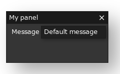

**{frontmatter.description}**
_Written by {frontmatter.author} on {frontmatter.lastupdated}_

import { Tabs, TabItem } from "@astrojs/starlight/components";

In this article we'll see how we can create layouts for our SplashKit interfaces! This will allow us to automatically position our UI elements in rows and columns, hide them under drop downs, and place them on draggable panels, which will help us create really detailed and dynamic interfaces.

The last few sections of this article will be closer to an API _reference_ than the previous one - rather than complete examples, there will be mostly snippets of code you can try out to explore each concept!

## Part 1: Creating panels

All the automatic layouting functionality in SplashKit starts by creating a container, and the most useful container is a 'panel'. A panel is like a mini window inside your program, that can be dragged around and resized. We'll be placing our elements _inside_ these panels.

Here's just a basic example from the previous tutorial that we can get started from:

:::tip[SplashKit Interfaces]
Remember that SplashKit uses an immediate mode GUI paradigm. This means we need to place _all_ of our interface code _inside_ the main `while` loop, between [Process Events](/api/input/#process-events) and [Draw Interface](/api/interface/#draw-interface)!
:::

<Tabs syncKey="code-language">
<TabItem label="C++">

```cpp
#include "splashkit.h"

int main()
{
    // open a window
    open_window("My Interface!", 800, 600);

    // main loop
    while (!quit_requested())
    {
        // get user events
        process_events();

        // clear screen
        clear_screen(COLOR_WHITE);

        // ...we'll put our interface code here...!

        // finally draw interface, then refresh screen
        draw_interface();
        refresh_screen();
    }

    // close all open windows
    close_all_windows();

    return 0;
}
```

</TabItem>
<TabItem label="C#">

<Tabs syncKey="csharp-style">
<TabItem label="Top-level Statements">

```csharp
using static SplashKitSDK.SplashKit;

// open a window
OpenWindow("My Interface!", 800, 600);

// main loop
while (!QuitRequested())
{
    // get user events
    ProcessEvents();

    // clear screen
    ClearScreen(ColorWhite());

    // ...we'll put our interface code here...!

    // finally draw interface, then refresh screen
    DrawInterface();
    RefreshScreen();
}

// close all open windows
CloseAllWindows();
```

</TabItem>
<TabItem label="Object-Oriented">

```csharp
using SplashKitSDK;

namespace InterfaceLayouts
{
    public class Program
    {
        public static void Main()
        {
            // open a window
            Window window = new Window("My Interface!", 800, 600);

            // main loop
            while (!window.CloseRequested)
            {
                // get user events
                SplashKit.ProcessEvents();

                // clear screen
                window.Clear(Color.White);

                // ...we'll put our interface code here...!

                // finally draw interface, then refresh screen
                SplashKit.DrawInterface();
                window.Refresh();
            }

            // close all open windows
            SplashKit.CloseAllWindows();
        }
    }
}
```

</TabItem>
</Tabs>

</TabItem>
</Tabs>

Let's add a panel now! Adding a panel takes two lines of code:

1. First we begin the panel with [Start Panel](/api/interface/#start-panel), which takes a name for the panel, and a rectangle for its _initial_ position.
    For example `start_panel("My panel", rectangle_from(50,50,200,100))` creates a panel with the title "My panel", that appears close to the top-left corner (50,50), and a width and height of 200 by 100.

    After this we can place all the UI elements that should go on the panel, just like we were!
2. Then once we're done, we need to end the panel with [End Panel](/api/interface/#end-panel), where we just give it the same name (so for example `end_panel("My panel")`).

One **really important** thing to note here is that [Start Panel](/api/interface/#start-panel) _returns_ whether the panel is visible or not, so we need to make sure to check this as well, and only create elements and end the panel `if` the panel is open, like so:

<Tabs syncKey="code-language">
<TabItem label="C++">

```cpp
// start the panel and check if it's open/visible
if (start_panel("My panel", rectangle_from(50,50,200,100)))
{
    // ...here we'll create all the UI elements, inside the braces { ... }

    // end the panel
    end_panel("My panel");
}
```

</TabItem>
<TabItem label="C#">

<Tabs syncKey="csharp-style">
<TabItem label="Top-level Statements">

```csharp
// start the panel and check if it's open/visible
if (StartPanel("My panel", RectangleFrom(50, 50, 200, 100)))
{
    // ...here we'll create all the UI elements, inside the braces { ... }

    // end the panel
    EndPanel("My panel");
}
```

</TabItem>
<TabItem label="Object-Oriented">

```csharp
// start the panel and check if it's open/visible
if (SplashKit.StartPanel("My panel", SplashKit.RectangleFrom(50, 50, 200, 100)))
{
    // ...here we'll create all the UI elements, inside the braces { ... }

    // end the panel
    SplashKit.EndPanel("My panel");
}
```

</TabItem>
</Tabs>

</TabItem>
</Tabs>

Just testing the code above will give us this! We can already drag around and resize the panel, so let's start adding elements!


:::tip[Creating layout elements]
Most of the layout elements, like [Panel](/api/interface/#start-panel), [Popup](/api/interface/#start-popup), and [Treenode](/api/interface/#start-treenode) work the same way.

1. We _start_ them, and possibly check if they're open or closed. We also give them a _name_.
    (e.g `if (start_panel("myPanel", ...))`, `if (start_treenode("myTreenode", ...))`)
2. We add our elements
3. Finally we _end_ them, using the same name.
    (e.g `end_panel("myPanel")`, `end_treenode("myTreenode")`)

:::

## Part 2: Adding UI elements

Adding elements is very similar to what we were doing last tutorial - we just don't need to specify the position anymore! For example previously we added a button with `button("My Button!", rectangle_from(300, 260, 200, 24))` - now we can just use `button("My Button!")`!

This'll give us a button like this:


Similarly, we can add a [Text Box](/api/interface/#text-box) by declaring a `string` variable _outside_ the main loop, and then calling `my_string = text_box(my_string)`:


Here's the full code recreating what we had last tutorial, while creating a panel and adding the elements inside it.

<Tabs syncKey="code-language">
<TabItem label="C++">

```cpp ins={20-22, 31-33}
#include "splashkit.h"

int main()
{
    // open a window
    open_window("My Interface!", 800, 600);

    // setup a variable to store the user's string - same as last tutorial
    string user_message = "Default message";

    // main loop
    while (!quit_requested())
    {
        // get user events
        process_events();

        // clear screen
        clear_screen(COLOR_WHITE);

        // here we start the panel
        if (start_panel("My panel", rectangle_from(50,50,200,100)))
        {
            // create the elements, just like last tutorial!
            if (button("Write To Terminal!"))
            {
                write_line(user_message);
            }

            user_message = text_box(user_message);

            // end the panel
            end_panel("My panel");
        }

        // finally draw interface, then refresh screen
        draw_interface();
        refresh_screen();
    }

    // close all open windows
    close_all_windows();
    
    return 0;
}
```

</TabItem>
<TabItem label="C#">

<Tabs syncKey="csharp-style">
<TabItem label="Top-level Statements">

```csharp ins={18-20, 29-31}
using static SplashKitSDK.SplashKit;

// open a window
OpenWindow("My Interface!", 800, 600);

// setup a variable to store the user's string - same as last tutorial
string userMessage = "Default message";

// main loop
while (!QuitRequested())
{
    // get user events
    ProcessEvents();

    // clear screen
    ClearScreen(ColorWhite());

    // here we start the panel
    if (StartPanel("My panel", RectangleFrom(50, 50, 200, 100)))
    {
        // create the elements, just like last tutorial!
        if (Button("Write To Terminal!"))
        {
            WriteLine(userMessage);
        }

        userMessage = TextBox(userMessage);

        // end the panel
        EndPanel("My panel");
    }

    // finally draw interface, then refresh screen
    DrawInterface();
    RefreshScreen();
}

// close all open windows
CloseAllWindows();
```

</TabItem>
<TabItem label="Object-Oriented">

```csharp ins={24-26, 35-37}
using SplashKitSDK;

namespace InterfaceLayouts
{
    public class Program
    {
        public static void Main()
        {
            // open a window
            Window window = new Window("My Interface!", 800, 600);

            // setup a variable to store the user's string - same as last tutorial
            string userMessage = "Default message";

            // main loop
            while (!window.CloseRequested)
            {
                // get user events
                SplashKit.ProcessEvents();

                // clear screen
                window.Clear(Color.White);

                // here we start the panel
                if (SplashKit.StartPanel("My panel", SplashKit.RectangleFrom(50, 50, 200, 100)))
                {
                    // create the elements, just like last tutorial!
                    if (SplashKit.Button("Write To Terminal!"))
                    {
                        SplashKit.WriteLine(userMessage);
                    }

                    userMessage = SplashKit.TextBox(userMessage);

                    // end the panel
                    SplashKit.EndPanel("My panel");
                }

                // finally draw interface, then refresh screen
                SplashKit.DrawInterface();
                window.Refresh();
            }

            // close all open windows
            SplashKit.CloseAllWindows();
        }
    }
}
```

</TabItem>
</Tabs>

</TabItem>
</Tabs>

:::tip[Elements inside panels]
To place elements inside panels, we just need to create them _between_ the `start` and `end` calls.
:::

Another useful thing you can do now is add _labels_ to your elements. You can do this by passing an additional string to each element function at the start - as an example, `text_box(my_string)` can become `text_box("Message", my_string)`, which will give us this:



:::note[SplashKit Interfaces]
Here's a quick rundown of common element functions:

| Without Label                 | With Label                              |
|-------------------------------|-----------------------------------------|
|boolean button(text)           | boolean button("Label:", text)          |
|boolean checkbox(text, state)  | boolean checkbox("Label:", text, state) |
|number slider(value, min, max) | number slider("Label:", value, min, max)|
|string text_box(text)          | string text_box("Label:", text)         |

-------------------------------------------

See the [API](/api/interface/) for more functions!
:::

## Part 3: Layout elements (Reference)

Now that we can create panels and place UI elements on those panels, let's see how we can use extra elements to help lay them out!

This section will focus on mainly demonstrating each concept.

Make sure to try each of these snippets out - you can just copy paste them into anywhere **between your start/end panel** calls.

Some of the easiest ways to group our elements together, is to place them under headers and inside 'insets'.

### Headers

Headers are really easy to add - we can use the [Header](/api/interface/#header) function, which takes a name for the heading, and returns if the header is open (like the panels!):

<Tabs syncKey="code-language">
<TabItem label="C++">

```cpp
if (header("Edit Message!"))
{
    user_message = text_box(user_message);
}
```

</TabItem>
<TabItem label="C#">

<Tabs syncKey="csharp-style">
<TabItem label="Top-level Statements">

```csharp
if (Header("Edit Message!"))
{
    userMessage = TextBox(userMessage);
}
```

</TabItem>
<TabItem label="Object-Oriented">

```csharp
if (SplashKit.Header("Edit Message!"))
{
    userMessage = SplashKit.TextBox(userMessage);
}
```

</TabItem>
</Tabs>

</TabItem>
</Tabs>


Note: `header`s do _not_ need to be began/ended, so they're nice and easy to use!

### Insets

Insets let you group a bunch of elements inside a fixed-size region! They can be created using [Start Inset](/api/interface/#start-inset), which takes a name, and a height. After creating your elements, you can then call [End Inset](/api/interface/#end-inset) with the same name to finish it.

Here's a code example - an inset is started, and six buttons are created inside it. Finally, the inset is ended.

<Tabs syncKey="code-language">
<TabItem label="C++">

```cpp
paragraph("This text is outside the inset area!");
start_inset("Inset area", 60);

if (button("Button 1!"))
    write_line("Button 1 clicked!");
if (button("Button 2!"))
    write_line("Button 2 clicked!");
if (button("Button 3!"))
    write_line("Button 3 clicked!");
if (button("Button 4!"))
    write_line("Button 4 clicked!");
if (button("Button 5!"))
    write_line("Button 5 clicked!");
if (button("Button 6!"))
    write_line("Button 6 clicked!");

end_inset("Inset area");
```

</TabItem>
<TabItem label="C#">

<Tabs syncKey="csharp-style">
<TabItem label="Top-level Statements">

```csharp
Paragraph("This text is outside the inset area!");
StartInset("Inset area", 60);

if (Button("Button 1!"))
    WriteLine("Button 1 clicked!");
if (Button("Button 2!"))
    WriteLine("Button 2 clicked!");
if (Button("Button 3!"))
    WriteLine("Button 3 clicked!");
if (Button("Button 4!"))
    WriteLine("Button 4 clicked!");
if (Button("Button 5!"))
    WriteLine("Button 5 clicked!");
if (Button("Button 6!"))
    WriteLine("Button 6 clicked!");

EndInset("Inset area");
```

</TabItem>
<TabItem label="Object-Oriented">

```csharp
SplashKit.Paragraph("This text is outside the inset area!");
SplashKit.StartInset("Inset area", 60);

if (SplashKit.Button("Button 1!"))
    SplashKit.WriteLine("Button 1 clicked!");
if (SplashKit.Button("Button 2!"))
    SplashKit.WriteLine("Button 2 clicked!");
if (SplashKit.Button("Button 3!"))
    SplashKit.WriteLine("Button 3 clicked!");
if (SplashKit.Button("Button 4!"))
    SplashKit.WriteLine("Button 4 clicked!");
if (SplashKit.Button("Button 5!"))
    SplashKit.WriteLine("Button 5 clicked!");
if (SplashKit.Button("Button 6!"))
    SplashKit.WriteLine("Button 6 clicked!");

SplashKit.EndInset("Inset area");
```

</TabItem>
</Tabs>

</TabItem>
</Tabs>


Another powerful feature of `insets`, is that you can use them as a container directly on the main window too!

### Tree nodes

Tree nodes allow you to organize your elements as a tree - like a file system! You can collapse and expand the nodes individually, so this is a great way to organize data.

Here's a code example - various _nested_ tree nodes are started and ended with, buttons placed in between - this creates a hierarchy.

<Tabs syncKey="code-language">
<TabItem label="C++">

```cpp
if (start_treenode("Some buttons!"))
{
    if (button("Button 1!"))
        write_line("Button 1 clicked!");
    if (button("Button 2!"))
        write_line("Button 2 clicked!");
    if (button("Button 3!"))
        write_line("Button 3 clicked!");
    end_treenode("Some buttons!");
}

if (start_treenode("Some more buttons!"))
{
    if (button("Button 4!"))
        write_line("Button 4 clicked!");
    if (button("Button 5!"))
        write_line("Button 5 clicked!");

    if (start_treenode("Buttons in buttons!!"))
    {
        if (button("Button 6!"))
            write_line("Button 6 clicked!");
        end_treenode("Buttons in buttons!!");
    }
    end_treenode("Some more buttons!");
}
```

</TabItem>
<TabItem label="C#">

<Tabs syncKey="csharp-style">
<TabItem label="Top-level Statements">

```csharp
if (StartTreenode("Some buttons!"))
{
    if (Button("Button 1!"))
        WriteLine("Button 1 clicked!");
    if (Button("Button 2!"))
        WriteLine("Button 2 clicked!");
    if (Button("Button 3!"))
        WriteLine("Button 3 clicked!");
    EndTreenode("Some buttons!");
}

if (StartTreenode("Some more buttons!"))
{
    if (Button("Button 4!"))
        WriteLine("Button 4 clicked!");
    if (Button("Button 5!"))
        WriteLine("Button 5 clicked!");

    if (StartTreenode("Buttons in buttons!!"))
    {
        if (Button("Button 6!"))
            WriteLine("Button 6 clicked!");
        EndTreenode("Buttons in buttons!!");
    }
    EndTreenode("Some more buttons!");
}
```

</TabItem>
<TabItem label="Object-Oriented">

```csharp
if (SplashKit.StartTreenode("Some buttons!"))
{
    if (SplashKit.Button("Button 1!"))
        SplashKit.WriteLine("Button 1 clicked!");
    if (SplashKit.Button("Button 2!"))
        SplashKit.WriteLine("Button 2 clicked!");
    if (SplashKit.Button("Button 3!"))
        SplashKit.WriteLine("Button 3 clicked!");
    SplashKit.EndTreenode("Some buttons!");
}

if (SplashKit.StartTreenode("Some more buttons!"))
{
    if (SplashKit.Button("Button 4!"))
        SplashKit.WriteLine("Button 4 clicked!");
    if (SplashKit.Button("Button 5!"))
        SplashKit.WriteLine("Button 5 clicked!");

    if (SplashKit.StartTreenode("Buttons in buttons!!"))
    {
        if (SplashKit.Button("Button 6!"))
            SplashKit.WriteLine("Button 6 clicked!");
        SplashKit.EndTreenode("Buttons in buttons!!");
    }
    SplashKit.EndTreenode("Some more buttons!");
}
```

</TabItem>
</Tabs>

</TabItem>
</Tabs>


## Part 4: Advanced layouts (Reference)

### Rows/Columns

The elements placed in panels are automatically placed in _rows_ - by default one element per row. We can create columns ourselves,
allowing us to group our elements together on single rows!

To start, we need to call [Start Custom Layout](/api/interface/#start-custom-layout) - this removes the default layouting. Now we can use the following functions to adjust how many elements we can place on the row:
:::note[SplashKit Interfaces]
Here's a rundown of common layout functions:

| Name | Description|
|---------------|-----------|
|[Split Into Columns](/api/interface/#split-into-columns)(count) | Splits the current row into equal sized columns - this is how many elements you can place on the one row |
|[Single Line Layout](/api/interface/#single-line-layout)() | Just place _all_ elements on a single row with their default size |
|[Add Column](/api/interface/#add-column)(width) | Adds a single column of a specific width in pixels |
|[Add Column Relative](/api/interface/#add-column-relative)(width) | Adds a single column of a specific width _relative_ to the total width (a value between 0 and 1)|

-------------------------------------------

You'll usually want to use the first two, while the bottom two can be used for more custom layouts.

See the [API](/api/interface/) for more functions!
:::

Finally, to return to the default layout, just call [Reset Layout](/api/interface/#reset-layout).

:::tip[Custom layouts]
When creating custom layouts, you'll usually want to:

1. Call [Start Custom Layout](/api/interface/#start-custom-layout) to clear the default layout.
2. Setup the layout using various functions, like `split_into_columns(count)`.
3. Add your elements.
4. Reset the layout to default with [Reset Layout](/api/interface/#reset-layout).

:::

You can also adjust the height of a row, using [Set Layout Height](/api/interface/#set-layout-height).

Here's an example, where we create six buttons - three on each row, with the top row being taller.

<Tabs syncKey="code-language">
<TabItem label="C++">

```cpp
start_custom_layout();
split_into_columns(3);
set_layout_height(64);

if (button("Button 1!"))
    write_line("Button 1 clicked!");
if (button("Button 2!"))
    write_line("Button 2 clicked!");
if (button("Button 3!"))
    write_line("Button 3 clicked!");

set_layout_height(0); // 0 resets to default

if (button("Button 4!"))
    write_line("Button 4 clicked!");
if (button("Button 5!"))
    write_line("Button 5 clicked!");
if (button("Button 6!"))
    write_line("Button 6 clicked!");

reset_layout();
```

</TabItem>
<TabItem label="C#">

<Tabs syncKey="csharp-style">
<TabItem label="Top-level Statements">

```csharp
StartCustomLayout();
SplitIntoColumns(3);
SetLayoutHeight(64);

if (Button("Button 1!"))
    WriteLine("Button 1 clicked!");
if (Button("Button 2!"))
    WriteLine("Button 2 clicked!");
if (Button("Button 3!"))
    WriteLine("Button 3 clicked!");

SetLayoutHeight(0); // 0 resets to default

if (Button("Button 4!"))
    WriteLine("Button 4 clicked!");
if (Button("Button 5!"))
    WriteLine("Button 5 clicked!");
if (Button("Button 6!"))
    WriteLine("Button 6 clicked!");

ResetLayout();
```

</TabItem>
<TabItem label="Object-Oriented">

```csharp
SplashKit.StartCustomLayout();
SplashKit.SplitIntoColumns(3);
SplashKit.SetLayoutHeight(64);

if (SplashKit.Button("Button 1!"))
    SplashKit.WriteLine("Button 1 clicked!");
if (SplashKit.Button("Button 2!"))
    SplashKit.WriteLine("Button 2 clicked!");
if (SplashKit.Button("Button 3!"))
    SplashKit.WriteLine("Button 3 clicked!");

SplashKit.SetLayoutHeight(0); // 0 resets to default

if (SplashKit.Button("Button 4!"))
    SplashKit.WriteLine("Button 4 clicked!");
if (SplashKit.Button("Button 5!"))
    SplashKit.WriteLine("Button 5 clicked!");
if (SplashKit.Button("Button 6!"))
    SplashKit.WriteLine("Button 6 clicked!");

SplashKit.ResetLayout();
```

</TabItem>
</Tabs>

</TabItem>
</Tabs>


### Entering Columns

A really powerful feature of columns, is that we can _enter_ a column, and add elements to it directly without automatically moving to the next one. This allows us to create much more complex layouts.

To enter a column, simple use [Enter Column](/api/interface/#enter-column) - now elements will be placed _inside_ the current column.

Once you're done, you can leave it with [Leave Column](/api/interface/#leave-column).

Here's an example:

<Tabs syncKey="code-language">
<TabItem label="C++">

```cpp
start_custom_layout();
split_into_columns(2);

enter_column();
set_layout_height(64);

if (button("Button 1!"))
    write_line("Button 1 clicked!");
if (button("Button 2!"))
    write_line("Button 2 clicked!");

leave_column();

enter_column();
set_layout_height(0); // 0 resets to default

if (button("Button 4!"))
    write_line("Button 4 clicked!");
if (button("Button 5!"))
    write_line("Button 5 clicked!");
if (button("Button 6!"))
    write_line("Button 6 clicked!");

leave_column();

reset_layout();
```

</TabItem>
<TabItem label="C#">

<Tabs syncKey="csharp-style">
<TabItem label="Top-level Statements">

```csharp
// Start custom layout
StartCustomLayout();
SplitIntoColumns(2);

EnterColumn();
SetLayoutHeight(64);

if (Button("Button 1!"))
    WriteLine("Button 1 clicked!");
if (Button("Button 2!"))
    WriteLine("Button 2 clicked!");

LeaveColumn();

EnterColumn();
SetLayoutHeight(0); // 0 resets to default

if (Button("Button 4!"))
    WriteLine("Button 4 clicked!");
if (Button("Button 5!"))
    WriteLine("Button 5 clicked!");
if (Button("Button 6!"))
    WriteLine("Button 6 clicked!");

LeaveColumn();

ResetLayout();
```

</TabItem>
<TabItem label="Object-Oriented">

```csharp
SplashKit.StartCustomLayout();
SplashKit.SplitIntoColumns(2);

SplashKit.EnterColumn();
SplashKit.SetLayoutHeight(64);

if (SplashKit.Button("Button 1!"))
    SplashKit.WriteLine("Button 1 clicked!");
if (SplashKit.Button("Button 2!"))
    SplashKit.WriteLine("Button 2 clicked!");

SplashKit.LeaveColumn();

SplashKit.EnterColumn();
SplashKit.SetLayoutHeight(0); // 0 resets to default

if (SplashKit.Button("Button 4!"))
    SplashKit.WriteLine("Button 4 clicked!");
if (SplashKit.Button("Button 5!"))
    SplashKit.WriteLine("Button 5 clicked!");
if (SplashKit.Button("Button 6!"))
    SplashKit.WriteLine("Button 6 clicked!");

SplashKit.LeaveColumn();

SplashKit.ResetLayout();
```

</TabItem>
</Tabs>

</TabItem>
</Tabs>


Take note how Button 1 and Button 2 are placed in the same _column_, rather than row now.
This is really powerful - you can now split the column again, adjust heights, and so on, to lay things out exactly how you want.

## Wrap up

Hopefully you now understand how to use SplashKit's layouting functionality!
This can be a little tricky to understand, so as always make sure to play around with the code and try things out!

Good luck using it in your projects!
In the next tutorial, we'll see how we can _style_ interfaces, to make them match our projects.
