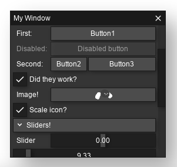
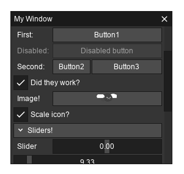
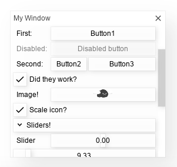
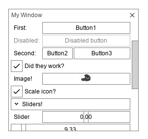
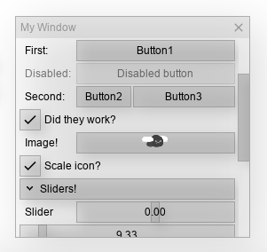
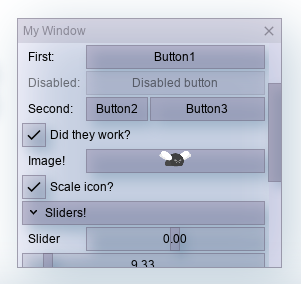
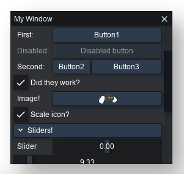
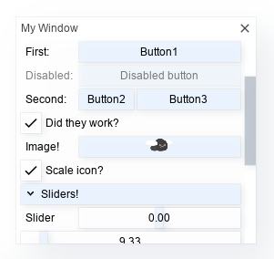
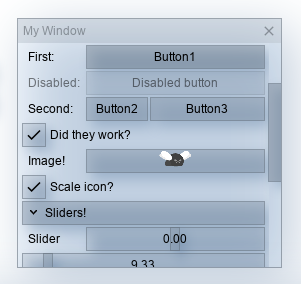
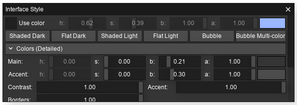

**{frontmatter.description}**
_Written by {frontmatter.author} on {frontmatter.lastupdated}_

import { Tabs, TabItem } from "@astrojs/starlight/components";

In this article we'll see how we can customize the _style_ of our interfaces, to make them match the visual design of our projects! We'll cover using the style presets, how to customize individual colors, and other aspects like fonts and spacing.

## Part 1: Colors and Shadows

### Using Preset Styles

SplashKit comes with a few preset styles that make it easy to start customizing the interface. To use them, just call [Set Interface Style](/api/interface/#set-interface-style) with the style you want - any elements created after this will use the new style! Here's an example:

<Tabs syncKey="code-language">
<TabItem label="C++">

```cpp ins={8}
# include "splashkit.h"

int main()
{
    // open a window
    open_window("My Interface!", 800, 600);

    // set the interface style
    set_interface_style(SHADED_LIGHT_STYLE);

    while (!quit_requested())
    {
        process_events();

        clear_screen(COLOR_WHITE);

        button("My Button!", rectangle_from(300, 260, 200, 24));

        draw_interface();

        refresh_screen();
    }

    // close all open windows
    close_all_windows();
    
    return 0;
}
```

</TabItem>
<TabItem label="C#">

<Tabs syncKey="csharp-style">
<TabItem label="Top-level Statements">

```csharp
using SplashKitSDK;
using static SplashKitSDK.SplashKit;

// open a window
OpenWindow("My Interface!", 800, 600);

// set the interface style
SetInterfaceStyle(InterfaceStyle.ShadedLightStyle);

while (!QuitRequested())
{
    ProcessEvents();

    ClearScreen(ColorWhite());

    Button("My Button!", RectangleFrom(300, 260, 200, 24));

    DrawInterface();

    RefreshScreen();
}

// close all open windows
CloseAllWindows();
```

</TabItem>
<TabItem label="Object-Oriented">

```csharp
using SplashKitSDK;

namespace InterfaceStyling
{
    public class Program
    {
        public static void Main()
        {
            // open a window
            Window window = new Window("My Interface!", 800, 600);

            // set the interface style
            SplashKit.SetInterfaceStyle(InterfaceStyle.ShadedLightStyle);

            while (!window.CloseRequested)
            {
                SplashKit.ProcessEvents();

                window.Clear(Color.White);

                SplashKit.Button("My Button!", SplashKit.RectangleFrom(300, 260, 200, 24));

                SplashKit.DrawInterface();

                window.Refresh();
            }

            // close all open windows
            SplashKit.CloseAllWindows();
        }
    }
}
```

</TabItem>
</Tabs>

</TabItem>
<TabItem label="Python">

```python ins={6}
from splashkit import *

# open a window
open_window("My Interface!", 800, 600)

# set the interface style
set_interface_style(InterfaceStyle.shaded_light_style)

while (not quit_requested()):
    process_events()

    clear_screen_to_white()

    button_at_position("My Button!", rectangle_from(300, 260, 200, 24))
    
    draw_interface()

    refresh_screen()

# close all open windows
close_all_windows()
```

</TabItem>
</Tabs>

You can choose from any of the styles in [Interface Style](/api/types/#interface-style). Here's how they look with a more complex interface:
<table>
    <tr>
        <td width="50%">
            
        </td>
        <td>
            
        </td>
    </tr>
    <tr>
        <td width="50%">
            `SHADED_DARK_STYLE` - A dark-mode interface with shadows and depth. **(Default)**
        </td>
        <td>
            `FLAT_DARK_STYLE` - A flat, dark-mode interface.
        </td>
    </tr>
    <tr>
        <td>
            
        </td>
        <td>
            
        </td>
    </tr>
    <tr>
        <td>
            `SHADED_LIGHT_STYLE` - A light-mode interface with shadows and depth.
        </td>
        <td>
            `FLAT_LIGHT_STYLE` - A flat, light-mode interface.
        </td>
    </tr>
    <tr>
        <td>
            
        </td>
        <td>
            
        </td>
    </tr>
    <tr>
        <td>
            `BUBBLE` - A light-mode interface with a semi-transparent bubbly look.
        </td>
        <td>
            `BUBBLE_MULTICOLORED` - A light-mode interface with a semi-transparent bubbly look - gives a multi-coloured result when provided a color.
        </td>
    </tr>
</table>

You can also customize a preset a little by providing an optional color that it can use -
for instance, `set_interface_style(SHADED_DARK_STYLE , hsb_color(0.6, 0.4, 1.0))` (using light blue) provides the following results:
<table>
    <tr>
        <td>
            
        </td>
        <td>
            
        </td>
        <td>
            
        </td>
    </tr>
</table>

### Custom Styles

You can also create your own unique look with the other interface style functions. The main two to try first are:

- [Set Interface Colors Auto](/api/interface/#set-interface-colors-auto), sets the majority of the interface's colors in one go
- [Set Interface Shadows](/api/interface/#set-interface-shadows), changes the color of and how blurry shadows are (see below)


For text, there's also:

- [Set Interface Text Color](/api/interface/#set-interface-text-color), changes the color of text _inside panels/elements_
- [Set Interface Root Text Color](/api/interface/#set-interface-root-text-color), changes the color of text _on the main window_

:::tip[SplashKit Interfaces]
When creating custom styles, try to make sure they still look good! Keeping things subtle is usually a good idea.
:::

There are also a variety of other functions that allow you to set colors for _specific_ things, like elements, panels, borders, etc.
Using these gives you a lot more flexibility, but also more room to make _not so great looking_ interfaces. If you want to try them out, you can find them all on the [API](/api/interface/)!

### Style Panel

As a utility for experimenting with different styles, SplashKit comes with an [Interface Style Panel](/api/interface/#interface-style-panel) function.
You can use this to create a panel that allows you to adjust the style - you can then note down the colors/settings you used, and set them yourself in code.



:::caution
The style panel will not save your style! You'll need to note down the settings you used, and recreate them using the interface style functions.
You'll likely want to use the [HSB Color](/api/color/#hsb-color) function to help with this.
:::

## Part 2: Fonts

By default, the interface will try and use a font available in your system. You can also set the font yourself, to customize how text appears!

- [Set Interface Font](/api/interface/#set-interface-font), lets you change the current font, loaded with [Load Font](/api/graphics/#load-font)
- [Set Interface Font Size](/api/interface/#set-interface-font-size), lets you change the current font size

<Tabs syncKey="code-language">
<TabItem label="C++">

```cpp
font myFont = load_font("Custom Font", "arial.ttf");
set_interface_font(myFont);
set_interface_font_size(12);
```

</TabItem>
<TabItem label="C#">

<Tabs syncKey="csharp-style">
<TabItem label="Top-level Statements">

```csharp
Font myFont = LoadFont("Custom Font", "arial.ttf");
SetInterfaceFont(myFont);
SetInterfaceFontSize(12);
```

</TabItem>
<TabItem label="Object-Oriented">

```csharp
Font myFont = SplashKit.LoadFont("Custom Font", "arial.ttf");
SplashKit.SetInterfaceFont(myFont);
SplashKit.SetInterfaceFontSize(12);
```

</TabItem>
</Tabs>

</TabItem>
<TabItem label="Python">

```python
my_font = load_font("Custom Font", "arial.ttf")
set_interface_font(my_font)
set_interface_font_size(12)
```

</TabItem>
</Tabs>

As mentioned in the previous section, you can also adjust the color of text with the following:

- [Set Interface Text Color](/api/interface/#set-interface-text-color), changes the color of text _inside panels/elements_
- [Set Interface Root Text Color](/api/interface/#set-interface-root-text-color), changes the color of text _on the main window_

## Part 3: Labels and Spacing/Padding

You can adjust the space given for labels with [Set Interface Label Width](/api/interface/#set-interface-label-width) - if your labels are being cut short, try increasing this from its default of 60!

You can also adjust the general spacing and padding in the interface using [Set Interface Spacing](/api/interface/#set-interface-spacing).

## Wrap up

You now know how to style SplashKit's interface to suit your project! For quick customization, [Set Interface Style](/api/interface/#set-interface-style) is a great function to start with.

If your project requires a more specific look, using the remaining functions will give you a lot of scope to adjust it. Good luck with using it in your projects!
