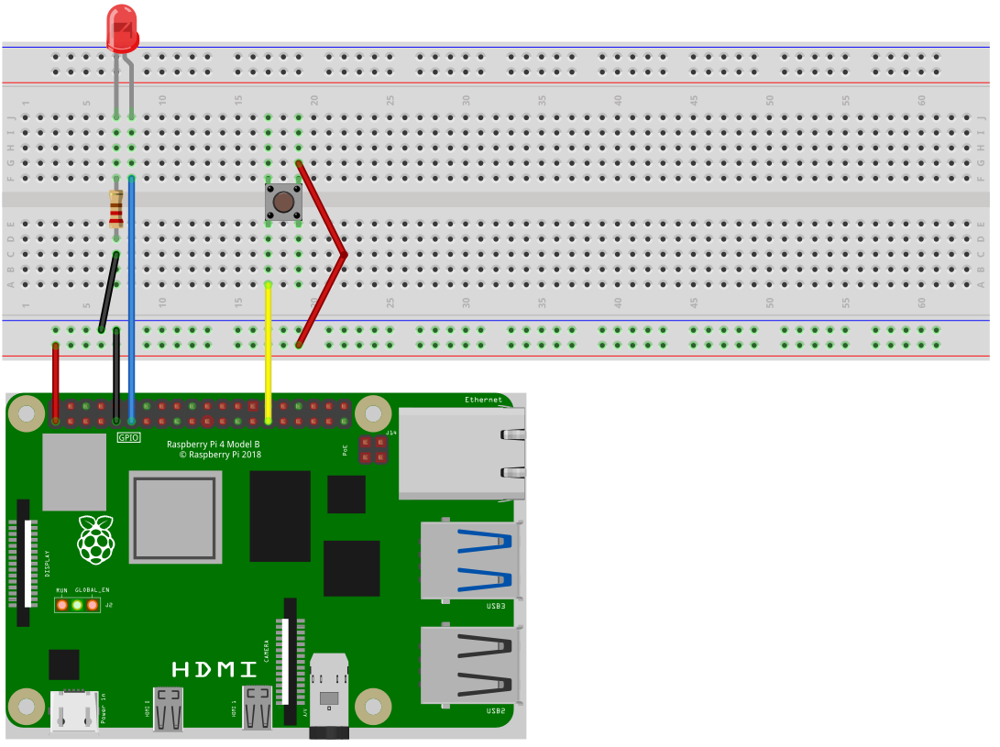
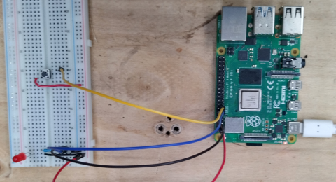

import { Tabs, TabItem , Steps} from "@astrojs/starlight/components";

**{frontmatter.description}**  
Written by: {frontmatter.author}  
_Last updated: {frontmatter.lastupdated}_

---

:::caution[Before you begin:]
When working with Raspberry Pi GPIO pins, it's crucial to handle the setup and cleanup processes carefully.

- Always ensure that the GPIO pins are properly initialised before use and cleaned up afterwards to prevent any damage to your Raspberry Pi
- Be mindful of static electricity which can pose a serious risk to the sensitive electronic components on the board
- Before touching the Raspberry Pi or any connected components, ground yourself to eliminate any static charge that may have accumulated.

These precautions help to protect your device from potential harm caused by electrostatic discharges.
:::

In this guide, we explore how to use the GPIO pins on a Raspberry Pi to read button presses. This ability is crucial for projects involving user input, like interactive installations or basic controls for robotics. We look at the basics of setting up a circuit with a button, how to use the SplashKit library to detect the button press and briefly introduce more advanced topics like the concept of floating pins and debouncing.

## Components

### Breadboard

Breadboards are invaluable for testing and building circuits without the need for soldering. Arranged in rows and columns of holes, each row internally connected. See [Blink LED Tutorial](/guides/raspberry-gpio/0-blink-led/#components) for more details.

### Push Button

A push button allows electricity to flow between its two contacts by physically moving strips of metal together when pressed. This connects the circuit and provides power to our input pin. This pushbutton has four pins and each diagonal pin is paired with each other. It's a simple switch mechanism which we can detect and use.

### Jumper Wires

Jumper wires connect our components on the breadboard to the Raspberry Pi and each other. We use M/F jumper wires for this setup. See [Blink LED Tutorial](/guides/raspberry-gpio/0-blink-led/#components) for more details.

## The Circuit

Below is the circuit diagram for this project. We connect the power and ground to the appropriate rails on the breadboard and connect our components ground or power connections to these rails. We can have the LED directly connected to Pin 11 on the Raspberry Pi, and the button to Pin 29.



The physical circuit is show in the below image, where we can see the physical implementation of the provided circuit diagram. Note: The power and ground rail connections are swapped in the below image due to the orientation of the breadboard, ensure your connections are correct.



## The Code

:::caution[Before running the code:]
This code requires the `pigpio` daemon, so make sure it is running! For more information see: [Starting the Daemon](/guides/raspberry-gpio/0-blink-led/#starting-the-daemon)
:::

<Tabs syncKey="code-language">
<TabItem label="C++">

```cpp
#include "splashkit.h"

int main()
{
    raspi_init();
    gpio_pin button_pin = PIN_29;
    gpio_pin led_pin = PIN_11;
    gpio_pin_value led_state = GPIO_LOW;

    raspi_set_mode(button_pin, GPIO_INPUT);
    raspi_set_mode(led_pin, GPIO_OUTPUT);

    raspi_set_pull_up_down(button_pin, PUD_DOWN);

    open_window("dummy_window", 1, 1);
    while(!any_key_pressed())
    {
        process_events();
        if(raspi_read(button_pin) == GPIO_HIGH)
        {
            led_state = raspi_read(led_pin);
            if(led_state == GPIO_LOW)
            {
                raspi_write(led_pin, GPIO_HIGH);
            }
            else
            {
                raspi_write(led_pin, GPIO_LOW);
            }
        }
    }

    close_all_windows();
    raspi_cleanup();
    return 0;
}
```

</TabItem>
<TabItem label="C#">

<Tabs syncKey="csharp-style">
<TabItem label="Top-level Statements">

```csharp
using SplashKitSDK;
using static SplashKitSDK.SplashKit;

RaspiInit();
GpioPin buttonPin = (GpioPin)29;
GpioPin ledPin = (GpioPin)11;
GpioPinValue ledState = (GpioPinValue) 0;

RaspiSetMode(buttonPin, (GpioPinMode) 0);
RaspiSetMode(ledPin, (GpioPinMode) 1);

RaspiSetPullUpDown(buttonPin, (PullUpDown) 1);

OpenWindow("dummy_window", 1, 1);
while(!AnyKeyPressed())
{
    ProcessEvents();
    if(RaspiRead(buttonPin) == (GpioPinValue) 1)
    {
        ledState = RaspiRead(ledPin);
        if(ledState == (GpioPinValue) 0)
        {
          RaspiWrite(ledPin, (GpioPinValue) 1);
        }
        else
        {
          RaspiWrite(ledPin, (GpioPinValue) 0);
        }
    }
}

CloseAllWindows();
RaspiCleanup();
```

</TabItem>
<TabItem label="Object-Oriented">

```csharp
using SplashKitSDK;

namespace RaspberryPiButtonLED
{
    public class Program
    {
        public static void Main()
        {
            SplashKit.RaspiInit();
            GpioPin buttonPin = GpioPin.Pin29;
            GpioPin ledPin = GpioPin.Pin11;
            GpioPinValue ledState = GpioPinValue.GpioLow;

            SplashKit.RaspiSetMode(buttonPin, GpioPinMode.GpioInput);
            SplashKit.RaspiSetMode(ledPin, GpioPinMode.GpioOutput);

            SplashKit.RaspiSetPullUpDown(buttonPin, PullUpDown.PudDown);

            SplashKit.OpenWindow("dummy_window", 1, 1);
            while (!SplashKit.AnyKeyPressed())
            {
                SplashKit.ProcessEvents();
                if (SplashKit.RaspiRead(buttonPin) == GpioPinValue.GpioHigh)
                {
                    ledState = SplashKit.RaspiRead(ledPin);
                    if (ledState == GpioPinValue.GpioLow)
                    {
                        SplashKit.RaspiWrite(ledPin, GpioPinValue.GpioHigh);
                    }
                    else
                    {
                        SplashKit.RaspiWrite(ledPin, GpioPinValue.GpioLow);
                    }
                }
            }

            SplashKit.CloseAllWindows();
            SplashKit.RaspiCleanup();
        }
    }
}
```

</TabItem>
</Tabs>
</TabItem>
</Tabs>

### Understanding the code

Lets break down this code and analyse it in sections.

<Steps>

1. **Initialise GPIO Hardware:**

    We start this code by initialising our hardware through [Raspi Init](/api/raspberry/#raspi-init), we then define the [Pins](/api/types/#gpio-pin) that we're are using for the button (Pin 29), and the LED (Pin 11). We also initialise a variable, `led_state`, to hold the state of the LED at any point in time. We use `led_state` later to determine whether to switch the LED on, or off.

    Next, we set the mode for each pin using [Raspi Set Mode](/api/raspberry/#raspi-set-mode). The button pin is set to [`GPIO_INPUT`](/api/types/#gpio-pin-mode) and the LED pin is set to [`GPIO_OUTPUT`](/api/types/#gpio-pin-mode). We do this as in this program we are detecting the input of the button and are writing the output of the LED. Then we use [Raspi Set Pull Up Down](/api/raspberry/#raspi-set-pull-up-down) on the button pin with the argument [`PUD_DOWN`](/api/types/#pull-up-down). This sets the internal pull-down resistor to prevent the pin from being a ["floating pin."](#floating-pins)

    <Tabs syncKey="code-language">
    <TabItem label="C++">

    ```cpp {5-8,10,11,13}
    #include "splashkit.h"

    int main()
    {
        raspi_init();
        gpio_pin button_pin = PIN_29;
        gpio_pin led_pin = PIN_11;
        gpio_pin_value led_state = GPIO_LOW;

        raspi_set_mode(button_pin, GPIO_INPUT);
        raspi_set_mode(led_pin, GPIO_OUTPUT);

        raspi_set_pull_up_down(button_pin, PUD_DOWN);

        open_window("dummy_window", 1, 1);
        while(!any_key_pressed())
        {
            process_events();
            if(raspi_read(button_pin) == GPIO_HIGH)
            {
                led_state = raspi_read(led_pin);
                if(led_state == GPIO_LOW)
                {
                    raspi_write(led_pin, GPIO_HIGH);
                }
                else
                {
                    raspi_write(led_pin, GPIO_LOW);
                }
            }
        }

        close_all_windows();
        raspi_cleanup();
        return 0;
    }
    ```

    </TabItem>

    <TabItem label="C#">

    <Tabs syncKey="csharp-style">
    <TabItem label="Top-level Statements">

    ```csharp {4-7,9-10,12}
    using SplashKitSDK;
    using static SplashKitSDK.SplashKit;

    RaspiInit();
    GpioPin buttonPin = (GpioPin)29;
    GpioPin ledPin = (GpioPin)11;
    GpioPinValue ledState = (GpioPinValue) 0;

    RaspiSetMode(buttonPin, (GpioPinMode) 0);
    RaspiSetMode(ledPin, (GpioPinMode) 1);

    RaspiSetPullUpDown(buttonPin, (PullUpDown) 1);

    OpenWindow("dummy_window", 1, 1);
    while(!AnyKeyPressed())
    {
        ProcessEvents();
        if(RaspiRead(buttonPin) == (GpioPinValue) 1)
        {
            ledState = RaspiRead(ledPin);
            if(ledState == (GpioPinValue) 0)
            {
              RaspiWrite(ledPin, (GpioPinValue) 1);
            }
            else
            {
              RaspiWrite(ledPin, (GpioPinValue) 0);
            }
        }
    }

    CloseAllWindows();
    RaspiCleanup();
    ```

    </TabItem>
    <TabItem label="Object-Oriented">

    ```csharp {9-12,14-15,17}
    using SplashKitSDK;

    namespace RaspberryPiButtonLED
    {
        public class Program
        {
            public static void Main()
            {
                SplashKit.RaspiInit();
                GpioPin buttonPin = GpioPin.Pin29;
                GpioPin ledPin = GpioPin.Pin11;
                GpioPinValue ledState = GpioPinValue.GpioLow;

                SplashKit.RaspiSetMode(buttonPin, GpioPinMode.GpioInput);
                SplashKit.RaspiSetMode(ledPin, GpioPinMode.GpioOutput);

                SplashKit.RaspiSetPullUpDown(buttonPin, PullUpDown.PudDown);

                SplashKit.OpenWindow("dummy_window", 1, 1);
                while (!SplashKit.AnyKeyPressed())
                {
                    SplashKit.ProcessEvents();
                    if (SplashKit.RaspiRead(buttonPin) == GpioPinValue.GpioHigh)
                    {
                        ledState = SplashKit.RaspiRead(ledPin);
                        if (ledState == GpioPinValue.GpioLow)
                        {
                            SplashKit.RaspiWrite(ledPin, GpioPinValue.GpioHigh);
                        }
                        else
                        {
                            SplashKit.RaspiWrite(ledPin, GpioPinValue.GpioLow);
                        }
                    }
                }

                SplashKit.CloseAllWindows();
                SplashKit.RaspiCleanup();
            }
        }
    }
    ```

    </TabItem>
    </Tabs>
    </TabItem>
    </Tabs>

2. **Get User Inputs:**

    Just like in the first [Blink LED Tutorial](/guides/raspberry-gpio/0-blink-led), we create a process that limits how long our program runs for. We do this so we know that our pins are cleaned properly upon exiting the program.

    <Tabs syncKey="code-language">
    <TabItem label="C++">

    ```cpp {15-18,31}
    #include "splashkit.h"

    int main()
    {
        raspi_init();
        gpio_pin button_pin = PIN_29;
        gpio_pin led_pin = PIN_11;
        gpio_pin_value led_state = GPIO_LOW;

        raspi_set_mode(button_pin, GPIO_INPUT);
        raspi_set_mode(led_pin, GPIO_OUTPUT);

        raspi_set_pull_up_down(button_pin, PUD_DOWN);

        open_window("dummy_window", 1, 1);
        while(!any_key_pressed())
        {
            process_events();
            if(raspi_read(button_pin) == GPIO_HIGH)
            {
                led_state = raspi_read(led_pin);
                if(led_state == GPIO_LOW)
                {
                    raspi_write(led_pin, GPIO_HIGH);
                }
                else
                {
                    raspi_write(led_pin, GPIO_LOW);
                }
            }
        }

        close_all_windows();
        raspi_cleanup();
        return 0;
    }
    ```

    </TabItem>

    <TabItem label="C#">

    <Tabs syncKey="csharp-style">
    <TabItem label="Top-level Statements">

    ```csharp {14-17,30}
    using SplashKitSDK;
    using static SplashKitSDK.SplashKit;

    RaspiInit();
    GpioPin buttonPin = (GpioPin)29;
    GpioPin ledPin = (GpioPin)11;
    GpioPinValue ledState = (GpioPinValue) 0;

    RaspiSetMode(buttonPin, (GpioPinMode) 0);
    RaspiSetMode(ledPin, (GpioPinMode) 1);

    RaspiSetPullUpDown(buttonPin, (PullUpDown) 1);

    OpenWindow("dummy_window", 1, 1);
    while(!AnyKeyPressed())
    {
        ProcessEvents();
        if(RaspiRead(buttonPin) == (GpioPinValue) 1)
        {
            ledState = RaspiRead(ledPin);
            if(ledState == (GpioPinValue) 0)
            {
              RaspiWrite(ledPin, (GpioPinValue) 1);
            }
            else
            {
              RaspiWrite(ledPin, (GpioPinValue) 0);
            }
        }
    }

    CloseAllWindows();
    RaspiCleanup();
    ```

    </TabItem>
    <TabItem label="Object-Oriented">

    ```csharp {19-22,35}
    using SplashKitSDK;

    namespace RaspberryPiButtonLED
    {
        public class Program
        {
            public static void Main()
            {
                SplashKit.RaspiInit();
                GpioPin buttonPin = GpioPin.Pin29;
                GpioPin ledPin = GpioPin.Pin11;
                GpioPinValue ledState = GpioPinValue.GpioLow;

                SplashKit.RaspiSetMode(buttonPin, GpioPinMode.GpioInput);
                SplashKit.RaspiSetMode(ledPin, GpioPinMode.GpioOutput);

                SplashKit.RaspiSetPullUpDown(buttonPin, PullUpDown.PudDown);

                SplashKit.OpenWindow("dummy_window", 1, 1);
                while (!SplashKit.AnyKeyPressed())
                {
                    SplashKit.ProcessEvents();
                    if (SplashKit.RaspiRead(buttonPin) == GpioPinValue.GpioHigh)
                    {
                        ledState = SplashKit.RaspiRead(ledPin);
                        if (ledState == GpioPinValue.GpioLow)
                        {
                            SplashKit.RaspiWrite(ledPin, GpioPinValue.GpioHigh);
                        }
                        else
                        {
                            SplashKit.RaspiWrite(ledPin, GpioPinValue.GpioLow);
                        }
                    }
                }

                SplashKit.CloseAllWindows();
                SplashKit.RaspiCleanup();
            }
        }
    }
    ```

    </TabItem>
    </Tabs>
    </TabItem>
    </Tabs>

3. **Read the Button Press:**

    Below is the main section of this code. On each loop we read the state of the button pin using [Raspi Read](/api/raspberry/#raspi-read) and if the result is `GPIO_HIGH`, then this indicates that the button has been pressed. We then read the state of the led, which can either be `GPIO_LOW` indicated the LED is not on, or `GPIO_HIGH` indicating that the LED is on. Once we have this state we can use [Raspi Write](/api/raspberry/#raspi-write) to change the pin to the opposite of what has been read.

    <Tabs syncKey="code-language">
    <TabItem label="C++">

    ```cpp {19-30}
    #include "splashkit.h"

    int main()
    {
        raspi_init();
        gpio_pin button_pin = PIN_29;
        gpio_pin led_pin = PIN_11;
        gpio_pin_value led_state = GPIO_LOW;

        raspi_set_mode(button_pin, GPIO_INPUT);
        raspi_set_mode(led_pin, GPIO_OUTPUT);

        raspi_set_pull_up_down(button_pin, PUD_DOWN);

        open_window("dummy_window", 1, 1);
        while(!any_key_pressed())
        {
            process_events();
            if(raspi_read(button_pin) == GPIO_HIGH)
            {
                led_state = raspi_read(led_pin);
                if(led_state == GPIO_LOW)
                {
                    raspi_write(led_pin, GPIO_HIGH);
                }
                else
                {
                    raspi_write(led_pin, GPIO_LOW);
                }
            }
        }

        close_all_windows();
        raspi_cleanup();
        return 0;
    }
    ```

    </TabItem>

    <TabItem label="C#">

    <Tabs syncKey="csharp-style">
    <TabItem label="Top-level Statements">

    ```csharp {18-29}
    using SplashKitSDK;
    using static SplashKitSDK.SplashKit;

    RaspiInit();
    GpioPin buttonPin = (GpioPin)29;
    GpioPin ledPin = (GpioPin)11;
    GpioPinValue ledState = (GpioPinValue) 0;

    RaspiSetMode(buttonPin, (GpioPinMode) 0);
    RaspiSetMode(ledPin, (GpioPinMode) 1);

    RaspiSetPullUpDown(buttonPin, (PullUpDown) 1);

    OpenWindow("dummy_window", 1, 1);
    while(!AnyKeyPressed())
    {
        ProcessEvents();
        if(RaspiRead(buttonPin) == (GpioPinValue) 1)
        {
            ledState = RaspiRead(ledPin);
            if(ledState == (GpioPinValue) 0)
            {
              RaspiWrite(ledPin, (GpioPinValue) 1);
            }
            else
            {
              RaspiWrite(ledPin, (GpioPinValue) 0);
            }
        }
    }

    CloseAllWindows();
    RaspiCleanup();
    ```

    </TabItem>
    <TabItem label="Object-Oriented">

    ```csharp {23-34}
    using SplashKitSDK;

    namespace RaspberryPiButtonLED
    {
        public class Program
        {
            public static void Main()
            {
                SplashKit.RaspiInit();
                GpioPin buttonPin = GpioPin.Pin29;
                GpioPin ledPin = GpioPin.Pin11;
                GpioPinValue ledState = GpioPinValue.GpioLow;

                SplashKit.RaspiSetMode(buttonPin, GpioPinMode.GpioInput);
                SplashKit.RaspiSetMode(ledPin, GpioPinMode.GpioOutput);

                SplashKit.RaspiSetPullUpDown(buttonPin, PullUpDown.PudDown);

                SplashKit.OpenWindow("dummy_window", 1, 1);
                while (!SplashKit.AnyKeyPressed())
                {
                    SplashKit.ProcessEvents();
                    if (SplashKit.RaspiRead(buttonPin) == GpioPinValue.GpioHigh)
                    {
                        ledState = SplashKit.RaspiRead(ledPin);
                        if (ledState == GpioPinValue.GpioLow)
                        {
                            SplashKit.RaspiWrite(ledPin, GpioPinValue.GpioHigh);
                        }
                        else
                        {
                            SplashKit.RaspiWrite(ledPin, GpioPinValue.GpioLow);
                        }
                    }
                }

                SplashKit.CloseAllWindows();
                SplashKit.RaspiCleanup();
            }
        }
    }
    ```

    </TabItem>
    </Tabs>
    </TabItem>
    </Tabs>

4. **Clean Up Memory:**

    Just like in the first [Blink LED Tutorial](/guides/raspberry-gpio/0-blink-led) and most projects involving GPIO pins, we must ensure that the hardware and resources we've used are cleaned properly, and we do this by stopping and freeing our timers and calling [Raspi Cleanup](/api/raspberry/#raspi-cleanup).

    <Tabs syncKey="code-language">
    <TabItem label="C++">

    ```cpp {33-34}
    #include "splashkit.h"

    int main()
    {
        raspi_init();
        gpio_pin button_pin = PIN_29;
        gpio_pin led_pin = PIN_11;
        gpio_pin_value led_state = GPIO_LOW;

        raspi_set_mode(button_pin, GPIO_INPUT);
        raspi_set_mode(led_pin, GPIO_OUTPUT);

        raspi_set_pull_up_down(button_pin, PUD_DOWN);

        open_window("dummy_window", 1, 1);
        while(!any_key_pressed())
        {
            process_events();
            if(raspi_read(button_pin) == GPIO_HIGH)
            {
                led_state = raspi_read(led_pin);
                if(led_state == GPIO_LOW)
                {
                    raspi_write(led_pin, GPIO_HIGH);
                }
                else
                {
                    raspi_write(led_pin, GPIO_LOW);
                }
            }
        }

        close_all_windows();
        raspi_cleanup();
        return 0;
    }
    ```

    </TabItem>

    <TabItem label="C#">

    <Tabs syncKey="csharp-style">
    <TabItem label="Top-level Statements">

    ```csharp {32-33}
    using SplashKitSDK;
    using static SplashKitSDK.SplashKit;

    RaspiInit();
    GpioPin buttonPin = (GpioPin)29;
    GpioPin ledPin = (GpioPin)11;
    GpioPinValue ledState = (GpioPinValue) 0;

    RaspiSetMode(buttonPin, (GpioPinMode) 0);
    RaspiSetMode(ledPin, (GpioPinMode) 1);

    RaspiSetPullUpDown(buttonPin, (PullUpDown) 1);

    OpenWindow("dummy_window", 1, 1);
    while(!AnyKeyPressed())
    {
        ProcessEvents();
        if(RaspiRead(buttonPin) == (GpioPinValue) 1)
        {
            ledState = RaspiRead(ledPin);
            if(ledState == (GpioPinValue) 0)
            {
              RaspiWrite(ledPin, (GpioPinValue) 1);
            }
            else
            {
              RaspiWrite(ledPin, (GpioPinValue) 0);
            }
        }
    }

    CloseAllWindows();
    RaspiCleanup();
    ```

    </TabItem>
    <TabItem label="Object-Oriented">

    ```csharp {37-38}
    using SplashKitSDK;

    namespace RaspberryPiButtonLED
    {
        public class Program
        {
            public static void Main()
            {
                SplashKit.RaspiInit();
                GpioPin buttonPin = GpioPin.Pin29;
                GpioPin ledPin = GpioPin.Pin11;
                GpioPinValue ledState = GpioPinValue.GpioLow;

                SplashKit.RaspiSetMode(buttonPin, GpioPinMode.GpioInput);
                SplashKit.RaspiSetMode(ledPin, GpioPinMode.GpioOutput);

                SplashKit.RaspiSetPullUpDown(buttonPin, PullUpDown.PudDown);

                SplashKit.OpenWindow("dummy_window", 1, 1);
                while (!SplashKit.AnyKeyPressed())
                {
                    SplashKit.ProcessEvents();
                    if (SplashKit.RaspiRead(buttonPin) == GpioPinValue.GpioHigh)
                    {
                        ledState = SplashKit.RaspiRead(ledPin);
                        if (ledState == GpioPinValue.GpioLow)
                        {
                            SplashKit.RaspiWrite(ledPin, GpioPinValue.GpioHigh);
                        }
                        else
                        {
                            SplashKit.RaspiWrite(ledPin, GpioPinValue.GpioLow);
                        }
                    }
                }

                SplashKit.CloseAllWindows();
                SplashKit.RaspiCleanup();
            }
        }
    }
    ```

    </TabItem>
    </Tabs>

    </TabItem>
    </Tabs>

</Steps>

### Build and run the code

We can build this program with the following command:

<Tabs syncKey="code-language">
<TabItem label="C++">

  ```shell
  g++ button_press.cpp -l SplashKit -o button_press
  ```

</TabItem>
<TabItem label="C#">

  ```shell
  dotnet build
  ```
  
</TabItem>
</Tabs>

We can then run the program with the following command:

<Tabs syncKey="code-language">
<TabItem label="C++">

  ```shell
  ./button_press
  ```

</TabItem>
<TabItem label="C#">

  ```shell
  dotnet run
  ```

</TabItem>
</Tabs>


## Further Information

### Floating Pins

A 'floating' pin is one that is not actively driven high (connected to some kind of power) or driven low (connected to ground). When this is the case the pin is said to be 'floating' as the state of the pin can change due to electrical noise or interference. If we were to read the pin in this state, then the value returned would be randomly either [`GPIO_HIGH`](/api/types/#gpio-pin-value) or [`GPIO_LOW`](/api/types/#gpio-pin-value)

In this tutorial we've used an internal pull-down resistor to prevent this. A pull-down resistor connects the pin to ground which effectively neutralises the electrical interference. Doing this ensures the pin only reads[`GPIO_LOW`](/api/types/#gpio-pin-value) until the button is actually pressed and the pin is powered.

### Debouncing

The button that is used in this tutorial works by physically moving a strip of metal against another strip of metal to complete a circuit. When you press or release the button, these electrical contacts can physically bounce and create multiple on-off signals. This phenomenon is known as 'debouncing' and can be remedied through hardware and software solutions. One basic way to address this in software is create a non-blocking delay when reading the input (in this case the button). To do this we record the time when we last read the input and take it away from the current time in the loop. We then only read the button when this result is greater than some interval we've set.
