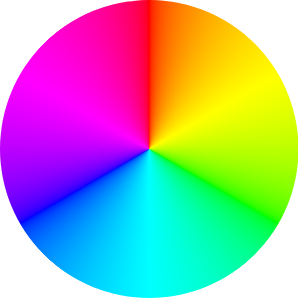

**{frontmatter.description}**  
Written by: {frontmatter.author}  
_Last updated: {frontmatter.lastupdated}_

---

import ColorGenerator from "/src/components/ColorGenerator.astro";
import ColorPalette from "/src/components/ColorPalette.astro";

## SplashKit Colors

Colors are at the heart of creating engaging and visually appealing applications, and SplashKit makes working with them seamless. By leveraging industry-standard color models, SplashKit enables you to work with colors in a way that feels natural and intuitive.

### Color RGB(A)

The RGB(A) model defines colors based on their Red, Green, and Blue components, with an optional Alpha channel to control transparency. Each component ranges from 0 to 255, creating a vast palette of possible colors. Whether you're designing vivid visuals or subtle gradients, RGB(A) is a straightforward way to define and manipulate colors.

### Color HSB

On the other hand, the HSB (Hue, Saturation, Brightness) model offers a more intuitive approach to color creation. Hue determines the base color, measured in degrees around a color wheel (0° for red, 120° for green, 240° for blue, and so on).

Saturation adjusts the intensity of the color, from a dull gray to a vibrant hue, while Brightness defines how light or dark the color appears. This model is particularly useful for applications where fine-tuning the emotional or thematic tone of visuals is key.

The tools below will help you to experiment with both models to find your perfect color. You can also explore the full range of SplashKit colors that have ready-to-use functions for C++, C#, or Python.

## Color Palette

SplashKit streamlines color manipulation in graphical applications by providing you with an intuitive and efficient approach to working with colors. This interactive color palette displays all the available SplashKit colors, allowing you to visually explore and select your desired shade. Once a color is chosen, the corresponding SplashKit functions in C++, C#, and Python will be shown, making it simple to integrate precise color choices into your project.

<ColorPalette />

## Color Generator

The Color Generator tool is designed to help you visualise and generate precise color configurations in both RGB(A) and HSB formats for your SplashKit projects. Whether you’re tweaking Red, Green, and Blue values or adjusting Hue, Saturation, and Brightness, this tool provides immediate visual feedback through a color preview box.

<ColorGenerator />
