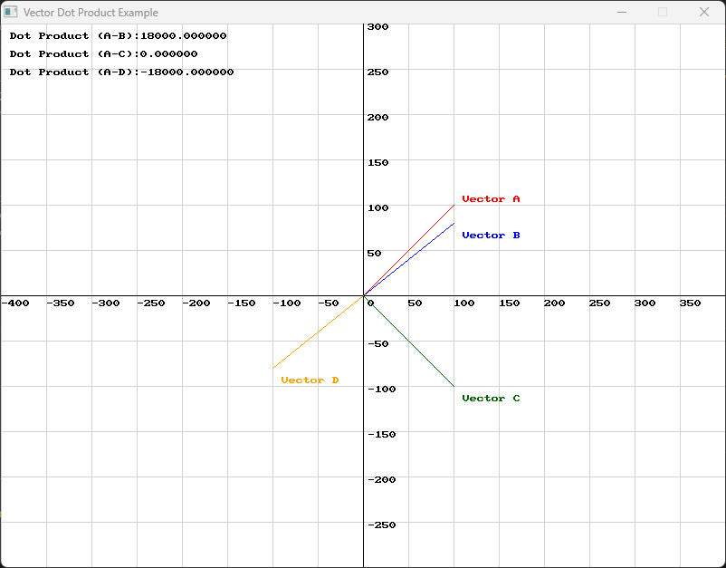

import { Tabs, TabItem, Aside } from "@astrojs/starlight/components";

**{frontmatter.description}**  

Written by: {frontmatter.author}  
_Last updated: {frontmatter.lastupdated}_

_While some Python code has been included in basic functions, full Python code for this tutorial is still in development._

---

## Vector Geometry - Angles

Understanding vector angles is important for creating dynamic and engaging gameplay in 2D games. Whether you’re aiming to align a character with a target, calculating the trajectory of a projectile, or determining the angle of impact in a collision, mastering vector angles will enhance your game’s realism and responsiveness. In this tutorial, we will cover the essential SplashKit functions for calculating vector angles, touch on the mathematical principles behind them, and see practical examples of how to use these concepts.

### SplashKit Vector Functions Used in This Tutorial

1. [Vector Angle](/api/physics/#vector-angle)
2. [Dot Product](/api/physics/#dot-product)
3. [Angle Between](/api/physics/#angle-between) 

## Introduction to Vector Angles

Understanding the angles between vectors helps to creating realistic movement, collision detection, and NPC behavior. Whether you're aligning a character's direction with a target, calculating the trajectory of a projectile, or determining the angle of impact in a collision, vector angles are at the heart of these computations.

Vector angles also play a significant role in various fields of physics, where they help analyse forces and motion, as well as in computer graphics where they are used to control lighting and shading. This tutorial will guide you through the essential SplashKit functions for calculating and understanding vector angles, enabling you to apply these concepts effectively in your game projects and beyond.

## Vector Angles

<Aside type="note" title="Function">
  The `vector_angle` function determines the angle of a vector relative to the x-axis. This angle is essential for understanding the direction of a vector in a two-dimensional space. 

  <Tabs syncKey="code-language">
  <TabItem label="C++">
    ```cpp 
    double vector_angle(const vector_2d v)
    ```
  </TabItem>
  <TabItem label="C#">
    ```csharp 
    public static double Vector2D.VectorAngle(Vector2D v);
    public static double SplashKit.VectorAngle(Vector2D v);
    ```
  </TabItem>
  <TabItem label="Python">
    ```python 
    def vector_angle(v):
    ```
  </TabItem>
</Tabs>
</Aside>


<details class="custom-details">
<summary>Use this code in your own IDE to play with the functions for yourself!</summary>

<Tabs syncKey="code-language">
<TabItem label="C++">
```cpp {61}
#include "splashkit.h"

using std::to_string;

// Function to draw a Cartesian grid
void draw_cartesian_grid()
{
    const int GRID_SPACING = 50;

    for (int x = 0; x < screen_width(); x += GRID_SPACING)
    {
        draw_line(COLOR_LIGHT_GRAY, x, 0, x, screen_height());
        if (x != screen_width() / 2)
        {
            draw_text(to_string(x - screen_width() / 2), COLOR_BLACK, x, screen_height() / 2 + 5);
        }
    }

    for (int y = 0; y < screen_height(); y += GRID_SPACING)
    {
        draw_line(COLOR_LIGHT_GRAY, 0, y, screen_width(), y);
        if (y != screen_height() / 2)
        {
            draw_text(to_string(screen_height() / 2 - y), COLOR_BLACK, screen_width() / 2 + 5, y);
        }
    }

    draw_line(COLOR_BLACK, 0, screen_height() / 2, screen_width(), screen_height() / 2); // x-axis
    draw_line(COLOR_BLACK, screen_width() / 2, 0, screen_width() / 2, screen_height());   // y-axis
    draw_text("0", COLOR_BLACK, screen_width() / 2 + 5, screen_height() / 2 + 5);
}

// Function to draw a vector and display its angle on the Cartesian plane
void draw_vector_with_angle(point_2d start, vector_2d v, color c, std::string label)
{
    point_2d end = {start.x + v.x, start.y + v.y}; // End point of the vector
    draw_line(c, start.x + screen_width() / 2, screen_height() / 2 - start.y,
              end.x + screen_width() / 2, screen_height() / 2 - end.y);

    // Label the vector
    draw_text(label, c, end.x + screen_width() / 2 + 10, screen_height() / 2 - end.y);
}

int main()
{
    open_window("Vector Angle Example", 800, 600);

    vector_2d my_vector = {100, 50}; // Example vector

    while (!window_close_requested("Vector Angle Example"))
    {
        process_events();
        clear_screen(COLOR_WHITE);

        draw_cartesian_grid();

        // Draw the vector on the Cartesian plane
        draw_vector_with_angle({0, 0}, my_vector, COLOR_BLUE, "Vector");

        // Display the vector angle
        double my_vector_angle = vector_angle(my_vector);
        draw_text("Angle: " + to_string(my_vector_angle) + " degrees", COLOR_BLACK, 10, 10);

        refresh_screen(60);
    }

    close_window("Vector Angle Example");
    return 0;
}
```
</TabItem> 
<TabItem label="C#">
```csharp {67}
using System;
using SplashKitSDK;

// Define constants
const int GRID_SPACING = 50;

void DrawCartesianGrid()
{
    int screenWidth = SplashKit.ScreenWidth();
    int screenHeight = SplashKit.ScreenHeight();
    int centerX = screenWidth / 2;
    int centerY = screenHeight / 2;

    for (int x = 0; x < screenWidth; x += GRID_SPACING)
    {
        SplashKit.DrawLine(Color.LightGray, x, 0, x, screenHeight);
        if (x != centerX)
        {
            SplashKit.DrawText((x - centerX).ToString(), Color.Black, x, centerY + 5);
        }
    }

    for (int y = 0; y < screenHeight; y += GRID_SPACING)
    {
        SplashKit.DrawLine(Color.LightGray, 0, y, screenWidth, y);
        if (y != centerY)
        {
            SplashKit.DrawText((centerY - y).ToString(), Color.Black, centerX + 5, y);
        }
    }

    SplashKit.DrawLine(Color.Black, 0, centerY, screenWidth, centerY); // x-axis
    SplashKit.DrawLine(Color.Black, centerX, 0, centerX, screenHeight); // y-axis
    SplashKit.DrawText("0", Color.Black, centerX + 5, centerY + 5);
}

void DrawVectorWithAngle(Point2D start, Vector2D v, Color c, string label)
{
    Point2D end = new Point2D { X = start.X + v.X, Y = start.Y + v.Y }; // End point of the vector
    SplashKit.DrawLine(
        c,
        start.X + SplashKit.ScreenWidth() / 2, SplashKit.ScreenHeight() / 2 - start.Y,
        end.X + SplashKit.ScreenWidth() / 2, SplashKit.ScreenHeight() / 2 - end.Y
    );

    // Label the vector
    SplashKit.DrawText(label, c, end.X + SplashKit.ScreenWidth() / 2 + 10, SplashKit.ScreenHeight() / 2 - end.Y);
}

// Create window
SplashKit.OpenWindow("Vector Angle Example", 800, 600);

// Example vector
Vector2D myVector = new Vector2D() { X = 100, Y = 50 };

while (!SplashKit.WindowCloseRequested("Vector Angle Example"))
{
    SplashKit.ProcessEvents();
    SplashKit.ClearScreen(Color.White);

    DrawCartesianGrid();

    // Draw the vector on the Cartesian plane
    DrawVectorWithAngle(new Point2D() { X = 0, Y = 0 }, myVector, Color.Blue, "Vector");

    // Display the vector angle
    double myVectorAngle = SplashKit.VectorAngle(myVector);
    SplashKit.DrawText($"Angle: {myVectorAngle:F2} degrees", Color.Black, 10, 10);

    SplashKit.RefreshScreen();
}
```
</TabItem> 
</Tabs>
</details>

Understanding the angle of a vector is needed in various game development scenarios:

- Character Orientation: Adjust the orientation of game characters or objects to face specific directions.
- Movement Mechanics: Implement mechanics that depend on the direction of movement, such as aiming and steering.
- Visual Indicators: Create visual cues that indicate direction, such as arrows or aiming reticles.

With a clear understanding of vector angles, you can create more intuitive and responsive gameplay experiences by accurately controlling the orientation and direction of game elements.

## Dot Product

Now that we have covered the basics of vector angles, we can explore how the dot product further enhances our understanding of vector relationships. 

<Aside type="note" title="Function">
  SplashKit's `dot_product` function calculates the dot product (scalar product) between two vector parameters and returns the result as a scalar value.

  <Tabs syncKey="code-language">
  <TabItem label="C++">
    ```cpp 
    double dot_product(const vector_2d &v1, const vector_2d &v2)
    ```
  </TabItem>
  <TabItem label="C#">
    ```csharp 
    public static double Vector2D.DotProduct(Vector2D v1, Vector2D v2);
    public static double SplashKit.DotProduct(Vector2D v1, Vector2D v2);
    ```
  </TabItem>
  <TabItem label="Python">
    ```python 
    def dot_product(v1, v2):
    ```
  </TabItem>
</Tabs>
</Aside>

The dot product of two vectors is a scalar value that provides key insights into the relationship between them. If the dot product is positive, the angle is less than 90 degrees, indicating that the vectors are pointing in a generally similar direction. A negative dot product means the angle is greater than 90 degrees, showing that the vectors are pointing in generally opposite directions. If the dot product is zero, the vectors are perpendicular.

<Aside type="note" title="Maths">
Mathematically, the dot product of two vectors 

$ A = (A_x, A_y)$ 

and 

$ B = (B_x, B_y)$ 

is calculated as:

$$ \mathbf{A} \cdot \mathbf{B} = A_x \times B_x + A_y \times B_y $$
</Aside>

<Tabs syncKey="code-language">
  <TabItem label="C++">
  ```cpp 
  double dot_product_result_ab = dot_product(vector_a, vector_b);
  double dot_product_result_ac = dot_product(vector_a, vector_c);
  double dot_product_result_ad = dot_product(vector_a, vector_d);
  ```
  </TabItem>

  <TabItem label="C#">
  ```csharp 
  double dotProductResultAB = SplashKit.DotProduct(vectorA, vectorB);
  double dotProductResultAC = SplashKit.DotProduct(vectorA, vectorC);
  double dotProductResultAD = SplashKit.DotProduct(vectorA, vectorD);
  ```
  </TabItem>

    <TabItem label="Python">
  ```python
  dot_product_result_ab = dot_product(vector_a, vector_b)
  dot_product_result_ac = dot_product(vector_a, vector_c)
  dot_product_result_ad = dot_product(vector_a, vector_d)
  ```
  </TabItem>
</Tabs>

Consider the following diagram:



- The dot product of Vector A and Vector B is positive, which means that they are pointing in relatively the same direction.
- The dot product of Vector A and Vector C is zero, which means that they are perpendicular to one another.
- The dot product of Vector A and Vector D is negative, which means that they are pointing in relatively different directions.

<details class="custom-details">
<summary>Use this code in your own IDE to play with the functions for yourself!</summary>

<Tabs syncKey="code-language">
<TabItem label="C++">
```cpp {55-58}
#include "splashkit.h"
using std::to_string;

// Define constants
const int GRID_SPACING = 50;

// Function to draw the Cartesian grid
void draw_cartesian_grid()
{
    for (int x = 0; x < screen_width(); x += GRID_SPACING)
    {
        draw_line(COLOR_LIGHT_GRAY, x, 0, x, screen_height());
        if (x != screen_width() / 2)
        {
            draw_text(to_string(x - screen_width() / 2), COLOR_BLACK, x, screen_height() / 2 + 5);
        }
    }

    for (int y = 0; y < screen_height(); y += GRID_SPACING)
    {
        draw_line(COLOR_LIGHT_GRAY, 0, y, screen_width(), y);
        if (y != screen_height() / 2)
        {
            draw_text(to_string(screen_height() / 2 - y), COLOR_BLACK, screen_width() / 2 + 5, y);
        }
    }

    draw_line(COLOR_BLACK, 0, screen_height() / 2, screen_width(), screen_height() / 2); // x-axis
    draw_line(COLOR_BLACK, screen_width() / 2, 0, screen_width() / 2, screen_height());   // y-axis
    draw_text("0", COLOR_BLACK, screen_width() / 2 + 5, screen_height() / 2 + 5);
}

// Function to draw a vector
void draw_vector(point_2d start, vector_2d v, color c, std::string label, int x_offset, int y_offset)
{
    point_2d end = {start.x + v.x, start.y + v.y};
    draw_line(c, start.x + screen_width() / 2, screen_height() / 2 - start.y,
              end.x + screen_width() / 2, screen_height() / 2 - end.y);
    draw_text(label, c, end.x + screen_width() / 2 + x_offset, screen_height() / 2 - end.y + y_offset);
}

int main()
{
    open_window("Vector Dot Product Example", 800, 600);

    // Define two vectors
    vector_2d vector_a = {100, 100};
    vector_2d vector_b = {100, 80};
    vector_2d vector_c = {100, -100};
    vector_2d vector_d = {-100, -80};

    // Starting point for vectors (origin)
    point_2d origin = {0, 0};

    // Calculate the dot product
    double dot_product_result_ab = dot_product(vector_a, vector_b);
    double dot_product_result_ac = dot_product(vector_a, vector_c);
    double dot_product_result_ad = dot_product(vector_a, vector_d);

    while (!window_close_requested("Vector Dot Product Example"))
    {
        process_events();
        clear_screen(COLOR_WHITE);
        draw_cartesian_grid();

        // Draw the vectors
        draw_vector(origin, vector_a, COLOR_RED, "Vector A", 10, -10);
        draw_vector(origin, vector_b, COLOR_BLUE, "Vector B", 10, 10);
        draw_vector(origin, vector_c, COLOR_DARK_GREEN, "Vector C", 10, 10);
        draw_vector(origin, vector_d, COLOR_ORANGE, "Vector D", 10, 10);

        // Display the dot product results
        draw_text("Dot Product (A-B):" + to_string(dot_product_result_ab), COLOR_BLACK, 10, 10);
        draw_text("Dot Product (A-C):" + to_string(dot_product_result_ac), COLOR_BLACK, 10, 30);
        draw_text("Dot Product (A-D):" + to_string(dot_product_result_ad), COLOR_BLACK, 10, 50);

        refresh_screen(60);
    }

    close_window("Vector Dot Product Example");
    return 0;
}
```
</TabItem> 
<TabItem label="C#">
```csharp {62-65}
using System;
using SplashKitSDK;

// Define constants
const int GRID_SPACING = 50;

// Function to draw the Cartesian grid
void DrawCartesianGrid()
{
    int screenWidth = SplashKit.ScreenWidth();
    int screenHeight = SplashKit.ScreenHeight();
    int centerX = screenWidth / 2;
    int centerY = screenHeight / 2;

    for (int x = 0; x < screenWidth; x += GRID_SPACING)
    {
        SplashKit.DrawLine(Color.LightGray, x, 0, x, screenHeight);
        if (x != centerX)
        {
            SplashKit.DrawText((x - centerX).ToString(), Color.Black, x, centerY + 5);
        }
    }

    for (int y = 0; y < screenHeight; y += GRID_SPACING)
    {
        SplashKit.DrawLine(Color.LightGray, 0, y, screenWidth, y);
        if (y != centerY)
        {
            SplashKit.DrawText((centerY - y).ToString(), Color.Black, centerX + 5, y);
        }
    }

    SplashKit.DrawLine(Color.Black, 0, centerY, screenWidth, centerY); // x-axis
    SplashKit.DrawLine(Color.Black, centerX, 0, centerX, screenHeight); // y-axis
    SplashKit.DrawText("0", Color.Black, centerX + 5, centerY + 5);
}

// Function to draw a vector
void DrawVector(Point2D start, Vector2D v, Color c, string label, int xOffset, int yOffset)
{
    Point2D end = new Point2D { X = start.X + v.X, Y = start.Y + v.Y };
    SplashKit.DrawLine(
        c,
        start.X + SplashKit.ScreenWidth() / 2, SplashKit.ScreenHeight() / 2 - start.Y,
        end.X + SplashKit.ScreenWidth() / 2, SplashKit.ScreenHeight() / 2 - end.Y
    );
    SplashKit.DrawText(label, c, end.X + SplashKit.ScreenWidth() / 2 + xOffset, SplashKit.ScreenHeight() / 2 - end.Y + yOffset);
}

// Create window
SplashKit.OpenWindow("Vector Dot Product Example", 800, 600);

// Define vectors
Vector2D vectorA = new Vector2D() { X = 100, Y = 100 };
Vector2D vectorB = new Vector2D() { X = 100, Y = 80 };
Vector2D vectorC = new Vector2D() { X = 100, Y = -100 };
Vector2D vectorD = new Vector2D() { X = -100, Y = -80 };

// Starting point for vectors (origin)
Point2D origin = new Point2D() { X = 0, Y = 0 };

// Calculate the dot product
double dotProductResultAB = SplashKit.DotProduct(vectorA, vectorB);
double dotProductResultAC = SplashKit.DotProduct(vectorA, vectorC);
double dotProductResultAD = SplashKit.DotProduct(vectorA, vectorD);

while (!SplashKit.WindowCloseRequested("Vector Dot Product Example"))
{
    SplashKit.ProcessEvents();
    SplashKit.ClearScreen(Color.White);
    DrawCartesianGrid();

    // Draw the vectors
    DrawVector(origin, vectorA, Color.Red, "Vector A", 10, -10);
    DrawVector(origin, vectorB, Color.Blue, "Vector B", 10, 10);
    DrawVector(origin, vectorC, Color.DarkGreen, "Vector C", 10, 10);
    DrawVector(origin, vectorD, Color.Orange, "Vector D", 10, 10);

    // Display the dot product results
    SplashKit.DrawText($"Dot Product (A-B): {dotProductResultAB}", Color.Black, 10, 10);
    SplashKit.DrawText($"Dot Product (A-C): {dotProductResultAC}", Color.Black, 10, 30);
    SplashKit.DrawText($"Dot Product (A-D): {dotProductResultAD}", Color.Black, 10, 50);

    SplashKit.RefreshScreen();
}
```
</TabItem> 
</Tabs>
</details>

One scenario where this may be useful is to determine if two game objects are facing each other or moving in similar directions. For instance, you can use it to check if an enemy is facing the player by comparing their direction vectors:

<Tabs syncKey="code-language">
  <TabItem label="C++">
  ```cpp 
  double dot = dot_product(player_direction, enemy_direction);
  if (dot > 0) 
  {
      // Objects are facing each other
  }
  ```
  </TabItem>

  <TabItem label="C#">
  ```csharp 
  double dot = DotProduct(playerDirection, enemyDirection);
  if (dot > 0)
  {
	  // Objects are facing each other
  }
  ```
  </TabItem>

  <TabItem label="Python">
  ```python
  dot = dot_product(player_direction, enemy_direction)
  if dot > 0:
      # Objects are facing each other
  ```
  </TabItem>
</Tabs>

The dot product is used for other useful things such as determining the vector of a reflection, for example a ball bouncing off of a surface, however that is not within the scope of this tutorial. It is important to understand that using the dot product and calculating the angle between two vectors are both valuable techniques in vector mathematics, but they serve different purposes and have different advantages. 

- The dot product is computationally efficient, as it involves only a few multiplications and additions. This is particularly useful in performance-critical applications like real-time graphics or game development.
- It can quickly determine if two vectors are pointing in similar or opposite directions without needing to compute the actual angle. This is useful in algorithms that need to classify vectors into different categories based on their alignment.

Let's dive into how we would calculate the angle between two vectors.

## Calculating Angles Between Vectors

<Aside type="note" title="Function">
  The `angle_between` function in SplashKit calculates the angle between two vectors. This function is particularly useful for determining the exact orientation between vectors, which is used in many game development scenarios such as navigation, aiming, and rotation.

  <Tabs syncKey="code-language">
  <TabItem label="C++">
    ```cpp 
    double angle_between(const vector_2d &v1, const vector_2d &v2)
    ```
  </TabItem>
  <TabItem label="C#">
    ```csharp 
    public static double Vector2D.AngleBetween(Vector2D v1, Vector2D v2);
    public static double SplashKit.AngleBetween(Vector2D v1, Vector2D v2);
    ```
  </TabItem>
  <TabItem label="Python">
    ```python
    def angle_between(v1, v2):
    ```
  </TabItem>
</Tabs>
</Aside>

To visualise the angle between two vectors, imagine an angle formed by placing a line from the end of the first vector to the end of the second vector. The angle between these vectors represents how much one vector needs to rotate to align with the other. This is helpful in applications where precise directional adjustments or relative orientations are necessary.

<Tabs syncKey="code-language">
  <TabItem label="C++">
  ```cpp 
  double angle = angle_between(vector1, vector2);
  ```
  </TabItem>

  <TabItem label="C#">
  ```csharp 
  double angle = SplashKit.AngleBetween(vector1, vector2);
  ```
  </TabItem>

  <TabItem label="Python">
  ```python
  angle = angle_between(vector1, vector2);
  ```
  </TabItem>
</Tabs>

Observe the following diagram:


Note that the green line that connects the two vectors is 135 degrees from the x axis, and not the angle created between the two lines. 

<details class="custom-details">
<summary>Use this code in your own IDE to play with the functions for yourself!</summary>

<Tabs syncKey="code-language">
<TabItem label="C++">
```cpp {62}
#include "splashkit.h"

using std::to_string;

// Function to draw a Cartesian grid
void draw_cartesian_grid()
{
    const int GRID_SPACING = 50;

    for (int x = 0; x < screen_width(); x += GRID_SPACING)
    {
        draw_line(COLOR_LIGHT_GRAY, x, 0, x, screen_height());
        if (x != screen_width() / 2)
        {
            draw_text(to_string(x - screen_width() / 2), COLOR_BLACK, x, screen_height() / 2 + 5);
        }
    }

    for (int y = 0; y < screen_height(); y += GRID_SPACING)
    {
        draw_line(COLOR_LIGHT_GRAY, 0, y, screen_width(), y);
        if (y != screen_height() / 2)
        {
            draw_text(to_string(screen_height() / 2 - y), COLOR_BLACK, screen_width() / 2 + 5, y);
        }
    }

    draw_line(COLOR_BLACK, 0, screen_height() / 2, screen_width(), screen_height() / 2); // x-axis
    draw_line(COLOR_BLACK, screen_width() / 2, 0, screen_width() / 2, screen_height());   // y-axis
    draw_text("0", COLOR_BLACK, screen_width() / 2 + 5, screen_height() / 2 + 5);
}

// Function to draw a vector on the Cartesian plane
void draw_vector(point_2d start, vector_2d v, color c, std::string label)
{
    point_2d end = {start.x + v.x, start.y + v.y}; // End point of the vector
    draw_line(c, start.x + screen_width() / 2, screen_height() / 2 - start.y,
              end.x + screen_width() / 2, screen_height() / 2 - end.y);
    draw_text(label, c, end.x + screen_width() / 2 + 10, screen_height() / 2 - end.y);
}

int main()
{
    open_window("Angle Between Vectors Example", 800, 600);

    vector_2d vector1 = {200, 100}; // Example vector 1
    vector_2d vector2 = {100, 200}; // Example vector 2

    while (!window_close_requested("Angle Between Vectors Example"))
    {
        process_events();
        clear_screen(COLOR_WHITE);

        draw_cartesian_grid();

        // Draw vectors
        draw_vector({0, 0}, vector1, COLOR_BLUE, "Vector 1");
        draw_vector({0, 0}, vector2, COLOR_RED, "Vector 2");
        draw_vector({vector1.x, vector1.y}, vector_subtract(vector2, vector1), COLOR_GREEN, "");

        // Calculate and display the angle between vectors
        double angle = angle_between(vector1, vector2);
        draw_text("Angle: " + to_string(angle) + " degrees", COLOR_BLACK, 10, 10);

        refresh_screen(60);
    }

    close_window("Angle Between Vectors Example");
    return 0;
}
```
</TabItem> 
<TabItem label="C#">
```csharp {74}
using System;
using SplashKitSDK;

// Define constants
const int GRID_SPACING = 50;

// Function to draw the Cartesian grid
void DrawCartesianGrid()
{
    int screenWidth = SplashKit.ScreenWidth();
    int screenHeight = SplashKit.ScreenHeight();
    int centerX = screenWidth / 2;
    int centerY = screenHeight / 2;

    for (int x = 0; x < screenWidth; x += GRID_SPACING)
    {
        SplashKit.DrawLine(Color.LightGray, x, 0, x, screenHeight);
        if (x != centerX)
        {
            SplashKit.DrawText((x - centerX).ToString(), Color.Black, x, centerY + 5);
        }
    }

    for (int y = 0; y < screenHeight; y += GRID_SPACING)
    {
        SplashKit.DrawLine(Color.LightGray, 0, y, screenWidth, y);
        if (y != centerY)
        {
            SplashKit.DrawText((centerY - y).ToString(), Color.Black, centerX + 5, y);
        }
    }

    SplashKit.DrawLine(Color.Black, 0, centerY, screenWidth, centerY); // x-axis
    SplashKit.DrawLine(Color.Black, centerX, 0, centerX, screenHeight); // y-axis
    SplashKit.DrawText("0", Color.Black, centerX + 5, centerY + 5);
}

// Function to draw a vector
void DrawVector(Point2D start, Vector2D v, Color c, string label)
{
    Point2D end = new Point2D { X = start.X + v.X, Y = start.Y + v.Y };
    SplashKit.DrawLine(
        c,
        start.X + SplashKit.ScreenWidth() / 2, SplashKit.ScreenHeight() / 2 - start.Y,
        end.X + SplashKit.ScreenWidth() / 2, SplashKit.ScreenHeight() / 2 - end.Y
    );
    SplashKit.DrawText(label, c, end.X + SplashKit.ScreenWidth() / 2 + 10, SplashKit.ScreenHeight() / 2 - end.Y);
}

// Create window
SplashKit.OpenWindow("Angle Between Vectors Example", 800, 600);

// Define vectors
Vector2D vector1 = new Vector2D() { X = 200, Y = 100 }; // Example vector 1
Vector2D vector2 = new Vector2D() { X = 100, Y = 200 }; // Example vector 2

while (!SplashKit.WindowCloseRequested("Angle Between Vectors Example"))
{
    SplashKit.ProcessEvents();
    SplashKit.ClearScreen(Color.White);
    DrawCartesianGrid();

    // Draw vectors
    DrawVector(new Point2D(), vector1, Color.Blue, "Vector 1");
    DrawVector(new Point2D(), vector2, Color.Red, "Vector 2");
    DrawVector(
        new Point2D { X = vector1.X, Y = vector1.Y },
        SplashKit.VectorSubtract(vector2, vector1),
        Color.Green,
        ""
    );

    // Calculate and display the angle between vectors
    double angle = SplashKit.AngleBetween(vector1, vector2);
    SplashKit.DrawText($"Angle: {angle} degrees", Color.Black, 10, 10);

    SplashKit.RefreshScreen();
}
```
</TabItem> 
</Tabs>
</details>

## Conclusion

Understanding vector angles is important for crafting realistic and dynamic interactions in game development and computer graphics. SplashKits tools like `vector_angle`, `dot_product`, and `angle_between` can be used to master vector orientation, relationships, and precise directional adjustments. With these concepts, you can enhance character alignment, improve collision detection, and fine-tune movements and animations.