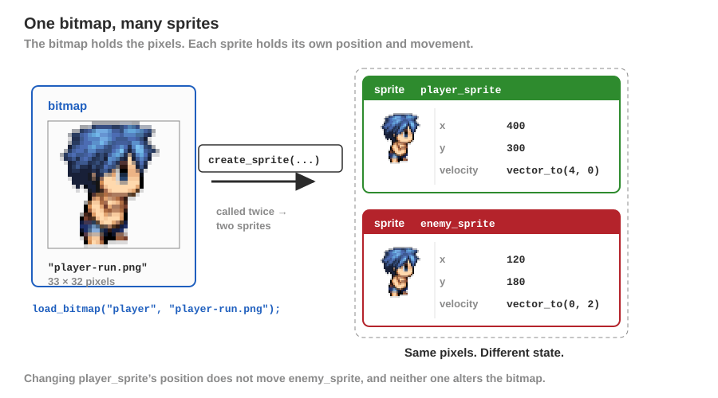
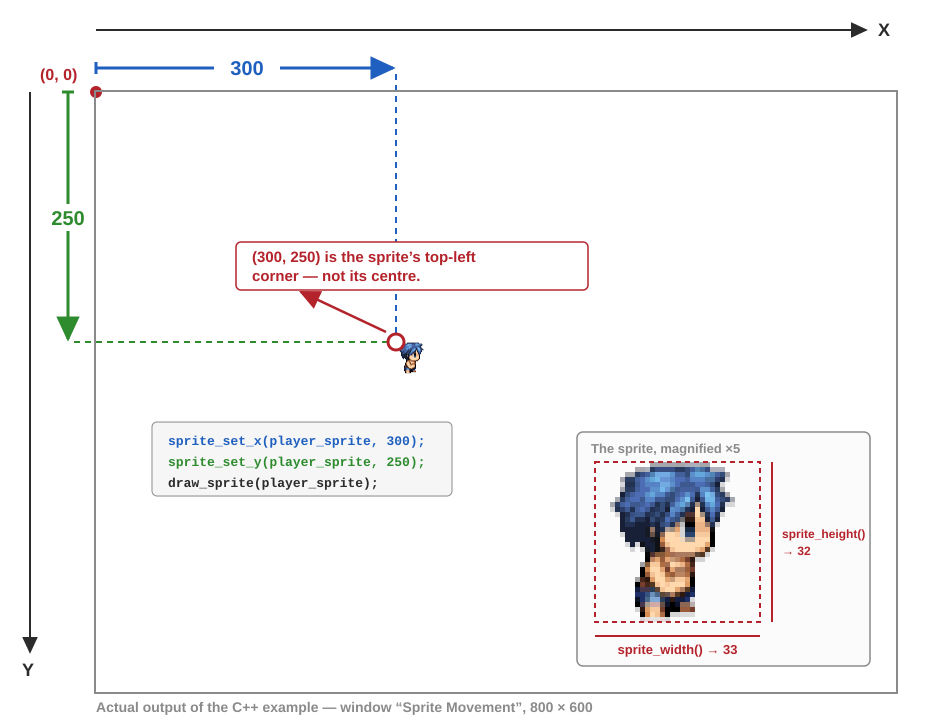
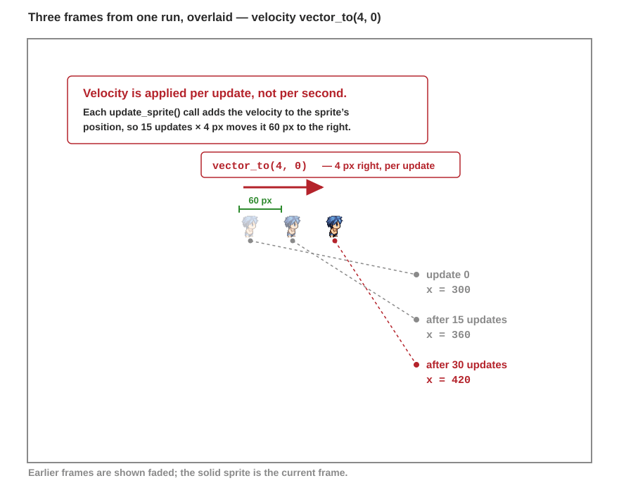
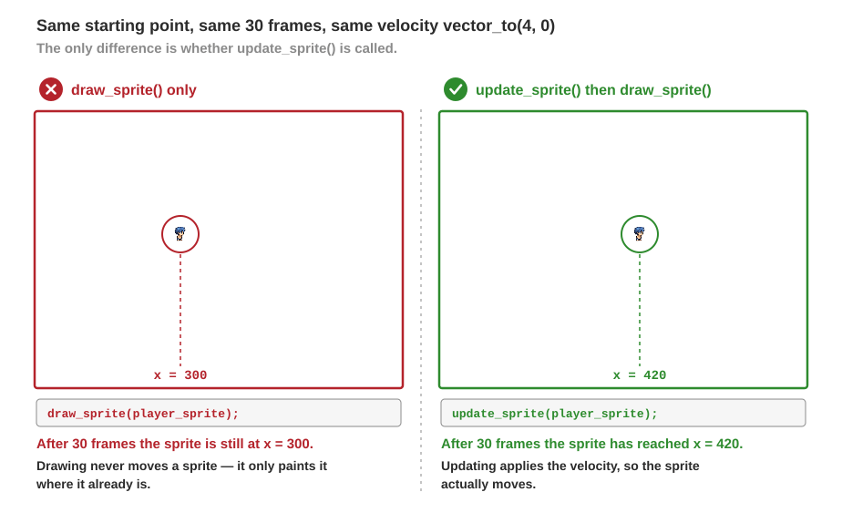
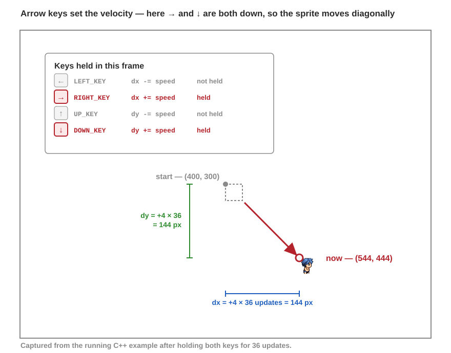
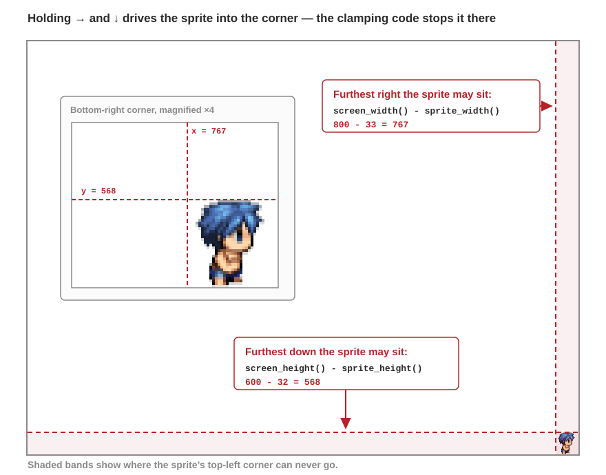
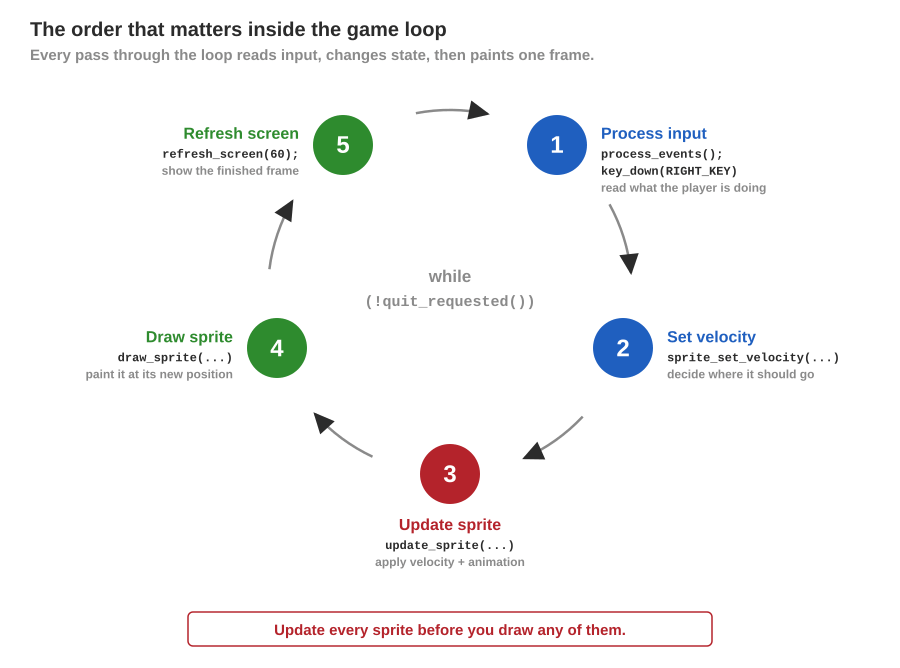

import { Tabs, TabItem } from "@astrojs/starlight/components";

**{frontmatter.description}**  
Written by: {frontmatter.author}  
_Last updated: {frontmatter.lastupdated}_

---

Sprites are useful when you want an image in your program to behave like an object in your game world. A sprite keeps track of details such as its position and velocity, and it can also be connected to animations and collision detection.

A sprite uses a bitmap for what it draws. Rather than changing the bitmap itself every time an object moves, you create a sprite from the bitmap and then update the sprite's position, velocity, animation, and other state. See the [Sprites API](/api/sprites/) for the full set of available operations.

## Before You Start

The examples below use `player-run.png`. You can download the same resource used by the existing Sprite Set Velocity API example from these [**Resources**](/usage-examples/sprites/sprite_set_velocity-1-example-resources.zip).

Extract the archive into your project directory so that the included `Resources` folder is at the project root. SplashKit will then find `Resources/images/player-run.png` when the examples load `player-run.png`.

Your project should look like this:

```text
my-sprite-project/
├── Resources/
│   └── images/
│       └── player-run.png
└── program.cpp
```

The path matters. `load_bitmap` is given the file name only, and SplashKit looks for it under `Resources/images`, so the `Resources` folder has to sit beside your program rather than inside another folder.

## Creating a Sprite

Start by loading a bitmap, then use [Create Sprite](/api/sprites/#create-sprite) to create a sprite that uses that bitmap.

<Tabs syncKey="code-language">
<TabItem label="C++">

```cpp
load_bitmap("player", "player-run.png");
sprite player_sprite = create_sprite(bitmap_named("player"));
```

</TabItem>
<TabItem label="C#">

<Tabs syncKey="csharp-style">
<TabItem label="Top-level Statements">

```csharp
LoadBitmap("player", "player-run.png");
Sprite playerSprite = CreateSprite(BitmapNamed("player"));
```

</TabItem>
<TabItem label="Object-Oriented">

```csharp
Bitmap playerBitmap = new Bitmap("player", "player-run.png");
Sprite playerSprite = new Sprite(playerBitmap);
```

</TabItem>
</Tabs>

</TabItem>
<TabItem label="Python">

```python
load_bitmap("player", "player-run.png")
player_sprite = create_sprite(bitmap_named("player"))
```

</TabItem>
</Tabs>

The bitmap stores the image data, while the sprite stores the state associated with the object that uses that image. This means that multiple sprites can use the same bitmap while each sprite keeps its own position and movement details.



## Your First Sprite Program

Before going further, here is a complete program that does the smallest useful thing: it loads the bitmap, creates a sprite, puts it on the screen, and waits five seconds so you can see it.

<Tabs syncKey="code-language">
<TabItem label="C++">

```cpp
#include "splashkit.h"

int main()
{
    open_window("My First Sprite", 800, 600);

    load_bitmap("player", "player-run.png");
    sprite player_sprite = create_sprite(bitmap_named("player"));
    sprite_set_x(player_sprite, 400);
    sprite_set_y(player_sprite, 300);

    clear_screen(COLOR_WHITE);
    draw_sprite(player_sprite);
    refresh_screen();
    delay(5000);

    free_sprite(player_sprite);
    close_all_windows();
    return 0;
}
```

</TabItem>
<TabItem label="C#">

<Tabs syncKey="csharp-style">
<TabItem label="Top-level Statements">

```csharp
using SplashKitSDK;
using static SplashKitSDK.SplashKit;

OpenWindow("My First Sprite", 800, 600);

LoadBitmap("player", "player-run.png");
Sprite playerSprite = CreateSprite(BitmapNamed("player"));
SpriteSetX(playerSprite, 400);
SpriteSetY(playerSprite, 300);

ClearScreen(ColorWhite());
DrawSprite(playerSprite);
RefreshScreen();
Delay(5000);

FreeSprite(playerSprite);
CloseAllWindows();
```

</TabItem>
<TabItem label="Object-Oriented">

```csharp
using SplashKitSDK;

namespace MyFirstSprite
{
    public class Program
    {
        public static void Main()
        {
            Window window = new Window("My First Sprite", 800, 600);

            Bitmap playerBitmap = new Bitmap("player", "player-run.png");
            Sprite playerSprite = new Sprite(playerBitmap);
            playerSprite.X = 400;
            playerSprite.Y = 300;

            window.Clear(Color.White);
            playerSprite.Draw();
            window.Refresh();
            SplashKit.Delay(5000);

            SplashKit.FreeSprite(playerSprite);
            SplashKit.CloseAllWindows();
        }
    }
}
```

</TabItem>
</Tabs>

</TabItem>
<TabItem label="Python">

```python
from splashkit import *

open_window("My First Sprite", 800, 600)

load_bitmap("player", "player-run.png")
player_sprite = create_sprite(bitmap_named("player"))
sprite_set_x(player_sprite, 400)
sprite_set_y(player_sprite, 300)

clear_screen(color_white())
draw_sprite(player_sprite)
refresh_screen()
delay(5000)

free_sprite(player_sprite)
close_all_windows()
```

</TabItem>
</Tabs>

If a white window opens with the character near the middle, your resources are in the right place and everything that follows will work. If the window opens but stays empty, see [If Something Goes Wrong](#if-something-goes-wrong).

## Positioning and Drawing a Sprite

A new sprite can be positioned using [Sprite Set X](/api/sprites/#sprite-set-x) and [Sprite Set Y](/api/sprites/#sprite-set-y), or by setting its complete position with [Sprite Set Position](/api/sprites/#sprite-set-position).

Once positioned, call [Draw Sprite](/api/sprites/#draw-sprite) each time the screen is drawn.

<Tabs syncKey="code-language">
<TabItem label="C++">

```cpp
sprite_set_x(player_sprite, 300);
sprite_set_y(player_sprite, 250);
draw_sprite(player_sprite);
```

</TabItem>
<TabItem label="C#">

<Tabs syncKey="csharp-style">
<TabItem label="Top-level Statements">

```csharp
SpriteSetX(playerSprite, 300);
SpriteSetY(playerSprite, 250);
DrawSprite(playerSprite);
```

</TabItem>
<TabItem label="Object-Oriented">

```csharp
playerSprite.X = 300;
playerSprite.Y = 250;
playerSprite.Draw();
```

</TabItem>
</Tabs>

</TabItem>
<TabItem label="Python">

```python
sprite_set_x(player_sprite, 300)
sprite_set_y(player_sprite, 250)
draw_sprite(player_sprite)
```

</TabItem>
</Tabs>

Running this gives you a sprite drawn 300 pixels across and 250 pixels down from the top-left corner of the window:



Two things are worth noting here. SplashKit measures Y downwards from the top of the window, so a larger Y value moves the sprite further down. The position also refers to the sprite's top-left corner rather than its centre, which is why [Sprite Width](/api/sprites/#sprite-width) and [Sprite Height](/api/sprites/#sprite-height) are needed whenever you care about the space the sprite actually occupies.

:::note
`Draw Sprite` only draws the sprite at its current location. It does not move the sprite. Movement happens when the sprite is updated.
:::

## Moving a Sprite with Velocity

Sprites have a velocity that describes how far they should move on the X and Y axes when they are updated. Set this using [Sprite Set Velocity](/api/sprites/#sprite-set-velocity), then call [Update Sprite](/api/sprites/#update-sprite) once per update of your game loop.

For example, a velocity of `vector_to(4, 0)` moves the sprite four pixels to the right each time it is updated.

<Tabs syncKey="code-language">
<TabItem label="C++">

```cpp
sprite_set_velocity(player_sprite, vector_to(4, 0));
update_sprite(player_sprite);
```

</TabItem>
<TabItem label="C#">

<Tabs syncKey="csharp-style">
<TabItem label="Top-level Statements">

```csharp
SpriteSetVelocity(playerSprite, VectorTo(4, 0));
UpdateSprite(playerSprite);
```

</TabItem>
<TabItem label="Object-Oriented">

```csharp
playerSprite.Velocity = SplashKit.VectorTo(4, 0);
playerSprite.Update();
```

</TabItem>
</Tabs>

</TabItem>
<TabItem label="Python">

```python
sprite_set_velocity(player_sprite, vector_to(4, 0))
update_sprite(player_sprite)
```

</TabItem>
</Tabs>

Each call to `Update Sprite` adds the velocity to the sprite's position. The image below overlays three frames from a single run of that code, so you can see the sprite advancing 4 pixels for every update:



Calling `Update Sprite` is important. Changing the velocity by itself does not change the sprite's position. Updating applies the velocity and also updates animation details when the sprite has an animation.

Leaving `Update Sprite` out is a common beginner mistake, and it is easy to miss because the program still runs and still draws the sprite. It simply never moves:



## Controlling a Sprite with the Keyboard

A common pattern is to calculate a new velocity from user input each time through the game loop, update the sprite, then draw it.

Here is that loop running. The panel shows which arrow keys are held, the `dx` and `dy` they produce, and the sprite's position as it changes:


Each held key contributes to `dx` or `dy`, and only then is the velocity set. That is what allows two keys at once to move the sprite diagonally:

<Tabs syncKey="code-language">
<TabItem label="C++">

```cpp
double dx = 0;
double dy = 0;

if (key_down(LEFT_KEY))
    dx -= speed;
if (key_down(RIGHT_KEY))
    dx += speed;
if (key_down(UP_KEY))
    dy -= speed;
if (key_down(DOWN_KEY))
    dy += speed;

sprite_set_velocity(player_sprite, vector_to(dx, dy));
update_sprite(player_sprite);
```

</TabItem>
<TabItem label="C#">

<Tabs syncKey="csharp-style">
<TabItem label="Top-level Statements">

```csharp
double dx = 0;
double dy = 0;

if (KeyDown(KeyCode.LeftKey))
    dx -= speed;
if (KeyDown(KeyCode.RightKey))
    dx += speed;
if (KeyDown(KeyCode.UpKey))
    dy -= speed;
if (KeyDown(KeyCode.DownKey))
    dy += speed;

SpriteSetVelocity(playerSprite, VectorTo(dx, dy));
UpdateSprite(playerSprite);
```

</TabItem>
<TabItem label="Object-Oriented">

```csharp
double dx = 0;
double dy = 0;

if (SplashKit.KeyDown(KeyCode.LeftKey))
    dx -= speed;
if (SplashKit.KeyDown(KeyCode.RightKey))
    dx += speed;
if (SplashKit.KeyDown(KeyCode.UpKey))
    dy -= speed;
if (SplashKit.KeyDown(KeyCode.DownKey))
    dy += speed;

playerSprite.Velocity = SplashKit.VectorTo(dx, dy);
playerSprite.Update();
```

</TabItem>
</Tabs>

</TabItem>
<TabItem label="Python">

```python
dx = 0
dy = 0

if key_down(KeyCode.left_key):
    dx -= speed
if key_down(KeyCode.right_key):
    dx += speed
if key_down(KeyCode.up_key):
    dy -= speed
if key_down(KeyCode.down_key):
    dy += speed

sprite_set_velocity(player_sprite, vector_to(dx, dy))
update_sprite(player_sprite)
```

</TabItem>
</Tabs>



:::note
`Key Down` reports whether a key is **currently held**, which is what movement needs. If you want something to happen once per press instead, such as firing a shot, use [Key Typed](/api/input/#key-typed).
:::

### Keeping the Sprite on Screen

Nothing stops a sprite leaving the window, so the position is clamped after the update. Because position is measured from the sprite's top-left corner, the sprite's own width and height have to be subtracted from the right and bottom limits:

<Tabs syncKey="code-language">
<TabItem label="C++">

```cpp
if (sprite_x(player_sprite) < 0)
    sprite_set_x(player_sprite, 0);
if (sprite_y(player_sprite) < 0)
    sprite_set_y(player_sprite, 0);
if (sprite_x(player_sprite) + sprite_width(player_sprite) > screen_width())
    sprite_set_x(player_sprite, screen_width() - sprite_width(player_sprite));
if (sprite_y(player_sprite) + sprite_height(player_sprite) > screen_height())
    sprite_set_y(player_sprite, screen_height() - sprite_height(player_sprite));
```

</TabItem>
<TabItem label="C#">

<Tabs syncKey="csharp-style">
<TabItem label="Top-level Statements">

```csharp
if (SpriteX(playerSprite) < 0)
    SpriteSetX(playerSprite, 0);
if (SpriteY(playerSprite) < 0)
    SpriteSetY(playerSprite, 0);
if (SpriteX(playerSprite) + SpriteWidth(playerSprite) > ScreenWidth())
    SpriteSetX(playerSprite, ScreenWidth() - SpriteWidth(playerSprite));
if (SpriteY(playerSprite) + SpriteHeight(playerSprite) > ScreenHeight())
    SpriteSetY(playerSprite, ScreenHeight() - SpriteHeight(playerSprite));
```

</TabItem>
<TabItem label="Object-Oriented">

```csharp
if (playerSprite.X < 0)
    playerSprite.X = 0;
if (playerSprite.Y < 0)
    playerSprite.Y = 0;
if (playerSprite.X + playerSprite.Width > window.Width)
    playerSprite.X = window.Width - playerSprite.Width;
if (playerSprite.Y + playerSprite.Height > window.Height)
    playerSprite.Y = window.Height - playerSprite.Height;
```

</TabItem>
</Tabs>

</TabItem>
<TabItem label="Python">

```python
if sprite_x(player_sprite) < 0:
    sprite_set_x(player_sprite, 0)
if sprite_y(player_sprite) < 0:
    sprite_set_y(player_sprite, 0)
if sprite_x(player_sprite) + sprite_width(player_sprite) > screen_width():
    sprite_set_x(player_sprite, screen_width() - sprite_width(player_sprite))
if sprite_y(player_sprite) + sprite_height(player_sprite) > screen_height():
    sprite_set_y(player_sprite, screen_height() - sprite_height(player_sprite))
```

</TabItem>
</Tabs>

In an 800 × 600 window with this 33 × 32 sprite, that puts the limits at `800 - 33 = 767` across and `600 - 32 = 568` down:



### The Order of the Loop

The important order in the loop is:

1. Process input.
2. Set the sprite's velocity.
3. Update the sprite.
4. Draw the sprite.
5. Refresh the screen.



Separating updating from drawing makes it easier to manage multiple sprites because every sprite can update its state before the frame is drawn.

## Using More Than One Sprite

A bitmap can back any number of sprites, and each one keeps its own position and velocity. You do not need to load the image again:

<Tabs syncKey="code-language">
<TabItem label="C++">

```cpp
load_bitmap("player", "player-run.png");

sprite player_sprite = create_sprite(bitmap_named("player"));
sprite_set_x(player_sprite, 400);
sprite_set_y(player_sprite, 300);

sprite enemy_sprite = create_sprite(bitmap_named("player"));
sprite_set_x(enemy_sprite, 120);
sprite_set_y(enemy_sprite, 180);
sprite_set_velocity(enemy_sprite, vector_to(0, 2));
```

</TabItem>
<TabItem label="C#">

<Tabs syncKey="csharp-style">
<TabItem label="Top-level Statements">

```csharp
LoadBitmap("player", "player-run.png");

Sprite playerSprite = CreateSprite(BitmapNamed("player"));
SpriteSetX(playerSprite, 400);
SpriteSetY(playerSprite, 300);

Sprite enemySprite = CreateSprite(BitmapNamed("player"));
SpriteSetX(enemySprite, 120);
SpriteSetY(enemySprite, 180);
SpriteSetVelocity(enemySprite, VectorTo(0, 2));
```

</TabItem>
<TabItem label="Object-Oriented">

```csharp
Bitmap playerBitmap = new Bitmap("player", "player-run.png");

Sprite playerSprite = new Sprite(playerBitmap);
playerSprite.X = 400;
playerSprite.Y = 300;

Sprite enemySprite = new Sprite(playerBitmap);
enemySprite.X = 120;
enemySprite.Y = 180;
enemySprite.Velocity = SplashKit.VectorTo(0, 2);
```

</TabItem>
</Tabs>

</TabItem>
<TabItem label="Python">

```python
load_bitmap("player", "player-run.png")

player_sprite = create_sprite(bitmap_named("player"))
sprite_set_x(player_sprite, 400)
sprite_set_y(player_sprite, 300)

enemy_sprite = create_sprite(bitmap_named("player"))
sprite_set_x(enemy_sprite, 120)
sprite_set_y(enemy_sprite, 180)
sprite_set_velocity(enemy_sprite, vector_to(0, 2))
```

</TabItem>
</Tabs>

Each sprite then needs its own `Update Sprite` and `Draw Sprite` call inside the loop. Update them all first, then draw them all, so every sprite is in its new position before the frame is painted.

## Cleaning Up Sprites

When you are finished with a sprite, release it with [Free Sprite](/api/sprites/#free-sprite). Bitmaps are freed separately, because other sprites may still be using them.

<Tabs syncKey="code-language">
<TabItem label="C++">

```cpp
free_sprite(player_sprite);
free_sprite(enemy_sprite);
free_all_bitmaps();
```

</TabItem>
<TabItem label="C#">

<Tabs syncKey="csharp-style">
<TabItem label="Top-level Statements">

```csharp
FreeSprite(playerSprite);
FreeSprite(enemySprite);
FreeAllBitmaps();
```

</TabItem>
<TabItem label="Object-Oriented">

```csharp
SplashKit.FreeSprite(playerSprite);
SplashKit.FreeSprite(enemySprite);
SplashKit.FreeAllBitmaps();
```

</TabItem>
</Tabs>

</TabItem>
<TabItem label="Python">

```python
free_sprite(player_sprite)
free_sprite(enemy_sprite)
free_all_bitmaps()
```

</TabItem>
</Tabs>

:::caution
`Free Sprite` does not free the bitmap the sprite was drawing, and freeing a bitmap does not free the sprites using it. In the C# object-oriented style there is no `playerSprite.Free()` method — use `SplashKit.FreeSprite(playerSprite)`.
:::

For a short program that exits straight away this is not strictly necessary, but freeing sprites matters as soon as your game creates and discards them while it runs, such as bullets or enemies.

## Sprites and Animations

Sprites can also use SplashKit animation scripts. When a sprite has an animation, [Update Sprite](/api/sprites/#update-sprite) updates both its movement and its animation details.

The existing [Using Animations in SplashKit](/guides/animations/using-animations/) guide explains how animation scripts, frames, and sprite sheets work without using sprites. Once you are comfortable with the basics in this guide, the [Sprites API](/api/sprites/) includes the functions for creating sprites with animation scripts and changing the active sprite animation.

## If Something Goes Wrong

Most problems with a first sprite program come down to one of these.

**The window opens but stays empty.**
SplashKit could not find the image. `load_bitmap` looks under `Resources/images`, so check that `Resources/images/player-run.png` sits beside your program, and that the `Resources` folder was not nested inside another folder when the archive was extracted. Check the name you passed too: it is the file name, `"player-run.png"`, not a path.

**The sprite appears but never moves.**
Either `Update Sprite` is missing from the loop, or the velocity is being set but the update happens before it. Set the velocity first, then update. See [update versus draw](#moving-a-sprite-with-velocity) above.

**The sprite moves far too fast or too slowly.**
Velocity is applied per update, not per second, so the speed depends on your frame rate. `Refresh Screen` with a target frame rate keeps that consistent.

**The sprite disappears off the edge of the window.**
Nothing clamps a sprite automatically. Add the bounds checks from [Keeping the Sprite on Screen](#keeping-the-sprite-on-screen).

**Nothing responds to the keyboard.**
`Process Events` has to be called every time through the loop, before the keys are read. Without it SplashKit never sees the input.

**Python raises `TypeError: refresh_screen() takes 0 positional arguments`.**
The Python binding names the version that takes a frame rate `refresh_screen_with_target_fps`. Use `refresh_screen_with_target_fps(60)`.

## Example Code

The following program brings the whole guide together. It creates a sprite, moves it with the arrow keys, keeps it inside the window, and frees it on the way out.

<Tabs syncKey="code-language">
<TabItem label="C++">

```cpp
#include "splashkit.h"

int main()
{
    open_window("Sprite Movement", 800, 600);

    load_bitmap("player", "player-run.png");
    sprite player_sprite = create_sprite(bitmap_named("player"));
    sprite_set_x(player_sprite, 400);
    sprite_set_y(player_sprite, 300);

    const double speed = 4;

    while (!quit_requested())
    {
        process_events();

        double dx = 0;
        double dy = 0;

        if (key_down(LEFT_KEY))
            dx -= speed;
        if (key_down(RIGHT_KEY))
            dx += speed;
        if (key_down(UP_KEY))
            dy -= speed;
        if (key_down(DOWN_KEY))
            dy += speed;

        sprite_set_velocity(player_sprite, vector_to(dx, dy));
        update_sprite(player_sprite);

        if (sprite_x(player_sprite) < 0)
            sprite_set_x(player_sprite, 0);
        if (sprite_y(player_sprite) < 0)
            sprite_set_y(player_sprite, 0);
        if (sprite_x(player_sprite) + sprite_width(player_sprite) > screen_width())
            sprite_set_x(player_sprite, screen_width() - sprite_width(player_sprite));
        if (sprite_y(player_sprite) + sprite_height(player_sprite) > screen_height())
            sprite_set_y(player_sprite, screen_height() - sprite_height(player_sprite));

        clear_screen(COLOR_WHITE);
        draw_sprite(player_sprite);
        refresh_screen(60);
    }

    free_sprite(player_sprite);
    free_all_bitmaps();
    close_all_windows();
    return 0;
}
```

</TabItem>
<TabItem label="C#">

<Tabs syncKey="csharp-style">
<TabItem label="Top-level Statements">

```csharp
using SplashKitSDK;
using static SplashKitSDK.SplashKit;

OpenWindow("Sprite Movement", 800, 600);

LoadBitmap("player", "player-run.png");
Sprite playerSprite = CreateSprite(BitmapNamed("player"));
SpriteSetX(playerSprite, 400);
SpriteSetY(playerSprite, 300);

const double speed = 4;

while (!QuitRequested())
{
    ProcessEvents();

    double dx = 0;
    double dy = 0;

    if (KeyDown(KeyCode.LeftKey))
        dx -= speed;
    if (KeyDown(KeyCode.RightKey))
        dx += speed;
    if (KeyDown(KeyCode.UpKey))
        dy -= speed;
    if (KeyDown(KeyCode.DownKey))
        dy += speed;

    SpriteSetVelocity(playerSprite, VectorTo(dx, dy));
    UpdateSprite(playerSprite);

    if (SpriteX(playerSprite) < 0)
        SpriteSetX(playerSprite, 0);
    if (SpriteY(playerSprite) < 0)
        SpriteSetY(playerSprite, 0);
    if (SpriteX(playerSprite) + SpriteWidth(playerSprite) > ScreenWidth())
        SpriteSetX(playerSprite, ScreenWidth() - SpriteWidth(playerSprite));
    if (SpriteY(playerSprite) + SpriteHeight(playerSprite) > ScreenHeight())
        SpriteSetY(playerSprite, ScreenHeight() - SpriteHeight(playerSprite));

    ClearScreen(ColorWhite());
    DrawSprite(playerSprite);
    RefreshScreen(60);
}

FreeSprite(playerSprite);
FreeAllBitmaps();
CloseAllWindows();
```

</TabItem>
<TabItem label="Object-Oriented">

```csharp
using SplashKitSDK;

namespace SpriteMovement
{
    public class Program
    {
        public static void Main()
        {
            Window window = new Window("Sprite Movement", 800, 600);

            Bitmap playerBitmap = new Bitmap("player", "player-run.png");
            Sprite playerSprite = new Sprite(playerBitmap);
            playerSprite.X = 400;
            playerSprite.Y = 300;

            const double speed = 4;

            while (!window.CloseRequested)
            {
                SplashKit.ProcessEvents();

                double dx = 0;
                double dy = 0;

                if (SplashKit.KeyDown(KeyCode.LeftKey))
                    dx -= speed;
                if (SplashKit.KeyDown(KeyCode.RightKey))
                    dx += speed;
                if (SplashKit.KeyDown(KeyCode.UpKey))
                    dy -= speed;
                if (SplashKit.KeyDown(KeyCode.DownKey))
                    dy += speed;

                playerSprite.Velocity = SplashKit.VectorTo(dx, dy);
                playerSprite.Update();

                if (playerSprite.X < 0)
                    playerSprite.X = 0;
                if (playerSprite.Y < 0)
                    playerSprite.Y = 0;
                if (playerSprite.X + playerSprite.Width > window.Width)
                    playerSprite.X = window.Width - playerSprite.Width;
                if (playerSprite.Y + playerSprite.Height > window.Height)
                    playerSprite.Y = window.Height - playerSprite.Height;

                window.Clear(Color.White);
                playerSprite.Draw();
                window.Refresh(60);
            }

            SplashKit.FreeSprite(playerSprite);
            SplashKit.FreeAllBitmaps();
            SplashKit.CloseAllWindows();
        }
    }
}
```

</TabItem>
</Tabs>

</TabItem>
<TabItem label="Python">

```python
from splashkit import *

open_window("Sprite Movement", 800, 600)

load_bitmap("player", "player-run.png")
player_sprite = create_sprite(bitmap_named("player"))
sprite_set_x(player_sprite, 400)
sprite_set_y(player_sprite, 300)

speed = 4

while not quit_requested():
    process_events()

    dx = 0
    dy = 0

    if key_down(KeyCode.left_key):
        dx -= speed
    if key_down(KeyCode.right_key):
        dx += speed
    if key_down(KeyCode.up_key):
        dy -= speed
    if key_down(KeyCode.down_key):
        dy += speed

    sprite_set_velocity(player_sprite, vector_to(dx, dy))
    update_sprite(player_sprite)

    if sprite_x(player_sprite) < 0:
        sprite_set_x(player_sprite, 0)
    if sprite_y(player_sprite) < 0:
        sprite_set_y(player_sprite, 0)
    if sprite_x(player_sprite) + sprite_width(player_sprite) > screen_width():
        sprite_set_x(player_sprite, screen_width() - sprite_width(player_sprite))
    if sprite_y(player_sprite) + sprite_height(player_sprite) > screen_height():
        sprite_set_y(player_sprite, screen_height() - sprite_height(player_sprite))

    clear_screen(color_white())
    draw_sprite(player_sprite)
    refresh_screen_with_target_fps(60)

free_sprite(player_sprite)
free_all_bitmaps()
close_all_windows()
```

</TabItem>
</Tabs>

## Where to Go Next

Once you can create, draw, and move a sprite, you can explore more of the [Sprites API](/api/sprites/), including:

- sprite animation and animation scripts
- sprite layers
- collision detection
- sprite rotation, scale, and anchor points
- sprite packs for working with groups of sprites
- freeing sprites when they are no longer needed with [Free Sprite](/api/sprites/#free-sprite)
